# **Лабораторная работа - Настройка протоколов CDP, LLDP и NTP**      
## **Топология**      
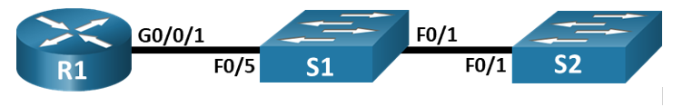  

## **Таблица адресации**  
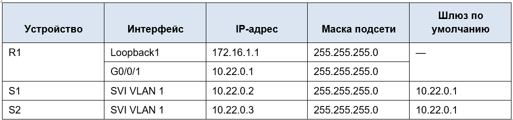       

## **Задачи**      
## **Часть 1. Создание сети и настройка основных параметров устройства**       
## **Часть 2. Обнаружение сетевых ресурсов с помощью протокола CDP**       
## **Часть 3. Обнаружение сетевых ресурсов с помощью протокола LLDP**       
## **Часть 4. Настройка и проверка NTP**       

## **Часть 1. Создание сети и настройка основных параметров устройства**       
### **Шаг 1. Создайте сеть согласно топологии.**       
#### Подключите устройства, как показано в топологии, и подсоедините необходимые кабели.      
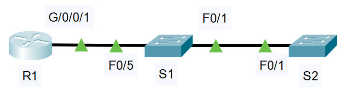        

### **Шаг 2. Настройте базовые параметры для маршрутизатора.**     
#### &nbsp;&nbsp;&nbsp;&nbsp;a.	Назначьте маршрутизатору имя устройства.      
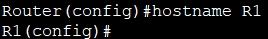      

#### &nbsp;&nbsp;&nbsp;&nbsp;b.	Отключите поиск DNS, чтобы предотвратить попытки маршрутизатора неверно преобразовывать введенные команды таким образом, как будто они являются именами узлов.      
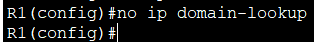      

#### &nbsp;&nbsp;&nbsp;&nbsp;c.	Назначьте **class** в качестве зашифрованного пароля привилегированного режима EXEC.      
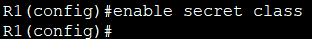      

#### &nbsp;&nbsp;&nbsp;&nbsp;d.	Назначьте **cisco** в качестве пароля консоли и включите вход в систему по паролю.       
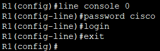      

#### &nbsp;&nbsp;&nbsp;&nbsp;e.	Назначьте **cisco** в качестве пароля VTY и включите вход в систему по паролю.       
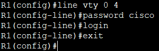      

#### &nbsp;&nbsp;&nbsp;&nbsp;f.	Зашифруйте открытые пароли.      
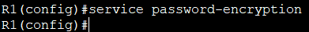      

#### &nbsp;&nbsp;&nbsp;&nbsp;g.	Создайте баннер с предупреждением о запрете несанкционированного доступа к устройству.      
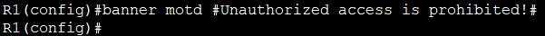      

#### &nbsp;&nbsp;&nbsp;&nbsp;h.	Настройка интерфейсов, перечисленных в таблице выше       
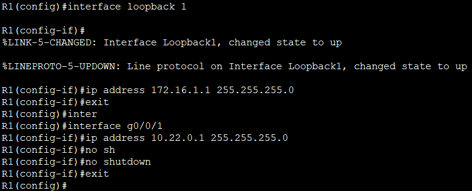     

#### &nbsp;&nbsp;&nbsp;&nbsp;i.	Сохраните текущую конфигурацию в файл загрузочной конфигурации.      
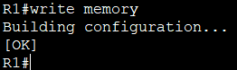      

### **Шаг 3. Настройте базовые параметры каждого коммутатора.**     
#### &nbsp;&nbsp;&nbsp;&nbsp;a.	Присвойте коммутатору имя устройства.      
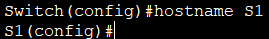     

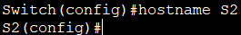     

#### &nbsp;&nbsp;&nbsp;&nbsp;b.	Отключите поиск DNS, чтобы предотвратить попытки маршрутизатора неверно преобразовывать введенные команды таким образом, как будто они являются именами узлов.      
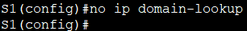      

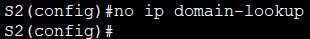     

#### &nbsp;&nbsp;&nbsp;&nbsp;c.	Назначьте **class** в качестве зашифрованного пароля привилегированного режима EXEC.    
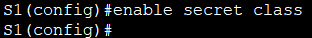    

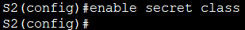      

#### &nbsp;&nbsp;&nbsp;&nbsp;d.	Назначьте **cisco** в качестве пароля консоли и включите вход в систему по паролю.      
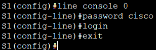      

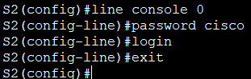     

#### &nbsp;&nbsp;&nbsp;&nbsp;e.	Назначьте **cisco** в качестве пароля VTY и включите вход в систему по паролю.        
   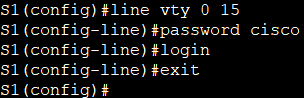     

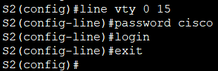        

#### &nbsp;&nbsp;&nbsp;&nbsp;f.	Зашифруйте открытые пароли.      
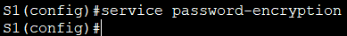        

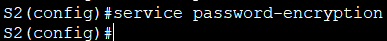       

#### &nbsp;&nbsp;&nbsp;&nbsp;g.	Создайте баннер, который предупреждает всех, кто обращается к устройству, видит баннерное сообщение «Только авторизованные пользователи!».       
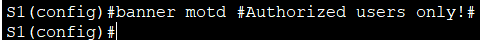     

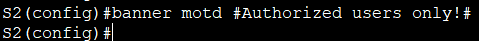  

#### &nbsp;&nbsp;&nbsp;&nbsp;h.	Отключите неиспользуемые интерфейсы       
Для коммутатора S1       
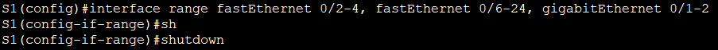      

Для коммутатора S2     
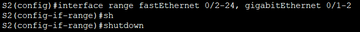     

#### &nbsp;&nbsp;&nbsp;&nbsp;i.	Сохраните текущую конфигурацию в файл загрузочной конфигурации.     
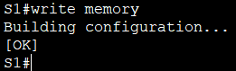     

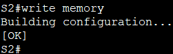     

## **Часть 2. Обнаружение сетевых ресурсов с помощью протокола CDP**       
#### &nbsp;&nbsp;&nbsp;&nbsp;a.	На R1 используйте соответствующую команду show cdp, чтобы определить, сколько интерфейсов включено CDP, сколько из них включено и сколько отключено.      
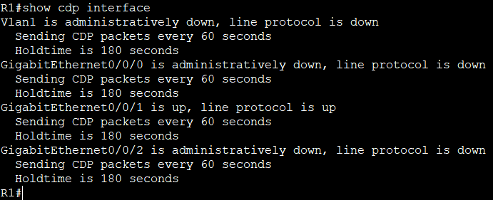      

#### **Сколько интерфейсов участвует в объявлениях CDP?**           
#### Ответ: 1 интерфейс (GigabitEthernet0/0/1).           

#### **Какие из них активны?**     
#### Ответ: Только GigabitEthernet0/0/1 – он находится в состоянии up и передаёт CDP-пакеты.     

#### &nbsp;&nbsp;&nbsp;&nbsp;b.	На R1 используйте соответствующую команду show cdp, чтобы определить версию IOS, используемую на S1.         
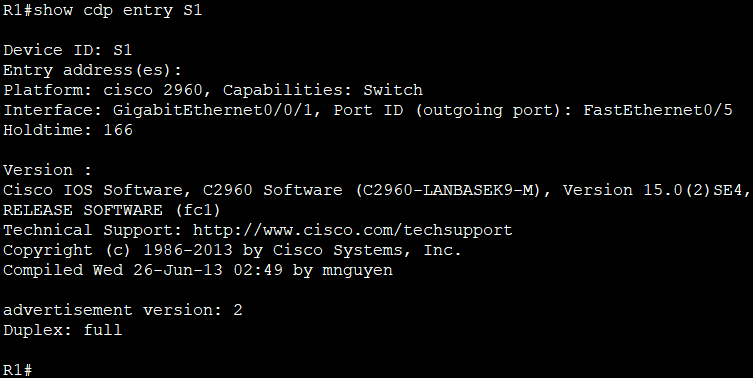      

#### **Какая версия IOS используется на  S1?**    
#### Ответ: Версия 15.0(2)SE4 (образ C2960-LANBASEK9-M).      

#### &nbsp;&nbsp;&nbsp;&nbsp;c.	На S1 используйте соответствующую команду show cdp, чтобы определить, сколько пакетов CDP было выданных.        
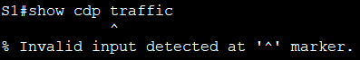       
#### Команда **show cdp traffic** не поддержиается в packet tracer. Этот шаг пропускаем.    

#### &nbsp;&nbsp;&nbsp;&nbsp;d.	Настройте SVI для VLAN 1 на S1 и S2, используя IP-адреса, указанные в таблице адресации выше. Настройте шлюз по умолчанию для каждого коммутатора на основе таблицы адресов.        
#### На коммутаторе S1:
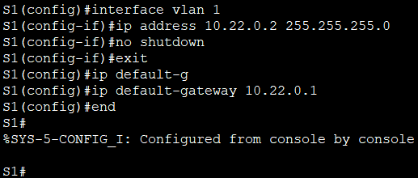     

#### На коммутаторе S2:      
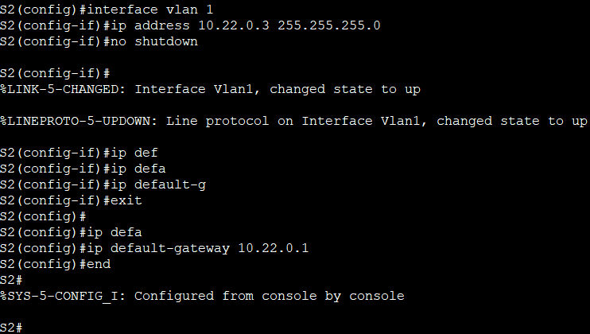    

#### &nbsp;&nbsp;&nbsp;&nbsp;e.	На R1 выполните команду show cdp entry S1         
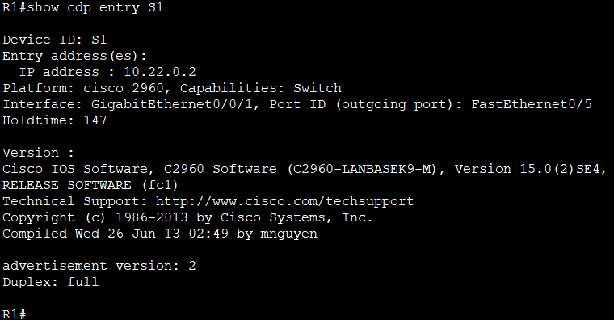     

#### **Какие дополнительные сведения доступны теперь?**     
#### Ответ: После настройки SVI VLAN1 на коммутаторе S1 в выводе команды show cdp entry S1 на R1 появились дополнительные сведения:
#### IP address: 10.22.0.2 – теперь CDP передаёт IP-адрес управления S1.       

#### &nbsp;&nbsp;&nbsp;&nbsp;f.	Отключить CDP глобально на всех устройствах.      
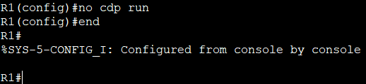     

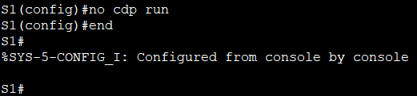     

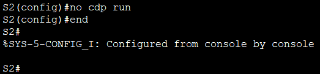     

## **Часть 3. Обнаружение сетевых ресурсов с помощью протокола LLDP**     
#### &nbsp;&nbsp;&nbsp;&nbsp;a.	Введите соответствующую команду lldp, чтобы включить LLDP на всех устройствах в топологии.      
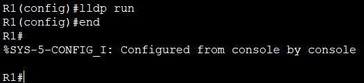     

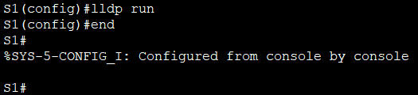     

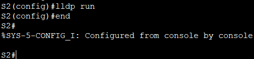    

#### &nbsp;&nbsp;&nbsp;&nbsp;b.	На S1 выполните соответствующую команду lldp, чтобы предоставить подробную информацию о S2.       
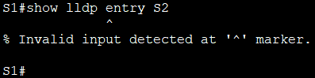     

#### В Cisco Packet Tracer команда **show lldp entry S2** не поддерживается.    
#### Вместо неё используем команду **show lldp neighbors detail**     
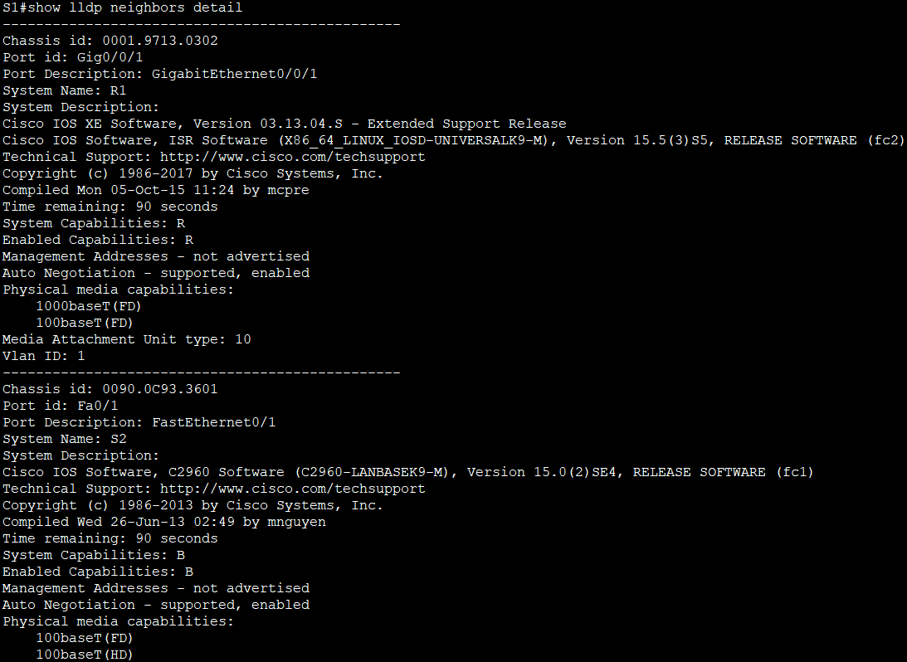   
     

#### Находим блок, относящийся к устройству с System Name: S2. Там будет строка **Chassis id**    
#### Это chassis ID коммутатора S2 (его MAC-адрес).    

#### **Что такое chassis ID  для коммутатора S2?**      
#### Ответ: Chassis ID коммутатора S2 – это уникальный идентификатор устройства, который представляет собой MAC-адрес S2.    

#### &nbsp;&nbsp;&nbsp;&nbsp;c.	Соединитесь через консоль на всех устройствах и используйте команды LLDP, необходимые для отображения топологии физической сети только из выходных данных команды show.      
#### На R1:   
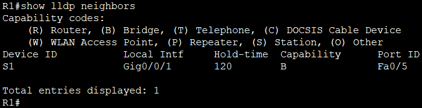     
#### R1 подключён к S1 через порт Gi0/0/1, а у S1 это порт Fa0/5     

#### На S1:     
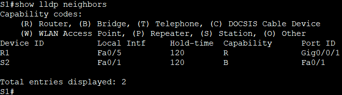      
#### Показывает двух соседей:    
#### Device ID: R1, Local Intf: Fa0/5, Port ID: Gi0/0/1 (подтверждение соединения с R1)       
#### Device ID: S2, Local Intf: Fa0/1, Port ID: Fa0/1 (S1 подключён к S2 через порт Fa0/1 с обеих сторон).   

#### На S2:    
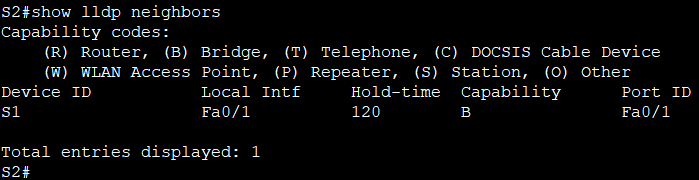      
#### Device ID: S1, Local Intf: Fa0/1, Port ID: Fa0/1 (подтверждение соединения с S1)    

#### Итоговая физическая топология:       
#### R1 (Gi0/0/1) --- (Fa0/5) S1 (Fa0/1) --- (Fa0/1) S2      

