# **Лаборатроная работа №2. Просмотр таблицы MAC-адресов коммутатора.** 
## **Задачи:**
## &nbsp;&nbsp;&nbsp;&nbsp; **Часть 1. Создание и настройка сети**
## &nbsp;&nbsp;&nbsp;&nbsp; **Часть 2. Изучение таблицы МАС-адресов коммутатора**

### **Часть 1. Создание и настройка сети**
#### **Шаг 1. Подключите сеть в соответствии с топологией.**           
Подключаем консольный кабель        
            

Подключаем кабель к Ethernet устройствам      

       

Проверяем, включены ли интерфейсы на коммутаторах

       

#### **Шаг 2. Настройте узлы ПК.**         
Настройка IP-адресов         
       

    

#### **Шаг 3. Выполните инициализацию и перезагрузку коммутаторов.**
На коммутаторе 1 последовательно вводим команды:       
**enable** - вход в привилегированный режим;        

        

**erase startup-config** -  стереть начальную конфигурацию;
   

Стандартная команда **erase startup-config** не удаляет файл с настройками VLAN (vlan.dat). Чтобы выполнить полный сброс, его нужно удалить отдельно набрав команду **delete flash:vlan.dat**;  
     
В данном случае VLAN еще не настроен (Файл vlan.dat пока еще не создан)   

**reload** - коммутатор начнет процесс перезагрузки. 

Повторяем процедуру для коммутатора 2 

#### **Шаг 4. Настройте базовые параметры каждого коммутатора.**    
&nbsp;&nbsp;&nbsp;&nbsp; a.	Настройте имена устройств в соответствии с топологией. 
      

     

&nbsp;&nbsp;&nbsp;&nbsp; b.	Настройте IP-адреса, как указано в таблице адресации.   
      

     

&nbsp;&nbsp;&nbsp;&nbsp; c.	Назначьте **cisco** в качестве паролей консоли и VTY.          
     

    

    

      

&nbsp;&nbsp;&nbsp;&nbsp; d.	Назначьте class в качестве пароля доступа к привилегированному режиму EXEC. 
     

     

Сохраняем параметры конфигурации   
     

    

### **Часть 2. Изучение таблицы МАС-адресов коммутатора**     
#### **Шаг 1. Запишите МАС-адреса сетевых устройств.**     
&nbsp;&nbsp;&nbsp;&nbsp; a.	Откройте командную строку на PC-A и PC-B и введите команду **ipconfig /all**.        
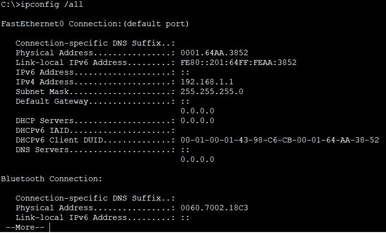       

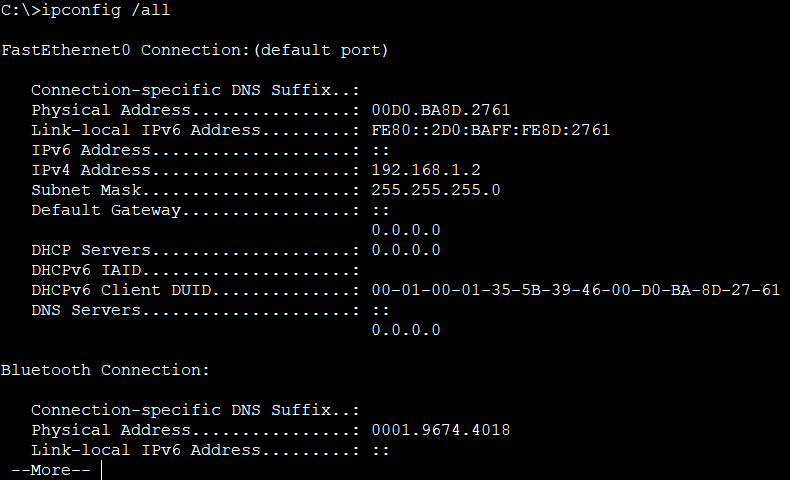        

**Назовите физические адреса адаптера Ethernet.**      
MAC-адрес компьютера PC-A: 0001.64AA.3852         
MAC-адрес компьютера PC-B: 00D0.BA8D.2761             

&nbsp;&nbsp;&nbsp;&nbsp; b.	Подключитесь к коммутаторам S1 и S2 через консоль и введите команду **show interface F0/1** на каждом коммутаторе.           
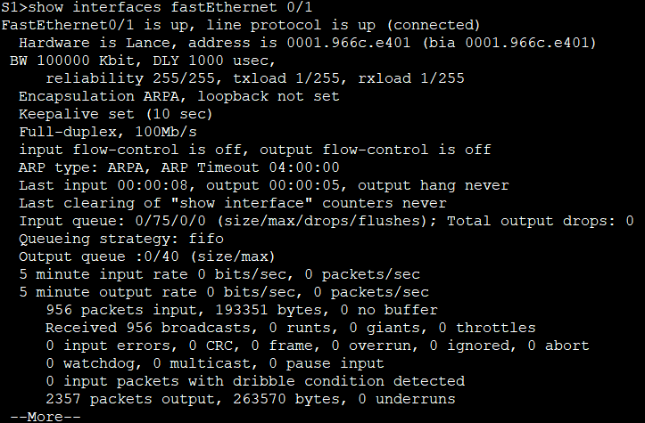       

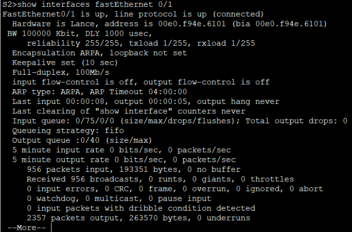        

**Назовите адреса оборудования во второй строке выходных данных команды (или зашитый адрес — bia).**          
МАС-адрес коммутатора S1 Fast Ethernet 0/1: 0001.966c.e401 (bia 0001.966c.e401)        
МАС-адрес коммутатора S2 Fast Ethernet 0/1: 00e0.f94e.6101 (bia 00e0.f94e.6101)      

#### **Шаг 2. Просмотрите таблицу МАС-адресов коммутатора.**      
&nbsp;&nbsp;&nbsp;&nbsp; a.	Подключитесь к коммутатору S2 через консоль и войдите в привилегированный режим EXEC.      
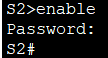        

&nbsp;&nbsp;&nbsp;&nbsp; b.	В привилегированном режиме EXEC введите команду **show mac address-table** и нажмите клавишу ввода.        
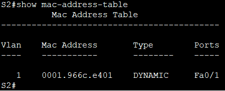        

**Записаны ли в таблице МАС-адресов какие-либо МАС-адреса?**      
Да, записаны.           

**Какие МАС-адреса записаны в таблице? С какими портами коммутатора они сопоставлены и каким устройствам принадлежат?**       
В Vlan 1 имеется MAC-адрес интерфейса Fa0/1.        

**Если вы не записали МАС-адреса сетевых устройств в шаге 1, как можно определить, каким устройствам принадлежат МАС-адреса, используя только выходные данные команды **show mac address-table**? Работает ли это решение в любой ситуации?**        
В столбце «Ports» отображается интерфейс с этим MAC-адресом. MAC-адрес можно косвенно определить по портам и OUI, но метод имеет ограничения.   

#### **Шаг 3. Очистите таблицу МАС-адресов коммутатора S2 и снова отобразите таблицу МАС-адресов.**        
&nbsp;&nbsp;&nbsp;&nbsp; a.	В привилегированном режиме EXEC введите команду **clear mac address-table dynamic** и нажмите клавишу Enter.       
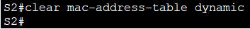       

&nbsp;&nbsp;&nbsp;&nbsp; b.	Снова быстро введите команду **show mac address-table**.       
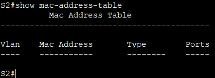       

**Указаны ли в таблице МАС-адресов адреса для VLAN 1? Указаны ли другие МАС-адреса?**      
Нет, не указаны. Он пустой.    

**Через 10 секунд введите команду **show mac address-table** и нажмите клавишу ввода. Появились ли в таблице МАС-адресов новые адреса?**           
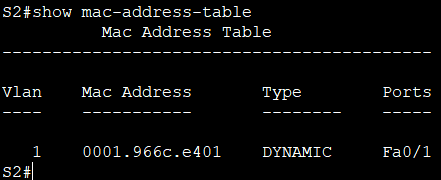       
Снова отображается старый MAC-адрес.        

#### **Шаг 4. С компьютера PC-B отправьте эхо-запросы устройствам в сети и просмотрите таблицу МАС-адресов коммутатора.**     
&nbsp;&nbsp;&nbsp;&nbsp; a.	На компьютере PC-B откройте командную строку и еще раз введите команду **arp -a**.     
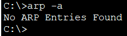       
**Не считая адресов многоадресной и широковещательной рассылки, сколько пар IP- и МАС-адресов устройств было получено через протокол ARP?**      
В кеше APR записей нет.    

&nbsp;&nbsp;&nbsp;&nbsp; b.	Из командной строки PC-B отправьте эхо-запросы на компьютер PC-A, а также коммутаторы S1 и S2.       
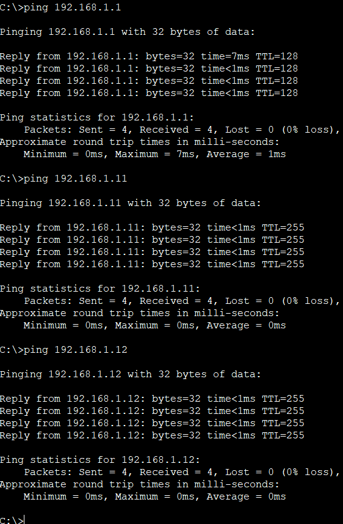       

**От всех ли устройств получены ответы?**      
Да, от всех.

&nbsp;&nbsp;&nbsp;&nbsp; c.	Подключившись через консоль к коммутатору S2, введите команду **show mac address-table**.         
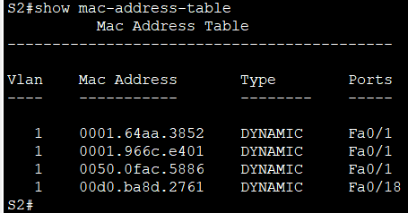        

**Добавил ли коммутатор в таблицу МАС-адресов дополнительные МАС-адреса? Если да, то какие адреса и устройства?**      
На коммутаторе имеются MAC-адреса обоих ПК и интерфейсов Fa0/1 и Vlan1. 

**На компьютере PC-B откройте командную строку и еще раз введите команду arp -a.**    
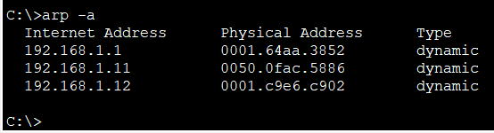      
 
**Появились ли в ARP-кэше компьютера PC-B дополнительные записи для всех сетевых устройств, которым были отправлены эхо-запросы?**      
Указаны IP и MAC адреса всех устройств в сети.

### Вопрос для повторения.**       
**В сетях Ethernet данные передаются на устройства по соответствующим МАС-адресам. Для этого коммутаторы и компьютеры динамически создают ARP-кэш и таблицы МАС-адресов. Если компьютеров в сети немного, эта процедура выглядит достаточно простой. Какие сложности могут возникнуть в крупных сетях?**    
Слишком большое количество ARP-запросов может замедлить работу всей сети.

[Скачать конфиг лабораторной работы №2](https://github.com/nikolaishlyahtin1987-creator/NETWORK-ENGINEER_2026/blob/main/Лабораторные%20работы/Лабораторна%20работа%20№2/Лабораторная%20работа%20№2.pkt "Нажмите для скачивания файла конфигурации")

