# **Лаборатроная работа №2. Просмотр таблицы MAC-адресов коммутатора.** 
## **Задачи:**
### &nbsp;&nbsp;&nbsp;&nbsp; **Часть 1. Создание и настройка сети**
### &nbsp;&nbsp;&nbsp;&nbsp; **Часть 2. Изучение таблицы МАС-адресов коммутатора**

### **Часть 1. Создание и настройка сети**
#### **Шаг 1. Подключите сеть в соответствии с топологией.**           
Подключаем консольный кабель        
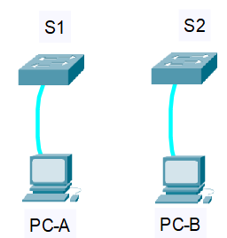            

Подключаем кабель к Ethernet устройствам      

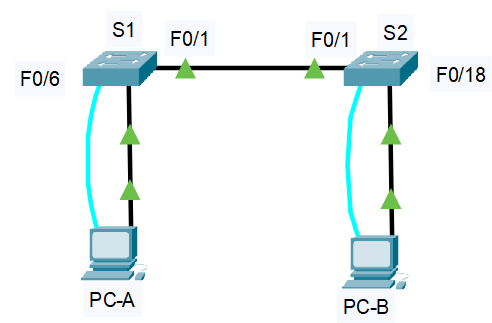       

Проверяем, включены ли интерфейсы на коммутаторах
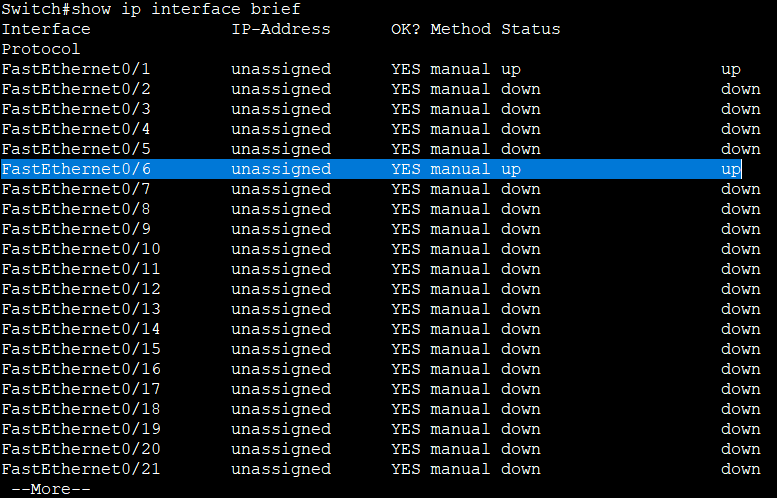

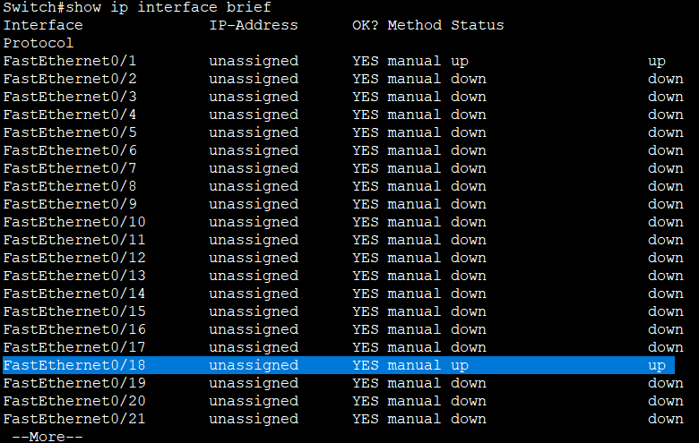       

#### **Шаг 2. Настройте узлы ПК.**         
Настройка IP-адресов         
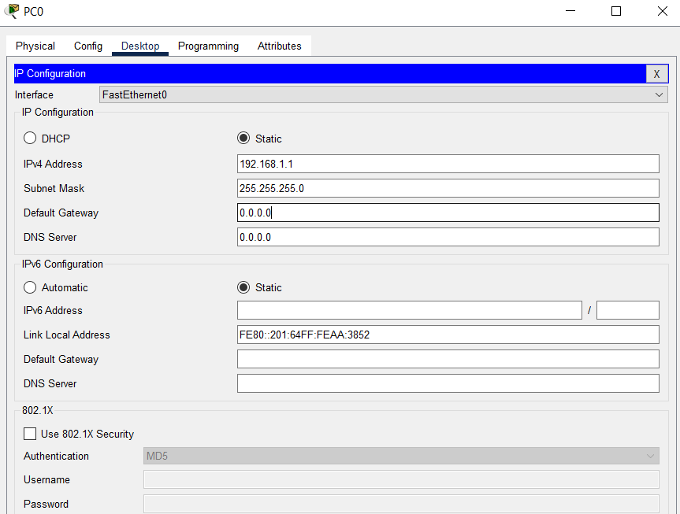       

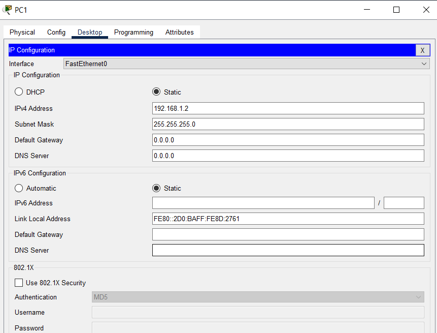    

#### **Шаг 3. Выполните инициализацию и перезагрузку коммутаторов.**
На коммутаторе 1 последовательно вводим команды:       
**enable** - вход в привилегированный режим;        

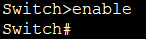        

**erase startup-config** -  стереть начальную конфигурацию;
   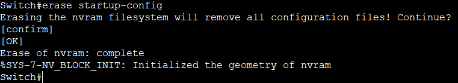

Стандартная команда **erase startup-config** не удаляет файл с настройками VLAN (vlan.dat). Чтобы выполнить полный сброс, его нужно удалить отдельно набрав команду **delete flash:vlan.dat**;  
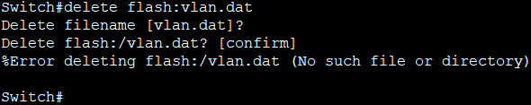     
В данном случае VLAN еще не настроен (Файл vlan.dat пока еще не создан)   

**reload** - коммутатор начнет процесс перезагрузки. 

Повторяем процедуру для коммутатора 2 

#### **Шаг 4. Настройте базовые параметры каждого коммутатора.**    
&nbsp;&nbsp;&nbsp;&nbsp; a.	Настройте имена устройств в соответствии с топологией. 
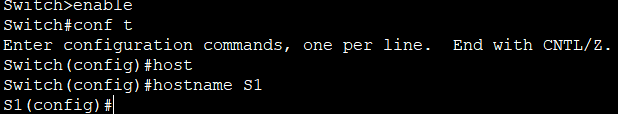      

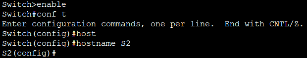     

&nbsp;&nbsp;&nbsp;&nbsp; b.	Настройте IP-адреса, как указано в таблице адресации.   
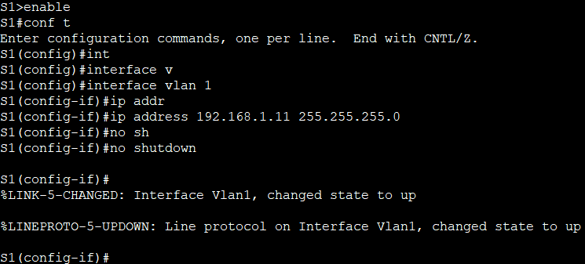      

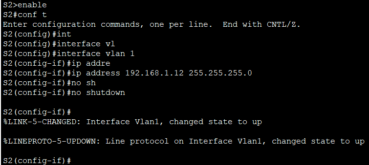     

&nbsp;&nbsp;&nbsp;&nbsp; c.	Назначьте **cisco** в качестве паролей консоли и VTY.          
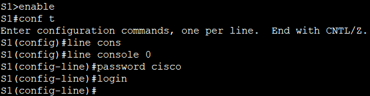     

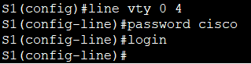    

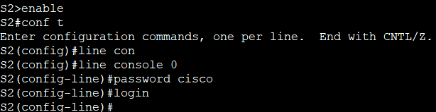    

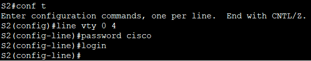      

&nbsp;&nbsp;&nbsp;&nbsp; d.	Назначьте class в качестве пароля доступа к привилегированному режиму EXEC. 
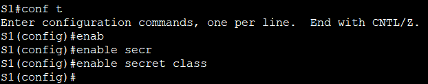     

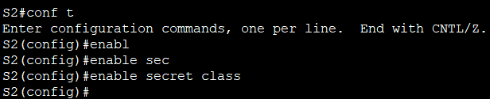     

Сохраняем параметры конфигурации   
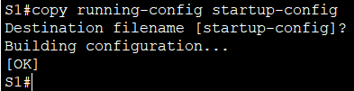     

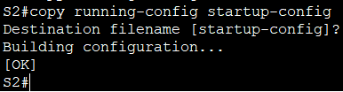    

