# **Лабораторная работа - Реализация DHCPv4**     
## **Топология**     
       
## **1.	Таблица адресации**    
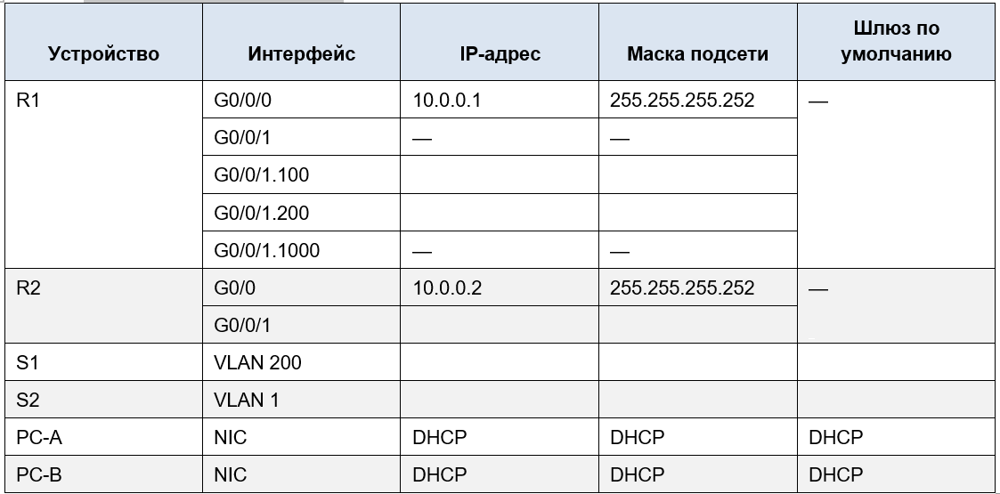     
## **2.	Таблица VLAN**    
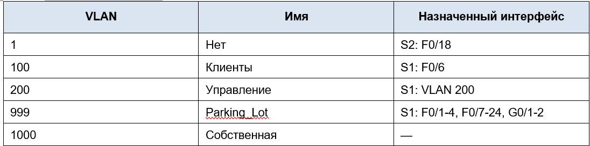     
## **3.	Задачи**    
### **Часть 1. Создание сети и настройка основных параметров устройства**
### **Часть 2. Настройка и проверка двух серверов DHCPv4 на R1**     
### **Часть 3. Настройка и проверка DHCP-ретрансляции на R2**     

## **Часть 1. Создание сети и настройка основных параметров устройства**      
### **Шаг 1. Создание схемы адресации**      
#### Подсеть сети 192.168.1.0/24 в соответствии со следующими требованиями:      
#### &nbsp;&nbsp;&nbsp;&nbsp;a.	Одна подсеть «Подсеть A», поддерживающая 58 хостов (клиентская VLAN на R1).       
#### &nbsp;&nbsp;&nbsp;&nbsp;Подсеть A:     
#### &nbsp;&nbsp;&nbsp;&nbsp;Запишите первый IP-адрес в таблице адресации для R1 G0/0/1.100.     
#### **Рассчет подсети А**    
#### 1. Определяем необходимое количество бит для хостов      
#### Формула для числа хостов в подсети: 2ⁿ – 2      
#### 2⁶ – 2 = 64 – 2 = 62      
#### Для хостовой части нужно 6 бит.      
#### **2. Вычисляем маску подсети**     
#### 32 – n = 32 – 6 = 26  
#### Маска подсети: /26 или в десятичном виде 255.255.255.192         
#### **3. Определяем размер подсети и адрес сети**        
#### Размер подсети (количество адресов) = 2ⁿ = 2⁶ = 64 адреса.      
#### Адрес сети (первый адрес) – 192.168.1.0.       
#### Широковещательный адрес (последний) - 192.168.1.63     
#### **4. Диапазон адресов для хостов**   
#### Первый адрес для хоста: 192.168.1.1       
#### Последний адрес: 192.168.1.62       
#### **Запишите первый IP-адрес в таблице адресации для R1 G0/0/1.100**   
#### IP-адрес: 192.168.1.1     
#### Маска подсети: 255.255.255.192 (/26)    

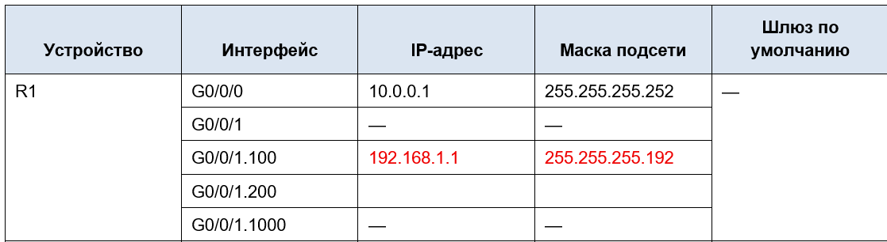   

#### &nbsp;&nbsp;&nbsp;&nbsp;b.	Одна подсеть «Подсеть B», поддерживающая 28 хостов (управляющая VLAN на R1). 
#### &nbsp;&nbsp;&nbsp;&nbsp;Подсеть B:     
#### &nbsp;&nbsp;&nbsp;&nbsp;1. Определяем необходимое количество бит для хостов    
#### 2⁵ – 2 = 32 – 2 = 30   
#### Для хостовой части нужно 5 бит     
#### &nbsp;&nbsp;&nbsp;&nbsp;2. Вычисляем маску подсети     
#### 32 – n = 32 – 5 = 27     
#### Маска подсети: /27 или 255.255.255.224    
#### &nbsp;&nbsp;&nbsp;&nbsp;3. Определяем размер и адрес подсети      
#### 2⁵ = 32 адреса.     
#### Начальный адрес – 192.168.1.64 (так как предыдущая подсеть закончилась на 63).    
#### Широковещательный адрес – 192.168.1.64 + 31 = 192.168.1.95        
#### &nbsp;&nbsp;&nbsp;&nbsp;4. Назначаем IP-адреса для устройств      
#### Первый IP-адрес 192.168.1.65 (адрес .64 зарезервирован, первый доступный – .65) – назначается интерфейсу R1 G0/0/1.200.      
#### Второй IP-адрес – 192.168.1.66 назначается интерфейсу S1 VLAN 200.      
#### Шлюз по умолчанию для S1 – это адрес R1, т.е. 192.168.1.65.        
#### &nbsp;&nbsp;&nbsp;&nbsp;5. Запишите первый IP-адрес в таблице адресации для R1 G0/0/1.200. Запишите второй IP-адрес в таблице адресов для S1 VLAN 200 и введите соответствующий шлюз по умолчанию.       
#### Первый IP для R1 G0/0/1.200: 192.168.1.65     
#### Второй IP для S1 VLAN 200: 192.168.1.66      
#### Шлюз по умолчанию для S1: 192.168.1.65       
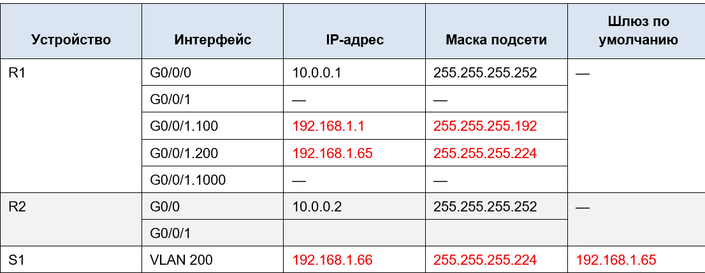      

#### &nbsp;&nbsp;&nbsp;&nbsp;c.	Одна подсеть «Подсеть C», поддерживающая 12 узлов (клиентская сеть на R2).      
#### &nbsp;&nbsp;&nbsp;&nbsp;Подсеть C:      
#### &nbsp;&nbsp;&nbsp;&nbsp;1. Определяем необходимое количество бит для хостов     
#### 2⁴ – 2 = 16 – 2 = 14       
#### Для хостовой части нужно 4 бита.        
#### &nbsp;&nbsp;&nbsp;&nbsp;2. Вычисляем маску подсети      
#### 32 – n = 32 – 4 = 28             
#### Маска подсети: /28 или 255.255.255.240        
#### &nbsp;&nbsp;&nbsp;&nbsp;3. Определяем размер и адрес подсети       
#### Размер подсети = 2⁴ = 16 адресов.       
#### Начальный адрес – 192.168.1.96 (так как предыдущая подсеть закончилась на 95).      
#### Широковещательный адрес – 192.168.1.96 + 15 = 192.168.1.111          
#### &nbsp;&nbsp;&nbsp;&nbsp;4. Назначаем IP для интерфейса R2 G0/0/1       
#### Адрес сети .96 зарезервирован, поэтому первый доступный адрес для хоста – 192.168.1.97      
#### IP-адрес R2 G0/0/1: 192.168.1.97       
#### Маска подсети: 255.255.255.240 (или /28)      
#### &nbsp;&nbsp;&nbsp;&nbsp;5. Запишите первый IP-адрес в таблице адресации для R2 G0/0/1         
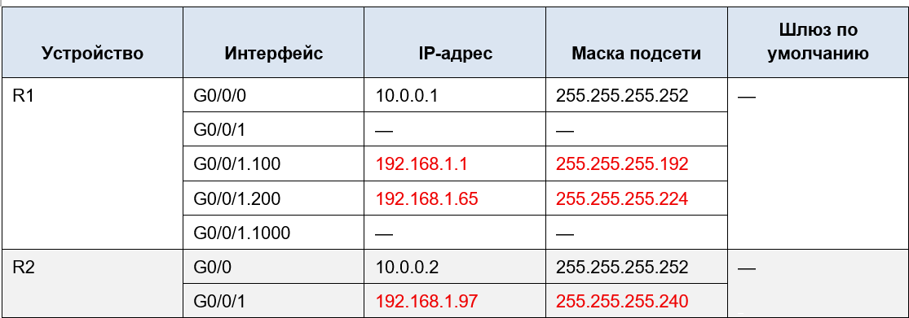  

### **Шаг 2. Создайте сеть согласно топологии.**     
#### Подключите устройства, как показано в топологии, и подсоедините необходимые кабели.        
 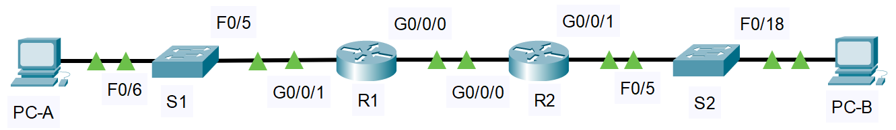        

### **Шаг 3. Произведите базовую настройку маршрутизаторов.**        
#### &nbsp;&nbsp;&nbsp;&nbsp;a.	Назначьте маршрутизатору имя устройства.      
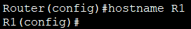          

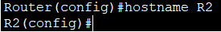    

#### &nbsp;&nbsp;&nbsp;&nbsp;b.	Отключите поиск DNS, чтобы предотвратить попытки маршрутизатора неверно преобразовывать введенные команды таким образом, как будто они являются именами узлов.       
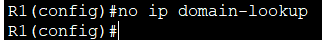      

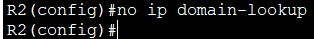     

#### &nbsp;&nbsp;&nbsp;&nbsp;c.	Назначьте **class** в качестве зашифрованного пароля привилегированного режима EXEC.      
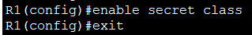    

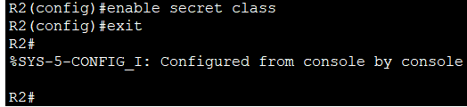    

#### &nbsp;&nbsp;&nbsp;&nbsp;d.	Назначьте **cisco** в качестве пароля консоли и включите вход в систему по паролю.     
 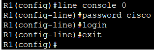         

 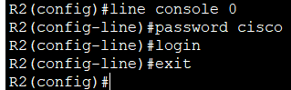      

#### &nbsp;&nbsp;&nbsp;&nbsp;e.	Назначьте cisco в качестве пароля VTY и включите вход в систему по паролю.      
 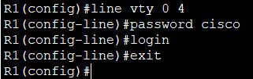     

 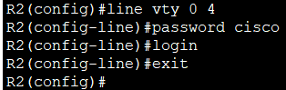     

#### &nbsp;&nbsp;&nbsp;&nbsp;f.	Зашифруйте открытые пароли.   
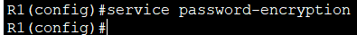     

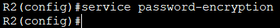     

#### &nbsp;&nbsp;&nbsp;&nbsp;g.	Создайте баннер с предупреждением о запрете несанкционированного доступа к устройству.     
     

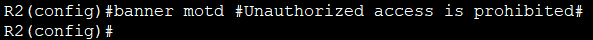     

#### &nbsp;&nbsp;&nbsp;&nbsp;h.	Сохраните текущую конфигурацию в файл загрузочной конфигурации.       
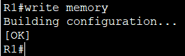     

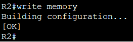     

#### &nbsp;&nbsp;&nbsp;&nbsp;i.	Установите часы на маршрутизаторе на сегодняшнее время и дату.     
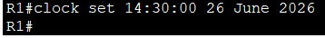    

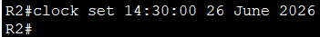   

### &nbsp;&nbsp;&nbsp;&nbsp;**Шаг 4. Настройка маршрутизации между сетями VLAN на маршрутизаторе R1**       
#### a.	Активируйте интерфейс G0/0/1 на маршрутизаторе.       
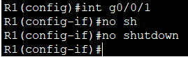     
    
#### b.	Настройте подинтерфейсы для каждой VLAN в соответствии с требованиями таблицы IP-адресации. Все субинтерфейсы используют инкапсуляцию 802.1Q и назначаются первый полезный адрес из вычисленного пула IP-адресов. Убедитесь, что подинтерфейсу для native VLAN не назначен IP-адрес. Включите описание для каждого подинтерфейса.        
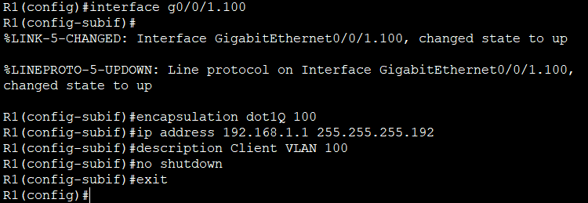     
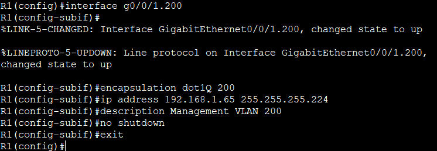    
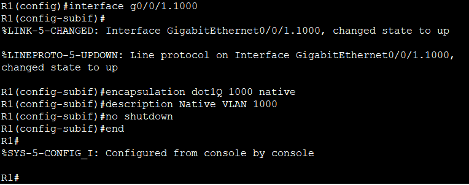    
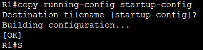    

#### &nbsp;&nbsp;&nbsp;&nbsp;c.	Убедитесь, что вспомогательные интерфейсы работают.       
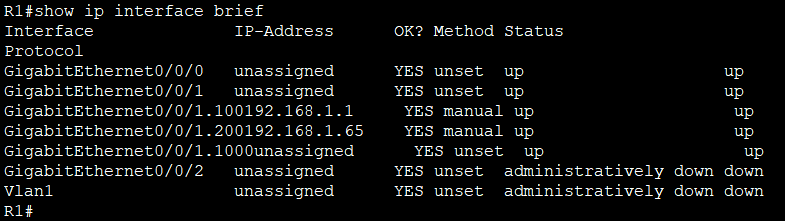  

### **Шаг 5. Настройте G0/1 на R2, затем G0/0/0 и статическую маршрутизацию для обоих маршрутизаторов**    
#### &nbsp;&nbsp;&nbsp;&nbsp;a.	Настройте G0/0/1 на R2 с первым IP-адресом подсети C, рассчитанным ранее.        
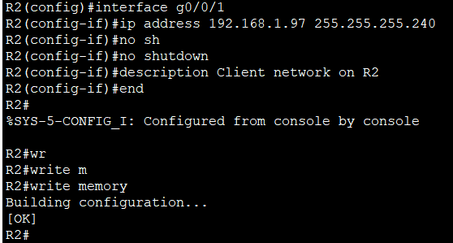    

#### &nbsp;&nbsp;&nbsp;&nbsp;b.	Настройте интерфейс G0/0/0 для каждого маршрутизатора на основе приведенной выше таблицы IP-адресации.      
     

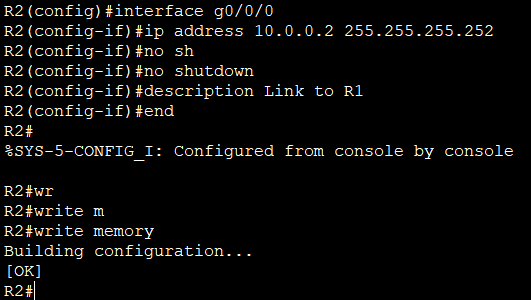    

#### &nbsp;&nbsp;&nbsp;&nbsp;c.	Настройте маршрут по умолчанию на каждом маршрутизаторе, указываемом на IP-адрес G0/0/0 на другом маршрутизаторе.      
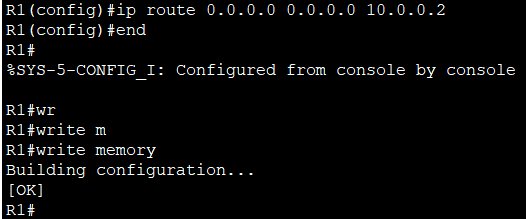      

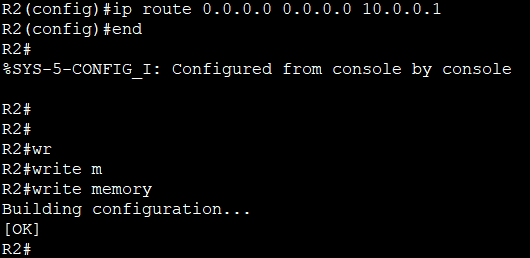     

#### &nbsp;&nbsp;&nbsp;&nbsp;d.	Убедитесь, что статическая маршрутизация работает с помощью пинга до адреса G0/0/1 R2 от R1       
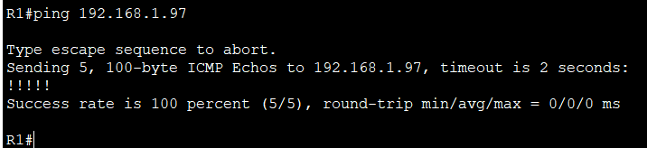    

#### &nbsp;&nbsp;&nbsp;&nbsp;e.	Сохраните текущую конфигурацию в файл загрузочной конфигурации.       
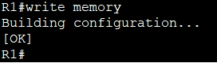    

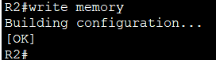   

### **Шаг 6.Настройте базовые параметры каждого коммутатора.**      
#### &nbsp;&nbsp;&nbsp;&nbsp;a.	Присвойте коммутатору имя устройства.      
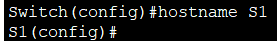    

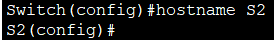      

#### &nbsp;&nbsp;&nbsp;&nbsp;b.	Отключите поиск DNS, чтобы предотвратить попытки маршрутизатора неверно преобразовывать введенные команды таким образом, как будто они являются именами узлов.      
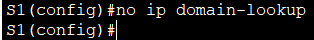    

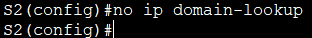    

#### &nbsp;&nbsp;&nbsp;&nbsp;c.	Назначьте **class** в качестве зашифрованного пароля привилегированного режима EXEC.      
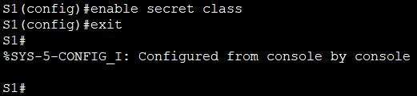    

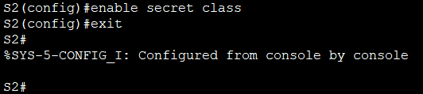    

#### &nbsp;&nbsp;&nbsp;&nbsp;d.	Назначьте **cisco** в качестве пароля консоли и включите вход в систему по паролю.       
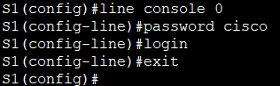     

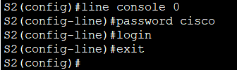     

#### &nbsp;&nbsp;&nbsp;&nbsp;e.	Назначьте **cisco** в качестве пароля VTY и включите вход в систему по паролю.      
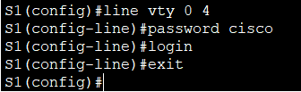     

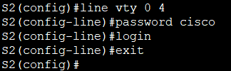    

#### &nbsp;&nbsp;&nbsp;&nbsp;f.	Зашифруйте открытые пароли.    
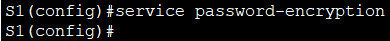     

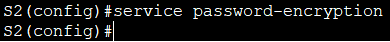     

#### &nbsp;&nbsp;&nbsp;&nbsp;g.	Создайте баннер с предупреждением о запрете несанкционированного доступа к устройству.       
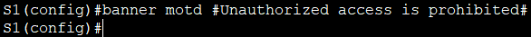     

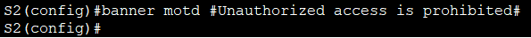     

#### &nbsp;&nbsp;&nbsp;&nbsp;h.	Сохраните текущую конфигурацию в файл загрузочной конфигурации.      
    

    

#### &nbsp;&nbsp;&nbsp;&nbsp;i.	Установите часы на маршрутизаторе на сегодняшнее время и дату.       
    

     

#### &nbsp;&nbsp;&nbsp;&nbsp;j.	Скопируйте текущую конфигурацию в файл загрузочной конфигурации.       
     

      

### **Шаг 7. Создайте сети VLAN на коммутаторе S1**     
#### &nbsp;&nbsp;&nbsp;&nbsp;a.	Создайте необходимые VLAN на коммутаторе 1 и присвойте им имена из приведенной выше таблицы.     
      
    
    
     
     

#### &nbsp;&nbsp;&nbsp;&nbsp;b.	Настройте и активируйте интерфейс управления на S1 (VLAN 200), используя второй IP-адрес из подсети, рассчитанный ранее. Кроме того установите шлюз по умолчанию на S1.      
     

#### &nbsp;&nbsp;&nbsp;&nbsp;c.	Настройте и активируйте интерфейс управления на S2 (VLAN 1), используя второй IP-адрес из подсети, рассчитанный ранее. Кроме того, установите шлюз по умолчанию на S2      
     

#### &nbsp;&nbsp;&nbsp;&nbsp;d.	Назначьте все неиспользуемые порты S1 VLAN Parking_Lot, настройте их для статического режима доступа и административно деактивируйте их. На S2 административно деактивируйте все неиспользуемые порты.      
     

#### На S2 (административное отключение всех неиспользуемых портов):
    

### **Шаг 8. Назначьте сети VLAN соответствующим интерфейсам коммутатора.**    
#### &nbsp;&nbsp;&nbsp;&nbsp;a.	Назначьте используемые порты соответствующей VLAN (указанной в таблице VLAN выше) и настройте их для режима статического доступа.     
#### Настройка S1 (порт F0/6):    
     

#### Настройка S2 (порт F0/18):       
      

#### &nbsp;&nbsp;&nbsp;&nbsp;b.	Убедитесь, что VLAN назначены на правильные интерфейсы.      
    

     

#### **Почему интерфейс F0/5 указан в VLAN 1?**     
#### На данном этапе F0/5 ещё не настроен как транк. По умолчанию все порты находятся в VLAN 1     

### **Шаг 9. Вручную настройте интерфейс S1 F0/5 в качестве транка 802.1Q.**      
#### &nbsp;&nbsp;&nbsp;&nbsp;a.	Измените режим порта коммутатора, чтобы принудительно создать магистральный канал.       
    

#### &nbsp;&nbsp;&nbsp;&nbsp;b.	В рамках конфигурации транка  установите для native  VLAN значение 1000      
     

#### &nbsp;&nbsp;&nbsp;&nbsp;c.	В качестве другой части конфигурации магистрали укажите, что VLAN 100, 200 и 1000 могут проходить по транку.     
     

#### &nbsp;&nbsp;&nbsp;&nbsp;d.	Сохраните текущую конфигурацию в файл загрузочной конфигурации.     
    

#### &nbsp;&nbsp;&nbsp;&nbsp;e.	Проверьте состояние транка.      
      

#### **Какой IP-адрес был бы у ПК, если бы он был подключен к сети с помощью DHCP?**     
#### PC-A подключён к VLAN 100  через порт S1 F0/6. Первые 5 адресов (192.168.1.1 – 192.168.1.5) зарезервированы для статического назначения. Первый выдаваемый DHCP-адрес будет 192.168.1.6.       

## **Часть 2. Настройка и проверка двух серверов DHCPv4 на R1**       
### **Шаг 1. Настройте R1 с пулами DHCPv4 для двух поддерживаемых подсетей. Ниже приведен только пул DHCP для подсети A**       
#### &nbsp;&nbsp;&nbsp;&nbsp;a.	Исключите первые пять используемых адресов из каждого пула адресов.     
#### **Для подсети A (VLAN 100):**              
#### Сеть: 192.168.1.0/26     
#### Шлюз: 192.168.1.1       
#### Исключаемый диапазон: 192.168.1.1 – 192.168.1.5        

#### **Для подсети C (клиенты на R2):**         
#### Сеть: 192.168.1.96/28      
#### Шлюз: 192.168.1.97       
#### Исключаемый диапазон: 192.168.1.97 – 192.168.1.101       

     

#### &nbsp;&nbsp;&nbsp;&nbsp;b.	Создайте пул DHCP (используйте уникальное имя для каждого пула).       
#### &nbsp;&nbsp;&nbsp;&nbsp;c.	Укажите сеть, поддерживающую этот DHCP-сервер.      
#### &nbsp;&nbsp;&nbsp;&nbsp;d.	В качестве имени домена укажите CCNA-lab.com.     
#### &nbsp;&nbsp;&nbsp;&nbsp;e.	Настройте соответствующий шлюз по умолчанию для каждого пула DHCP.       
#### &nbsp;&nbsp;&nbsp;&nbsp;f.	Настройте время аренды на 2 дня 12 часов и 30 минут.    
     

#### Packet Tracer не поддерживает команду **lease**, поэтому пукт f пропускаем.     

#### &nbsp;&nbsp;&nbsp;&nbsp;g.	Затем настройте второй пул DHCPv4, используя имя пула R2_Client_LAN и вычислите сеть, маршрутизатор по умолчанию, и используйте то же имя домена и время аренды, что и предыдущий пул DHCP.
     

### **Шаг 2. Сохраните конфигурацию.**     
      

### **Шаг 3. Проверка конфигурации сервера DHCPv4**    
#### &nbsp;&nbsp;&nbsp;&nbsp;a.	Чтобы просмотреть сведения о пуле, выполните команду **show ip dhcp pool**.       
      

#### &nbsp;&nbsp;&nbsp;&nbsp;b.	Выполните команду show ip dhcp bindings для проверки установленных назначений адресов DHCP.       
       

#### &nbsp;&nbsp;&nbsp;&nbsp;c.	Выполните команду show ip dhcp server statistics для проверки сообщений DHCP.      
    

#### В Packet Tracer данная коанда не работает     

### **Шаг 4. Попытка получить IP-адрес от DHCP на PC-A**    
#### &nbsp;&nbsp;&nbsp;&nbsp;a.	Из командной строки компьютера PC-A выполните команду ipconfig /all.     
     

#### &nbsp;&nbsp;&nbsp;&nbsp;b.	После завершения процесса обновления выполните команду ipconfig для просмотра новой информации об IP-адресе.      
     

#### &nbsp;&nbsp;&nbsp;&nbsp;c.	Проверьте подключение с помощью пинга IP-адреса интерфейса R0 G0/0/1.       
#### В задании, опечатка: вместо R0 G0/0/1 возможно имеется в виду интерфейс R1 G0/0/1.100, который является шлюзом по умолчанию для PC-A.   

     

  

 
  
