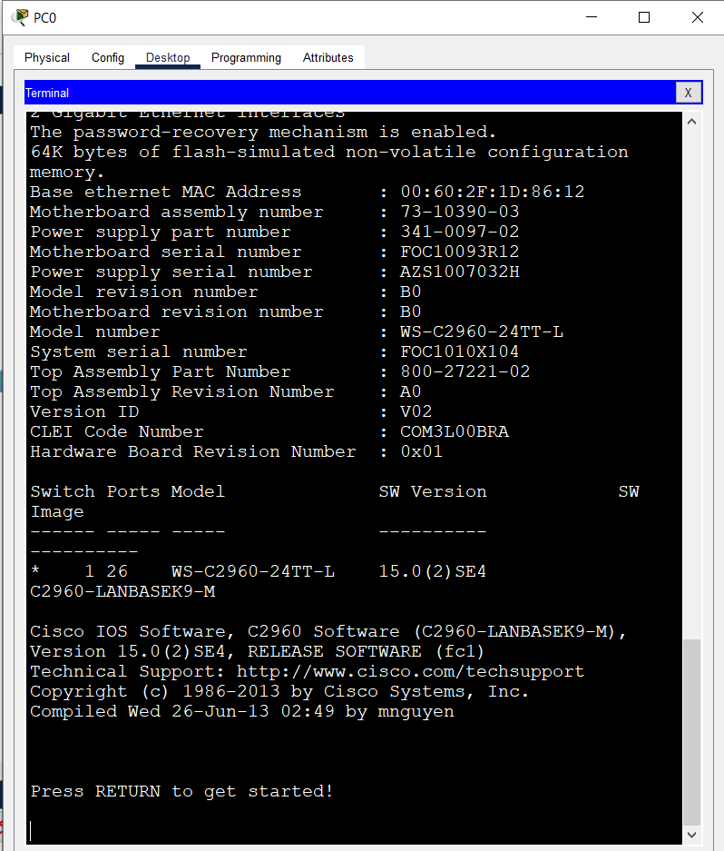

# **Лабораторная работа №1. Базовая настройка коммутатора**
## **Задачи:**
### &nbsp;&nbsp;&nbsp;&nbsp;**Часть 1. Проверка конфигурации коммутатора по умолчанию**
### &nbsp;&nbsp;&nbsp;&nbsp;**Часть 2. Создание сети и настройка основных параметров устройства**
* Настройте базовые параметры коммутатора
* Настройте IP-адрес для ПК
### &nbsp;&nbsp;&nbsp;&nbsp;**Часть 3. Проверка сетевых подключений**
* Отобразите конфигурацию устройства
* Протестируйте сквозное соединение, отправив эхо-запрос
* Протестируйте возможности удаленного управления с помощью Telnet

### **Часть 1. Создание сети и проверка настроек коммутатора по умолчанию**
#### **Шаг 1. Создайте сеть согласно топологии**
&nbsp;&nbsp;&nbsp;&nbsp;а. Подсоедините консольный кабель, как показано в топологии

&nbsp;&nbsp;&nbsp;&nbsp;b. Установите консольное подключение к коммутатору с компьютера PC-A с помощью программы эмуляции терминала

#### **Вопросы:**
1. Почему нужно использовать консольное подключение для первоначальной настройки коммутатора?    
Консоль обеспечивает прямой доступ к интерфейсу конфигурации коммутатора независимо от состояния сети.
2. Почему нельзя подключиться к коммутатору через Telnet или SSH?   
Необходимо настроить на коммутаторе IP-адресацию.