# **Лабораторная работа №1. Базовая настройка коммутатора**
## **Задачи:**
### &nbsp;&nbsp;&nbsp;&nbsp;**Часть 1. Проверка конфигурации коммутатора по умолчанию**
### &nbsp;&nbsp;&nbsp;&nbsp;**Часть 2. Создание сети и настройка основных параметров устройства**
* Настройте базовые параметры коммутатора
* Настройте IP-адрес для ПК
### &nbsp;&nbsp;&nbsp;&nbsp;**Часть 3. Проверка сетевых подключений**
* Отобразите конфигурацию устройства
* Протестируйте сквозное соединение, отправив эхо-запрос
* Протестируйте возможности удаленного управления с помощью Telnet

### **Часть 1. Создание сети и проверка настроек коммутатора по умолчанию**
#### **Шаг 1. Создайте сеть согласно топологии**
&nbsp;&nbsp;&nbsp;&nbsp;а. Подсоедините консольный кабель, как показано в топологии              
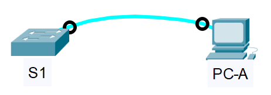

&nbsp;&nbsp;&nbsp;&nbsp;b. Установите консольное подключение к коммутатору с компьютера PC-A с помощью программы эмуляции терминала
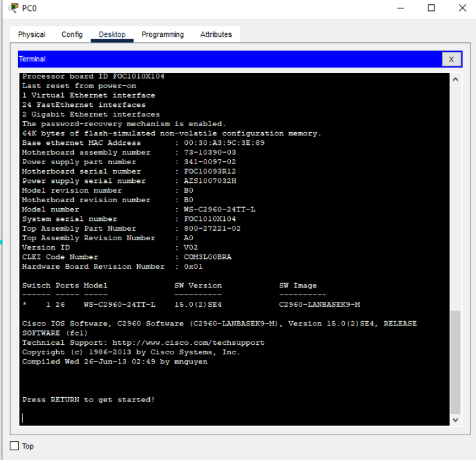

#### **Вопросы:**
1. Почему нужно использовать консольное подключение для первоначальной настройки коммутатора?    
Консоль обеспечивает прямой доступ к интерфейсу конфигурации коммутатора независимо от состояния сети.
2. Почему нельзя подключиться к коммутатору через Telnet или SSH?   
Необходимо настроить на коммутаторе IP-адресацию.     

#### **Шаг 2. Проверка настроек коммутатора по умолчанию**     
а. Вводим команду **enable**, чтобы войти в привилегированный режим.
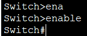    
Вводим команду **show rinning-config**, чтобы убедиться, что на коммутаторе находится пустой файл конфигурации.   

б. Изучаем текущий файл работающей конфигурации    
&nbsp;&nbsp;&nbsp;&nbsp;- Сколько интерфейсов FastEthernet имеется на коммутаторе 2960?    
Ответ: 24 интерфейса.   
&nbsp;&nbsp;&nbsp;&nbsp;- Сколько интерфейсов Gigabit Ethernet имеется на коммутаторе 2960?    
Ответ: 2 интерфейса.     
&nbsp;&nbsp;&nbsp;&nbsp;- Каков диапазон значений, отображаемых в vty-линиях?   
Ответ: 0-15           

с. Изучите файл загрузочной конфигурации (startup configuration), который содержится в энергонезависимом ОЗУ (NVRAM).       
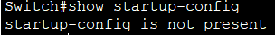     
&nbsp;&nbsp;&nbsp;&nbsp;- Почему появляется это сообщение?   
Ответ: потому что никто еще не записывал конфигурацию.

d.	Изучите характеристики SVI для VLAN 1.    
&nbsp;&nbsp;&nbsp;&nbsp; - Назначен ли IP-адрес сети VLAN 1?      
Ответ: нет, не назначен.    
&nbsp;&nbsp;&nbsp;&nbsp;- Какой MAC-адрес имеет SVI?     
Ответ: MAC-адрес виртуального интерфейса коммутатора (SVI) может быть разным и зависит от конкретной конфигурации.    
В данном случае MAC-адрес 0060.2fld.8612
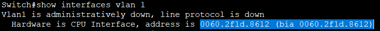   
&nbsp;&nbsp;&nbsp;&nbsp;- Данный интерфейс включен?    
Ответ: этот интерфейс выключен.   
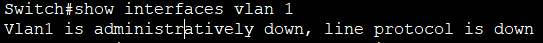     

e. Изучите IP-свойства интерфейса SVI сети VLAN 1.    
&nbsp;&nbsp;&nbsp;&nbsp;- Какие выходные данные вы видите?    
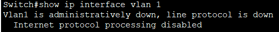        
в VLAN 1 не назначен порт, который находится в рабочем состоянии     

f. Подсоедините кабель Ethernet компьютера PC-A к порту 6 на коммутаторе и изучите IP-свойства интерфейса SVI сети VLAN 1. Дождитесь согласования параметров скорости и дуплекса между коммутатором и ПК.    
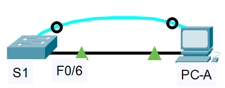      
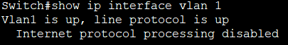   

g. Изучите сведения о версии ОС Cisco IOS на коммутаторе.  
&nbsp;&nbsp;&nbsp;&nbsp;- Под управлением какой версии ОС Cisco IOS работает коммутатор?    
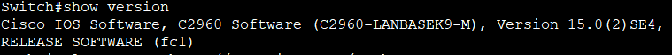     
&nbsp;&nbsp;&nbsp;&nbsp;- Как называется файл образа системы?      
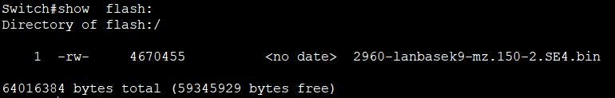    

h. Изучите свойства по умолчанию интерфейса FastEthernet, который используется компьютером PC-A.      
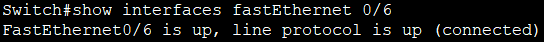   

&nbsp;&nbsp;&nbsp;&nbsp;-Интерфейс включен или выключен?       
&nbsp;&nbsp;&nbsp;&nbsp; Интерфейс включен.   
&nbsp;&nbsp;&nbsp;&nbsp;- Что нужно сделать, чтобы включить интерфейс?    
&nbsp;&nbsp;&nbsp;&nbsp; Нужно выполнить команду **no shutdown**    
&nbsp;&nbsp;&nbsp;&nbsp; -Какой MAC-адрес у интерфейса?    
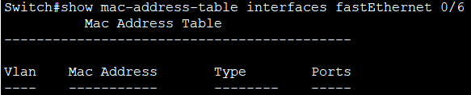     
&nbsp;&nbsp;&nbsp;&nbsp;-Какие настройки скорости и дуплекса заданы в интерфейсе?     
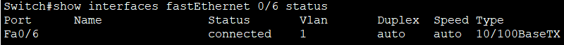        

i. Изучите флеш-память     
&nbsp;&nbsp;&nbsp;&nbsp;Выполните команду show **flash** или **dir flash**     
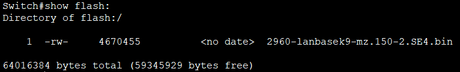      
&nbsp;&nbsp;&nbsp;&nbsp;-Какое имя присвоено образу Cisco IOS?    
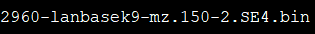      

### **Часть 2. Настройка базовых параметров сетевых устройств**     

#### **Шаг 1. Настройка основных параметров коммутатора**      
a. В режиме глобальной конфигурации настройте базовые параметры конфигурации     
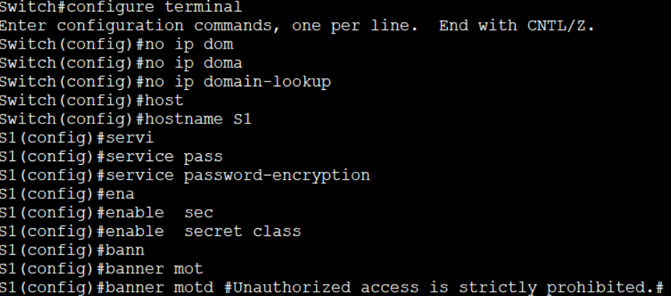      

b.	Назначьте IP-адрес интерфейсу SVI на коммутаторе.      
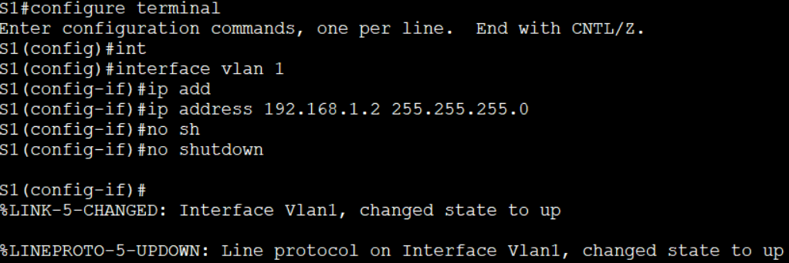       

c. Доступ через порт консоли также следует ограничить  с помощью пароля.     
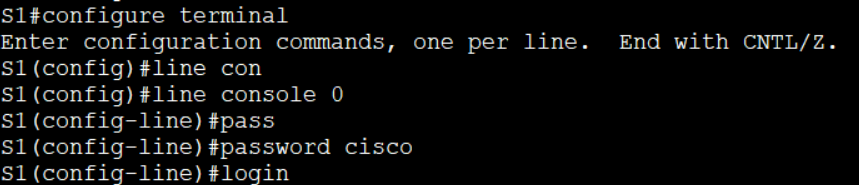      

d.	Настройте каналы виртуального соединения для удаленного управления (vty), чтобы коммутатор разрешил доступ через Telnet.      
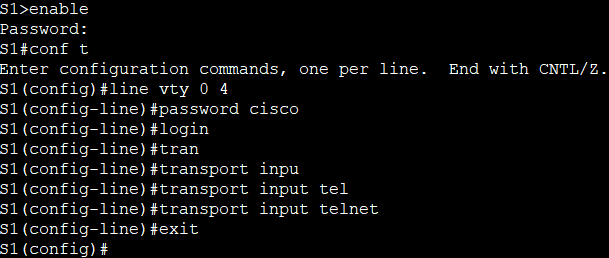      

&nbsp;&nbsp;&nbsp;&nbsp;- Для чего нужна команда login?     
&nbsp;&nbsp;&nbsp;&nbsp; Она включает проверку пароля для доступа к этой линии. Без этой команды коммутатор не будет требовать пароль, даже если он задан командой **password**.  

