# **Настройка протокола OSPFv2 для одной области**        
## **Топология**     
 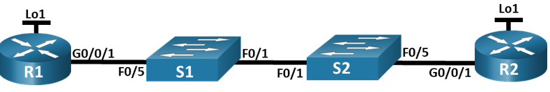       
## **Таблица адресации**      
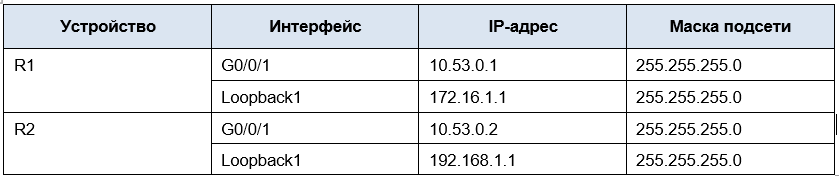       
## **Цели**       
## **Часть 1. Создание сети и настройка основных параметров устройства**         
## **Часть 2. Настройка и проверка базовой работы протокола  OSPFv2 для одной области**       
## **Часть 3. Оптимизация и проверка конфигурации OSPFv2 для одной области**          

## **Часть 1. Создание сети и настройка основных параметров устройства**        
### **Шаг 1. Создайте сеть согласно топологии**        
#### Подключите устройства, как показано в топологии, и подсоедините необходимые кабели.           
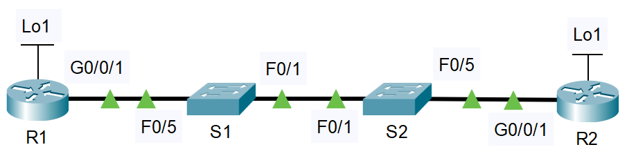     

### **Шаг 2. Произведите базовую настройку маршрутизаторов.**      
#### &nbsp;&nbsp;&nbsp;&nbsp;a.	Назначьте маршрутизатору имя устройства.        
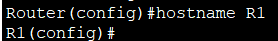     

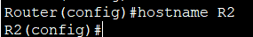    

#### &nbsp;&nbsp;&nbsp;&nbsp;b.	Отключите поиск DNS, чтобы предотвратить попытки маршрутизатора неверно преобразовывать введенные команды таким образом, как будто они являются именами узлов.
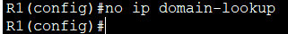     

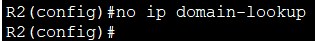     

#### &nbsp;&nbsp;&nbsp;&nbsp;c.	Назначьте class в качестве зашифрованного пароля привилегированного режима EXEC.
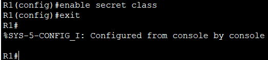     

     

#### &nbsp;&nbsp;&nbsp;&nbsp;d.	Назначьте cisco в качестве пароля консоли и включите вход в систему по паролю.    
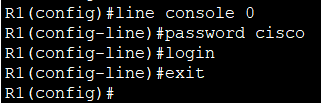     

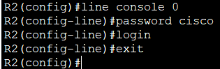        

#### &nbsp;&nbsp;&nbsp;&nbsp;e.	Назначьте cisco в качестве пароля VTY и включите вход в систему по паролю.      
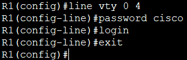       

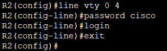     

#### &nbsp;&nbsp;&nbsp;&nbsp;f.	Зашифруйте открытые пароли.    
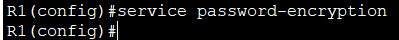     

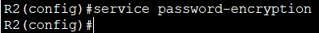     

#### &nbsp;&nbsp;&nbsp;&nbsp;g.	Создайте баннер с предупреждением о запрете несанкционированного доступа к устройству.      
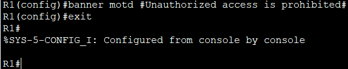     

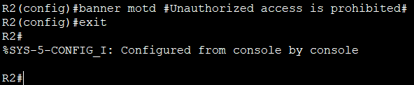      

#### &nbsp;&nbsp;&nbsp;&nbsp;h.	Сохраните текущую конфигурацию в файл загрузочной конфигурации.    
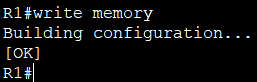     

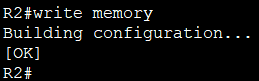     

### **Шаг 3. Настройте базовые параметры каждого коммутатора.**     
#### &nbsp;&nbsp;&nbsp;&nbsp;a.	Назначьте коммутатору имя устройства.     
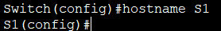     

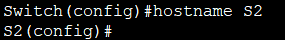      

#### &nbsp;&nbsp;&nbsp;&nbsp;b.	Отключите поиск DNS, чтобы предотвратить попытки маршрутизатора неверно преобразовывать введенные команды таким образом, как будто они являются именами узлов.     
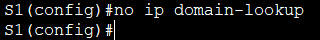      

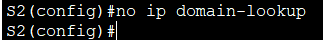      

#### &nbsp;&nbsp;&nbsp;&nbsp;c.	Назначьте class в качестве зашифрованного пароля привилегированного режима EXEC.     
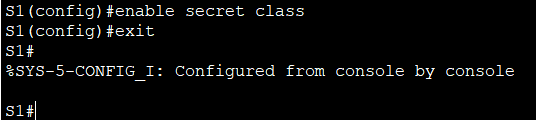       

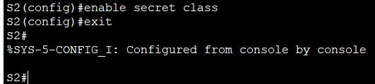     

#### &nbsp;&nbsp;&nbsp;&nbsp;d.	Назначьте cisco в качестве пароля консоли и включите вход в систему по паролю.       
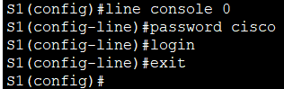      

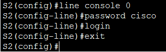     

#### &nbsp;&nbsp;&nbsp;&nbsp;e.	Назначьте cisco в качестве пароля VTY и включите вход в систему по паролю.     
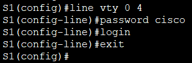      

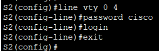     

#### &nbsp;&nbsp;&nbsp;&nbsp;f.	Зашифруйте открытые пароли.    
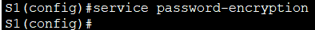       

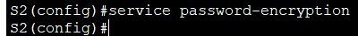   

#### &nbsp;&nbsp;&nbsp;&nbsp;g.	Создайте баннер с предупреждением о запрете несанкционированного доступа к устройству.     
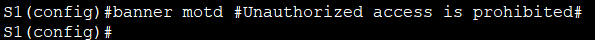      

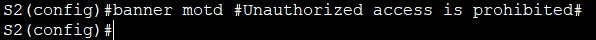      

#### &nbsp;&nbsp;&nbsp;&nbsp;h.	Сохраните текущую конфигурацию в файл загрузочной конфигурации.    
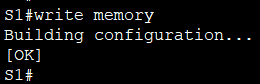      

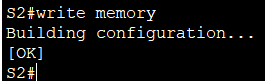     

## **Часть 2. Настройка и проверка базовой работы протокола OSPFv2 для одной области**     
### **Шаг 1. Настройте адреса интерфейса и базового OSPFv2 на каждом маршрутизаторе.**     
#### &nbsp;&nbsp;&nbsp;&nbsp;a.	Настройте адреса интерфейсов на каждом маршрутизаторе, как показано в таблице адресации выше.      
 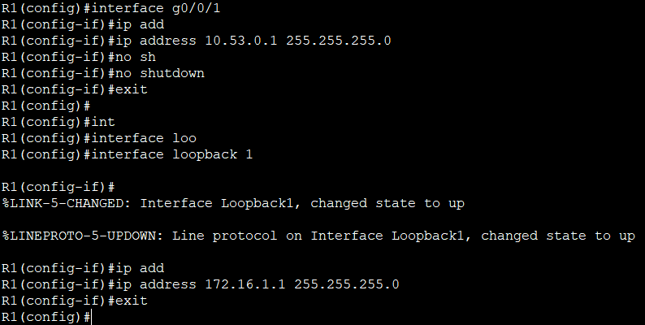        

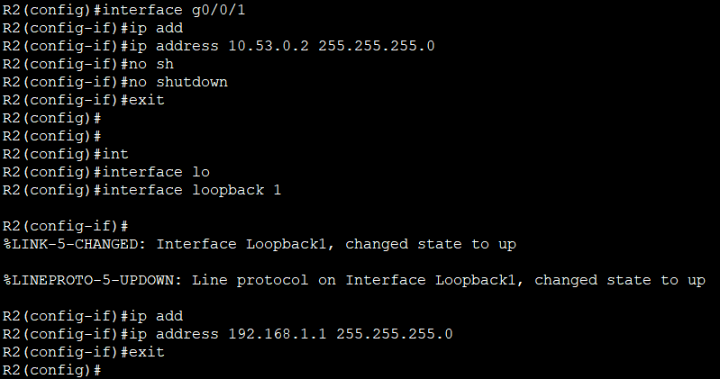     

#### &nbsp;&nbsp;&nbsp;&nbsp;b.	Перейдите в режим конфигурации маршрутизатора OSPF, используя идентификатор процесса 56.     
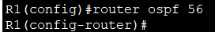    

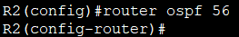     

#### &nbsp;&nbsp;&nbsp;&nbsp;c.	Настройте статический идентификатор маршрутизатора для каждого маршрутизатора (1.1.1.1 для R1, 2.2.2.2 для R2).      
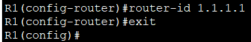     

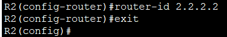     

#### &nbsp;&nbsp;&nbsp;&nbsp;d.	Настройте инструкцию сети для сети между R1 и R2, поместив ее в область 0.     
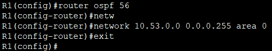    

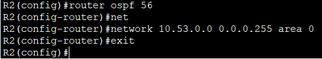     

#### &nbsp;&nbsp;&nbsp;&nbsp;e.	Только на R2 добавьте конфигурацию, необходимую для объявления сети Loopback 1 в область OSPF 0.       
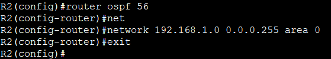      

#### &nbsp;&nbsp;&nbsp;&nbsp;f.	Убедитесь, что OSPFv2 работает между маршрутизаторами. Выполните команду, чтобы убедиться, что R1 и R2 сформировали смежность. Какой маршрутизатор является DR? Какой маршрутизатор является BDR? Каковы критерии отбора?     
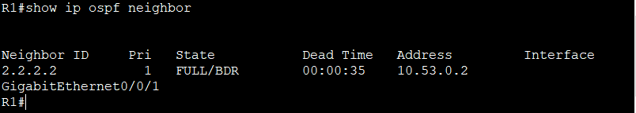    

#### Ответ на вопрос: 
#### Приоритеты интерфейсов G0/0/1 на обоих маршрутизаторах равны 1.
#### Так как приоритеты одинаковы, DR становится маршрутизатор с наибольшим Router ID – R2 (2.2.2.2), а BDR – R1 (1.1.1.1).     

#### &nbsp;&nbsp;&nbsp;&nbsp;g.	На R1 выполните команду show ip route ospf, чтобы убедиться, что сеть R2 Loopback1 присутствует в таблице маршрутизации. Обратите внимание, что поведение OSPF по умолчанию заключается в объявлении интерфейса обратной связи в качестве маршрута узла с использованием 32-битной маски.    
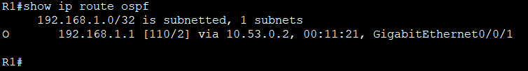      

#### &nbsp;&nbsp;&nbsp;&nbsp;h.	Запустите Ping до  адреса интерфейса R2 Loopback 1 из R1. Выполнение команды ping должно быть успешным.     
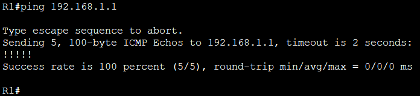     

