# **Настройка и проверка расширенных списков контроля доступа.**       
## **Топология**      
  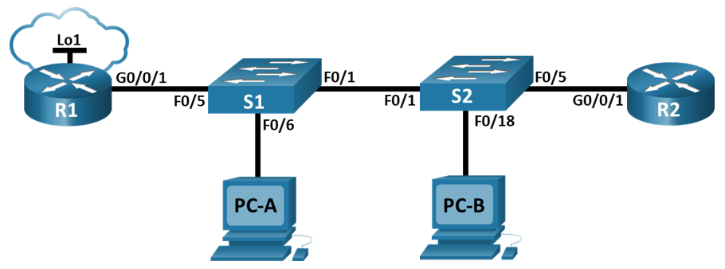      

## **Таблица адресации**    
 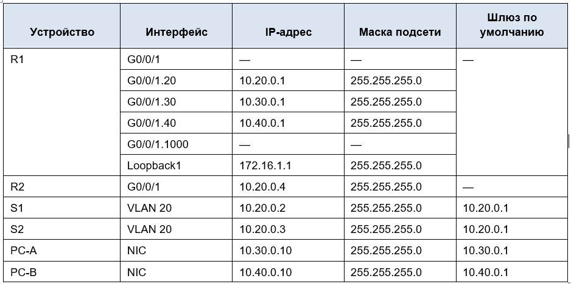        

## **Таблица VLAN**      
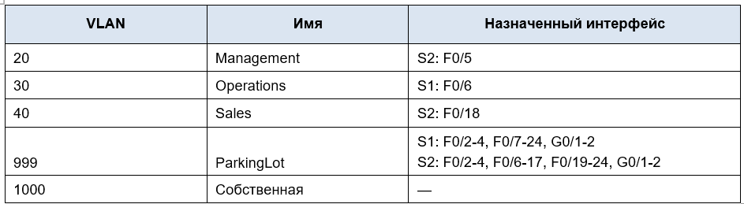      

## **Задачи**    
## **Часть 1. Создание сети и настройка основных параметров устройства**    
## **Часть 2. Настройка и проверка списков расширенного контроля доступа**     

## **Часть 1. Создание сети и настройка основных параметров устройства**      
### **Шаг 1. Создайте сеть согласно топологии.**      
#### Подключите устройства, как показано в топологии, и подсоедините необходимые кабели.    
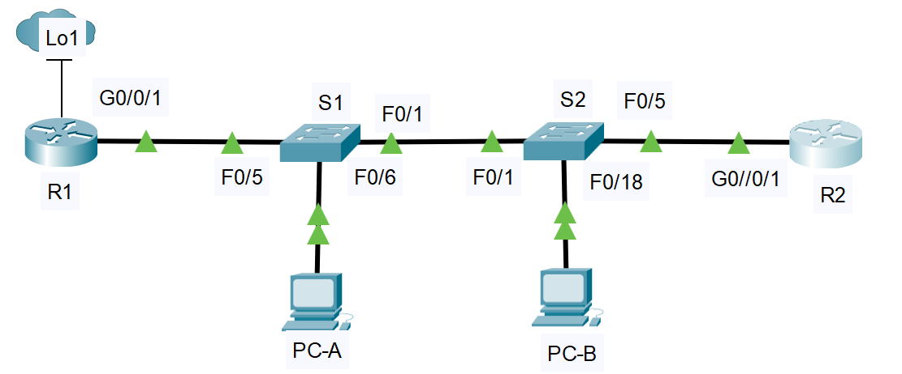      

### **Шаг 2. Произведите базовую настройку маршрутизаторов.**     
#### &nbsp;&nbsp;&nbsp;&nbsp;a.	Назначьте маршрутизатору имя устройства.     
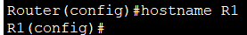     

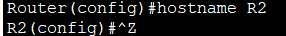     

#### &nbsp;&nbsp;&nbsp;&nbsp;b.	Отключите поиск DNS, чтобы предотвратить попытки маршрутизатора неверно преобразовывать введенные команды таким образом, как будто они являются именами узлов.      
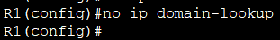     

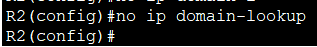    

#### &nbsp;&nbsp;&nbsp;&nbsp;c.	Назначьте **class** в качестве зашифрованного пароля привилегированного режима EXEC.    
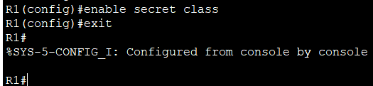    

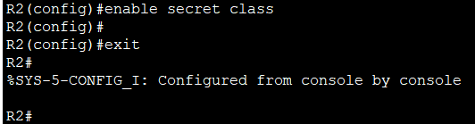     

#### &nbsp;&nbsp;&nbsp;&nbsp;d.	Назначьте **cisco** в качестве пароля консоли и включите вход в систему по паролю.      
  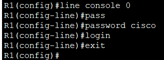    

  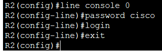    

#### &nbsp;&nbsp;&nbsp;&nbsp;e.	Назначьте **cisco** в качестве пароля VTY и включите вход в систему по паролю        
   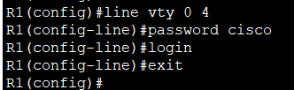     

   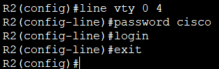     

#### &nbsp;&nbsp;&nbsp;&nbsp;  f. Зашифруйте открытые пароли.      
 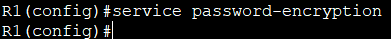     

 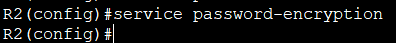    

#### &nbsp;&nbsp;&nbsp;&nbsp;g.	Создайте баннер с предупреждением о запрете несанкционированного доступа к устройству.     
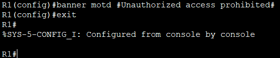      

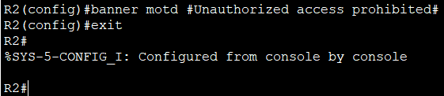    

#### &nbsp;&nbsp;&nbsp;&nbsp;h.	Сохраните текущую конфигурацию в файл загрузочной конфигурации.    
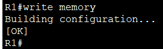    

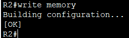    

### **Шаг 3. Настройте базовые параметры каждого коммутатора.**      
#### &nbsp;&nbsp;&nbsp;&nbsp;a.	Присвойте коммутатору имя устройства.     
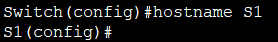     

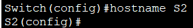     

#### b.	Отключите поиск DNS, чтобы предотвратить попытки маршрутизатора неверно преобразовывать введенные команды таким образом, как будто они являются именами узлов.     
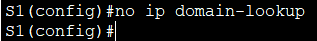     

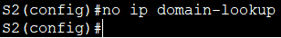    

#### &nbsp;&nbsp;&nbsp;&nbsp;c.	Назначьте **class** в качестве зашифрованного пароля привилегированного режима EXEC.     
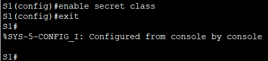    

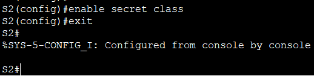     

#### &nbsp;&nbsp;&nbsp;&nbsp;d.	Назначьте cisco в качестве пароля консоли и включите вход в систему по паролю.      
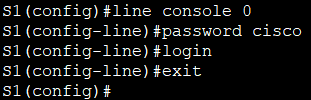     

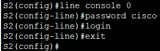     

#### &nbsp;&nbsp;&nbsp;&nbsp;e.	Назначьте **cisco** в качестве пароля VTY и включите вход в систему по паролю.     
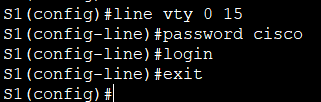     

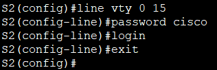    

#### &nbsp;&nbsp;&nbsp;&nbsp;f.	Зашифруйте открытые пароли.      
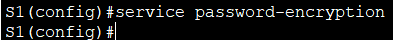     

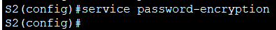    

#### &nbsp;&nbsp;&nbsp;&nbsp;g.	Создайте баннер с предупреждением о запрете несанкционированного доступа к устройству.      
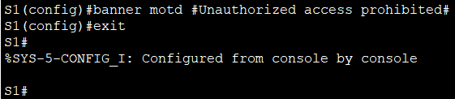     

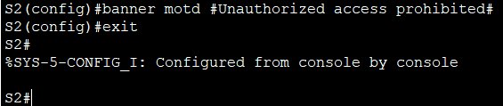     

#### &nbsp;&nbsp;&nbsp;&nbsp;h.	Сохраните текущую конфигурацию в файл загрузочной конфигурации.     
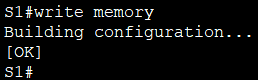      

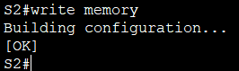     

## **Часть 2. Настройка сетей VLAN на коммутаторах.**     
### **Шаг 1. Создайте сети VLAN на коммутаторах.**     
#### &nbsp;&nbsp;&nbsp;&nbsp;a.	Создайте необходимые VLAN и назовите их на каждом коммутаторе из приведенной выше таблицы.     
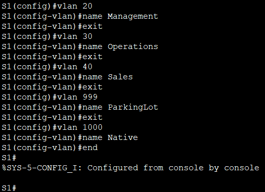     

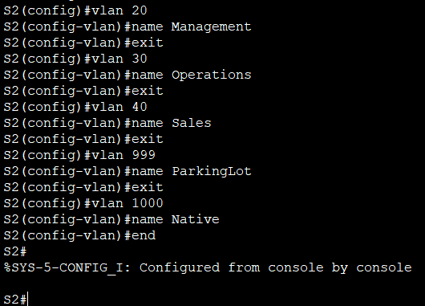     

#### &nbsp;&nbsp;&nbsp;&nbsp;b.	Настройте интерфейс управления и шлюз по умолчанию на каждом коммутаторе, используя информацию об IP-адресе в таблице адресации.      
#### В таблице адресации указано, что для управления выделена VLAN 20 (Management) со следующими адресами:       
#### - S1: IP 10.20.0.2/24, шлюз по умолчанию 10.20.0.1   
#### - S2: IP 10.20.0.3/24, шлюз по умолчанию 10.20.0.1     
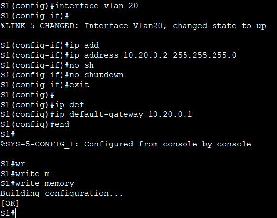     

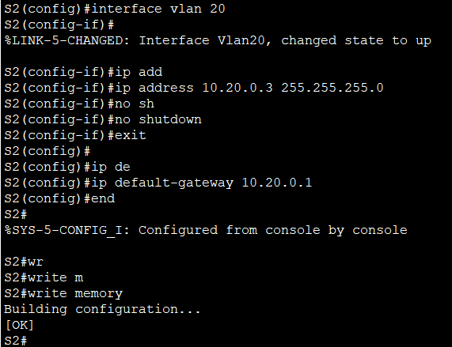     

#### &nbsp;&nbsp;&nbsp;&nbsp;c.	Назначьте все неиспользуемые порты коммутатора VLAN Parking Lot, настройте их для статического режима доступа и административно деактивируйте их.      
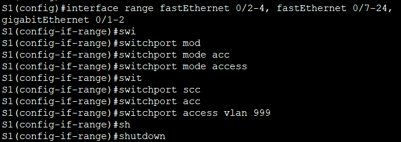     

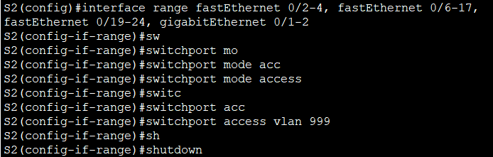     

### **Шаг 2. Назначьте сети VLAN соответствующим интерфейсам коммутатора**     
#### &nbsp;&nbsp;&nbsp;&nbsp;    a.	Назначьте используемые порты соответствующей VLAN (указанной в таблице VLAN выше) и настройте их для режима статического доступа.      
  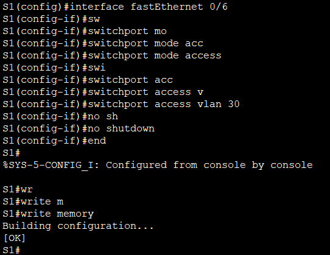      

  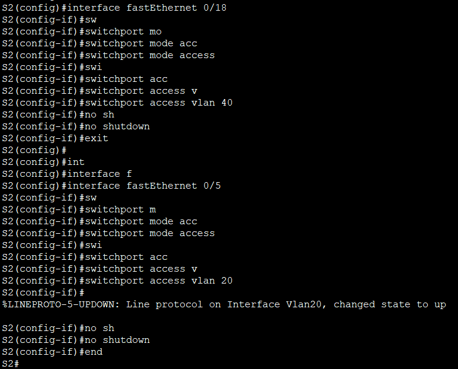     

#### &nbsp;&nbsp;&nbsp;&nbsp;b.	Выполните команду **show vlan brief**, чтобы убедиться, что сети VLAN назначены правильным интерфейсам.       
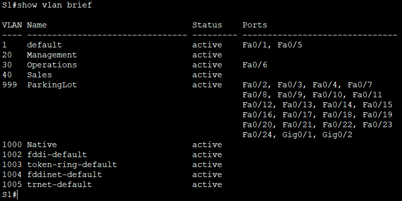     

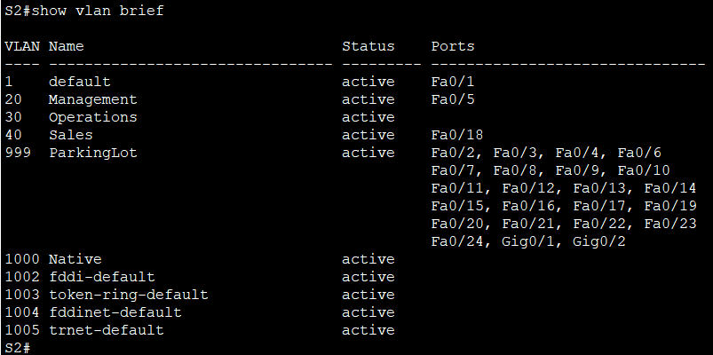     

## **Часть 3.Настройте транки (магистральные каналы).      
### **Шаг 1. Вручную настройте магистральный интерфейс F0/1.**       
#### &nbsp;&nbsp;&nbsp;&nbsp;a.	Измените режим порта коммутатора на интерфейсе F0/1, чтобы принудительно создать магистральную связь. Не забудьте сделать это на обоих коммутаторах.      
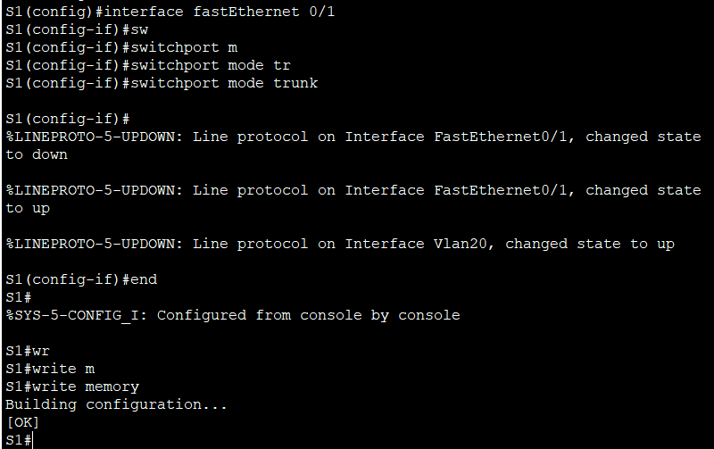     

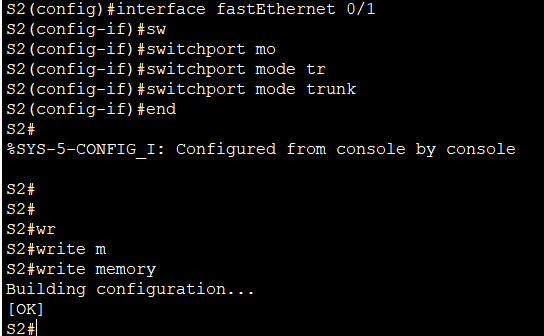     

#### &nbsp;&nbsp;&nbsp;&nbsp;b.	В рамках конфигурации транка установите для native vlan значение 1000 на обоих коммутаторах. При настройке двух интерфейсов для разных собственных VLAN сообщения об ошибках могут отображаться временно.       
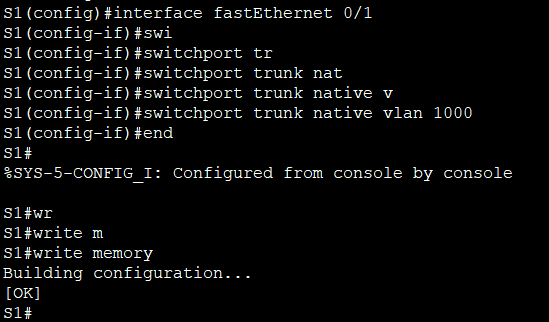     

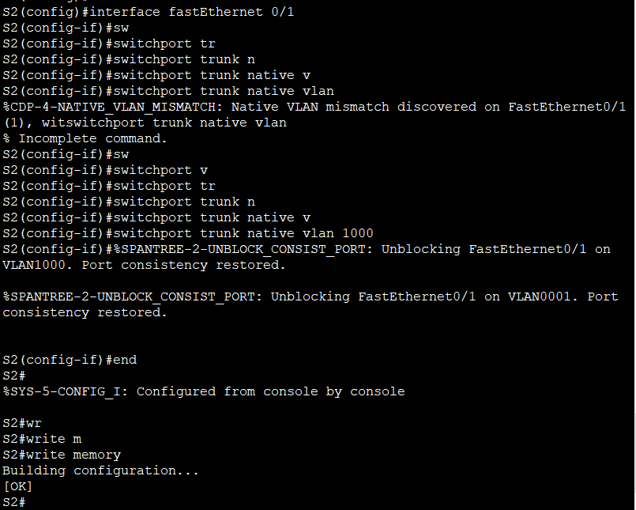      

#### &nbsp;&nbsp;&nbsp;&nbsp;c.	В качестве другой части конфигурации транка укажите, что VLAN 20, 30, 40 и 1000 разрешены в транке.       
     

      

#### &nbsp;&nbsp;&nbsp;&nbsp;d.	Выполните команду **show interfaces trunk** для проверки портов магистрали, собственной VLAN и разрешенных VLAN через магистраль.       
     

     

### **Шаг 2. Вручную настройте магистральный интерфейс F0/5 на коммутаторе S1.**     
#### &nbsp;&nbsp;&nbsp;&nbsp;a.	Настройте интерфейс S1 F0/5 с теми же параметрами транка, что и F0/1. Это транк до маршрутизатора.     
     

#### &nbsp;&nbsp;&nbsp;&nbsp;b.	Сохраните текущую конфигурацию в файл загрузочной конфигурации.    
        

#### &nbsp;&nbsp;&nbsp;&nbsp;c.	Используйте команду show interfaces trunk для проверки настроек транка.    
     

## **Часть 4. Настройте маршрутизацию.**     
### **Шаг 1. Настройка маршрутизации между сетями VLAN на R1.**      
#### &nbsp;&nbsp;&nbsp;&nbsp;a.	Активируйте интерфейс G0/0/1 на маршрутизаторе.      
     

#### &nbsp;&nbsp;&nbsp;&nbsp;b.	Настройте подинтерфейсы для каждой VLAN, как указано в таблице IP-адресации. Все подинтерфейсы используют инкапсуляцию 802.1Q. Убедитесь, что подинтерфейс для собственной VLAN не имеет назначенного IP-адреса. Включите описание для каждого подинтерфейса.     

#### Создаем подинтерфейс для VLAN 20 (Management):      
      

#### Создаем подинтерфейс для VLAN 30 (Operations):     
      

#### Создаем подинтерфейс для VLAN 40 (Sales):    
     

#### Создаем подинтерфейс для native VLAN 1000 (без IP-адреса):       
     

#### &nbsp;&nbsp;&nbsp;&nbsp;c.	Настройте интерфейс Loopback 1 на R1 с адресацией из приведенной выше таблицы.       
     

#### &nbsp;&nbsp;&nbsp;&nbsp;d.	С помощью команды show ip interface brief проверьте конфигурацию подынтерфейса.    
     

### **Шаг 2. Настройка интерфейса R2 g0/0/1 с использованием адреса из таблицы и маршрута по умолчанию с адресом следующего перехода 10.20.0.1**     
#### Назначаем IP-адрес на интерфейсе G0/0/1 и активируем его:     
     

#### Настроим маршрут по умолчанию в сторону R1:     
      

## **Часть 5. Настройте удаленный доступ**      
### **Шаг 1. Настройте все сетевые устройства для базовой поддержки SSH.**     
#### &nbsp;&nbsp;&nbsp;&nbsp;a.	Создайте локального пользователя с именем пользователя SSHadmin и зашифрованным паролем $cisco123!        
     

    

     

     

#### &nbsp;&nbsp;&nbsp;&nbsp;b.	Используйте ccna-lab.com в качестве доменного имени     
    

    

     

    

#### &nbsp;&nbsp;&nbsp;&nbsp;c.	Генерируйте криптоключи с помощью 1024 битного модуля.     
    

    

    

     

#### &nbsp;&nbsp;&nbsp;&nbsp;d.	Настройте первые пять линий VTY на каждом устройстве, чтобы поддерживать только SSH-соединения и с локальной аутентификацией.     
      

     

    

    

### **Шаг 2. Включите защищенные веб-службы с проверкой подлинности на R1.**    
#### &nbsp;&nbsp;&nbsp;&nbsp;a.	Включите сервер HTTPS на R1.     
#### В Cisco Packet Tracer HTTPS недоступен, пропускаем этот шаг.
    

#### &nbsp;&nbsp;&nbsp;&nbsp;b.	Настройте R1 для проверки подлинности пользователей, пытающихся подключиться к веб-серверу.     
#### Команда ip http authentication local также не поддерживается в Packet Tracer, этот шаг тоже пропускаем.
    

## **Часть 6. Проверка подключения**      
### **Шаг 1. Настройте узлы ПК.**        
#### Адреса ПК указаны в таблице адресации.
      

     

### **Шаг 2. Выполните следующие тесты. Эхозапрос должен пройти успешно.**     
    

#### PC-A → PC-B (ping 10.40.0.10)
    

#### PC-A → R1 Management (ping 10.20.0.1)      
     

#### PC-B → PC-A (ping 10.30.0.10)       
      

####  PC-B → R1 Management (ping 10.20.0.1)        
     

#### PC-B → Loopback 1 R1 (ping 172.16.1.1)     
     

####  PC-B → R1 Management по HTTPS (https://10.20.0.1)   
#### В Cisco Packet Tracer HTTPS не поддерживается (будем отслеживать счётчики ACL для подтверждения работы правил.)  
    

#### PC-B → Loopback 1 по HTTPS (https://172.16.1.1)    
    
#### В Cisco Packet Tracer HTTPS не поддерживается (будем отслеживать счётчики ACL для подтверждения работы правил.)

#### PC-B → R1 Management по SSH (SSH к 10.20.0.4)  
      

####  PC-B → Loopback 1 по SSH (SSH к 172.16.1.1)     
    

## **Часть 7. Настройка и проверка списков контроля доступа (ACL)**    
#### При проверке базового подключения компания требует реализации следующих политик безопасности:    
#### **Политика1.** Сеть Sales не может использовать SSH в сети Management (но в  другие сети SSH разрешен).     
#### **Политика 2.** Сеть Sales не имеет доступа к IP-адресам в сети Management с помощью любого веб-протокола (HTTP/HTTPS). Сеть Sales также не имеет доступа к интерфейсам R1 с помощью любого веб-протокола. Разрешён весь другой веб-трафик (обратите внимание — Сеть Sales  может получить доступ к интерфейсу Loopback 1 на R1).      
#### **Политика3.** Сеть Sales не может отправлять эхо-запросы ICMP в сети Operations или Management. Разрешены эхо-запросы ICMP к другим адресатам.     
#### **Политика 4**. Cеть Operations  не может отправлять ICMP эхозапросы в сеть Sales. Разрешены эхо-запросы ICMP к другим адресатам.       

### **Шаг 1. Анализ требований политик безопасности**    
#### Что нужно запретить:
|Полтитика|Источник|Назначение |Протокол/порты |Действие|
|:---|---|---|---|----:| 
|1|Сеть Sales (10.40.0.0/24)|Сеть Management (10.20.0.0/24) |TCP порт 22 (SSH)  |Запрет |
|2|Сеть Sales  |Сеть Management (10.20.0.0/24)   |TCP порты 80, 443 (HTTP/HTTPS)   |Запрет   |     
|2|Сеть Sales| Интерфейсы R1: 10.30.0.1 и 10.40.0.1  | TCP порты 80, 443  |Запрет  |   
|2(искл)| Сеть Sales |Loopback1 R1 (172.16.1.1)   |TCP 80, 443   |Разрешён   |
|3|Сеть Sales  |Сеть Management и Operations   |ICMP echo-request (ping)   |Запрет   | 
|4|Сеть Operations (10.30.0.0/24)  |Сеть Sales (10.40.0.0/24)   |ICMP echo-request   |Запрет   | 

#### Трафик из Sales – фильтровать на входе субинтерфейса G0/0/1.40 (VLAN 40).     
#### Трафик из Operations – фильтровать на входе субинтерфейса G0/0/1.30 (VLAN 30).   
#### Cначала все запреты, затем в конце – разрешить всё остальное, чтобы случайно не заблокировать нужный трафик.      

### **Шаг 2. Создание и применение расширенных ACL**   
#### 2.1. Создание ACL для трафика из Sales   
     

#### 2.2. Создание ACL для трафика из Operations      
       

#### 2.3. Применяем ACL на интерфейсы     
        

   

 