# **Настройка NAT для IPv4**     
## **Топология**    
     
## **Таблица адресации**     
     
## **Цели**       
## **Часть 1. Создание сети и настройка основных параметров устройства**       
## **Часть 2. Настройка и проверка NAT для IPv4**        
## **Часть 3. Настройка и проверка PAT для IPv4**      
## **Часть 4. Настройка и проверка статического NAT для IPv4.**      

## **Часть 1. Создание сети и настройка основных параметров устройства**     
### **Шаг 1. Подключите кабели сети согласно приведенной топологии.**       
#### Подключите устройства в соответствии с топологией и подсоедините соответствующие кабели.        
        

### **Шаг 2. Произведите базовую настройку маршрутизаторов.**    
#### &nbsp;&nbsp;&nbsp;&nbsp;a.	Назначьте маршрутизатору имя устройства.      
     

     

#### &nbsp;&nbsp;&nbsp;&nbsp; b.	Отключите поиск DNS, чтобы предотвратить попытки маршрутизатора неверно преобразовывать введенные команды таким образом, как будто они являются именами узлов.       
     

    

#### &nbsp;&nbsp;&nbsp;&nbsp; c.	Назначьте **class** в качестве зашифрованного пароля привилегированного режима EXEC.    
     

     

#### &nbsp;&nbsp;&nbsp;&nbsp;d.	Назначьте **cisco** в качестве пароля консоли и включите вход в систему по паролю.     
      

     

#### &nbsp;&nbsp;&nbsp;&nbsp;e.	Назначьте **cisco** в качестве пароля VTY и включите вход в систему по паролю.     
     

     

#### &nbsp;&nbsp;&nbsp;&nbsp;f.	Зашифруйте открытые пароли.     
     

    

#### &nbsp;&nbsp;&nbsp;&nbsp;g.	Создайте баннер с предупреждением о запрете несанкционированного доступа к устройству.    
    

    

#### &nbsp;&nbsp;&nbsp;&nbsp;h.	Настройте IP-адресации интерфейса, как указано в таблице выше.    
       

     

#### &nbsp;&nbsp;&nbsp;&nbsp;i.	Настройте маршрут по умолчанию. от R2 до  R1.     
#### В тексте лабораторной работы опечатка. Согласно разделe «Общие сведения/сценарий» маршрут по умолчанию используется от R1 до R2.  
#### Кроме того, в таблице адресации и топологии R1 – это шлюз компании, а R2 – маршрутизатор провайдера (ISP). Для того чтобы внутренние хосты (PC-A, PC-B, коммутаторы) могли выходить в Интернет (в данном случае – к loopback-интерфейсу R2), на R1 должен быть настроен маршрут по умолчанию, направляющий весь трафик к R2.   
#### Поэтому считаю целесообразным настроить маршрут по умолчанию от R1 к R2.
      

#### &nbsp;&nbsp;&nbsp;&nbsp;j.	Сохраните текущую конфигурацию в файл загрузочной конфигурации.  
    

    

### **Шаг 3. Настройте базовые параметры каждого коммутатора.**    
#### &nbsp;&nbsp;&nbsp;&nbsp;a.	Присвойте коммутатору имя устройства.     
     

    

#### &nbsp;&nbsp;&nbsp;&nbsp;b.	Отключите поиск DNS, чтобы предотвратить попытки маршрутизатора неверно преобразовывать введенные команды таким образом, как будто они являются именами узлов.     
     

      

#### &nbsp;&nbsp;&nbsp;&nbsp;c.	Назначьте **class** в качестве зашифрованного пароля привилегированного режима EXEC.    
     

     

#### d.	Назначьте **cisco** в качестве пароля консоли и включите вход в систему по паролю.     
     

    

#### &nbsp;&nbsp;&nbsp;&nbsp;e.	Назначьте cisco в качестве пароля VTY и включите вход в систему по паролю.     
     

     

#### &nbsp;&nbsp;&nbsp;&nbsp;f.	Зашифруйте открытые пароли.     
     

    

#### &nbsp;&nbsp;&nbsp;&nbsp;g.	Создайте баннер с предупреждением о запрете несанкционированного доступа к устройству.     
     

    

#### &nbsp;&nbsp;&nbsp;&nbsp;h.	Выключите все интерфейсы, которые не будут использоваться. 
#### На S1:    
  

      

#### На S2:    
    

     

#### &nbsp;&nbsp;&nbsp;&nbsp;i.	Настройте IP-адресации интерфейса, как указано в таблице выше.   
#### Для удалённого доступа к коммутаторам из других подсетей (например, с ПК) необходимо настроить шлюз по умолчанию – в данной сети это адрес R1 (192.168.1.1)  

     

      

#### &nbsp;&nbsp;&nbsp;&nbsp;j.	Сохраните текущую конфигурацию в файл загрузочной конфигурации.   
     

     

## **Часть 2. Настройка и проверка NAT для IPv4.**      
### **Шаг 1. Настройте NAT на R1, используя пул из трех адресов 209.165.200.226-209.165.200.228.**    
#### &nbsp;&nbsp;&nbsp;&nbsp;a.	Настройте простой список доступа, который определяет, какие хосты будут разрешены для трансляции. В этом случае все устройства в локальной сети R1 имеют право на трансляцию.     
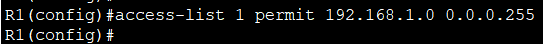         

#### &nbsp;&nbsp;&nbsp;&nbsp;b.	Создайте пул NAT и укажите ему имя и диапазон используемых адресов.     
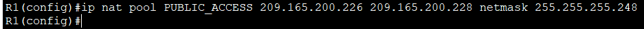      

#### &nbsp;&nbsp;&nbsp;&nbsp;c.	Настройте перевод, связывая ACL и пул с процессом преобразования.   
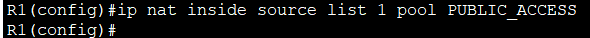     

#### &nbsp;&nbsp;&nbsp;&nbsp;d.	Задайте внутренний (inside) интерфейс.     
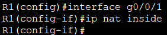     

#### &nbsp;&nbsp;&nbsp;&nbsp;e.	Определите внешний (outside) интерфейс.       
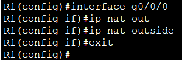      

### **Шаг 2. Проверьте конфигурацию.**       
#### &nbsp;&nbsp;&nbsp;&nbsp;a.	С PC-B,  запустите эхо-запрос интерфейса Lo1 (209.165.200.1) на R2. Если эхо-запрос не прошел, выполните процес поиска и устранения неполадок. На R1 отобразите таблицу NAT на R1 с помощью команды **show ip nat translations**.      
#### 1. Проверка NAT с PC-B      
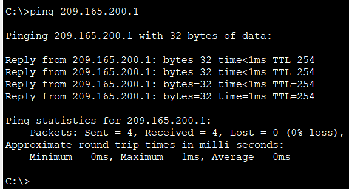    

#### 2. Просмотр таблицы трансляций NAT на R1  
 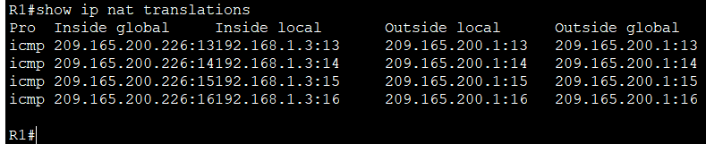     

#### **Во что был транслирован внутренний локальный адрес PC-B?**      
#### Ответ: Внутренний локальный адрес 192.168.1.3 был транслирован в 209.165.200.226 (первый доступный адрес из пула PUBLIC_ACCESS).    

#### **Какой тип адреса NAT является переведенным адресом?**    
#### Ответ: Переведённый адрес – это **Inside Global** (внутренний глобальный), который используется для представления хоста во внешней сети Интернет.      

#### &nbsp;&nbsp;&nbsp;&nbsp;b.	С PC-A, запустите  эхо-запрос интерфейса Lo1 (209.165.200.1) на R2. Если эхо-запрос не прошел, выполните отладку. На R1 отобразите таблицу NAT на R1 с помощью команды **show ip nat translations**.     
#### 1. Запуск эхо-запроса с PC-A      
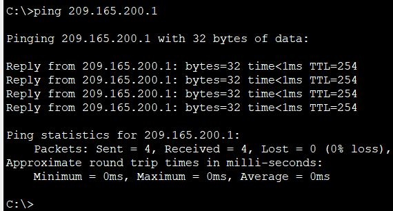      

#### 2. Просмотр таблицы трансляций NAT на R1     
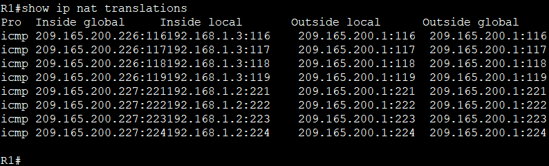         

#### &nbsp;&nbsp;&nbsp;&nbsp;c.	Обратите внимание, что предыдущая трансляция для PC-B все еще находится в таблице. Из S1, эхо-запрос интерфейса Lo1 (209.165.200.1) на R2. Если эхо-запрос не прошел, выполните отладку. На R1 отобразите таблицу NAT на R1 с помощью команды show ip nat translations.   
#### 1.  Запуск эхо-запроса с S1   
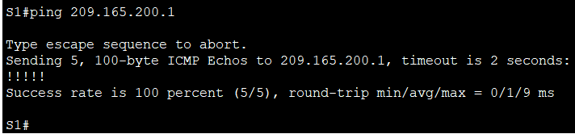     

#### 2. Просмотр таблицы NAT на R1   
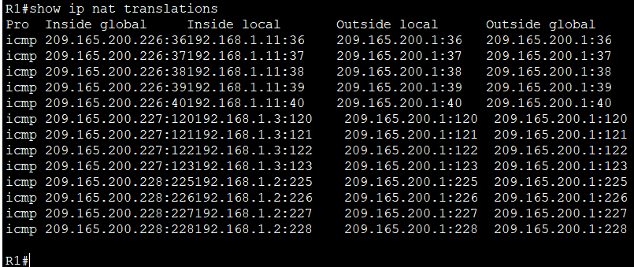     

#### &nbsp;&nbsp;&nbsp;&nbsp;d.	Теперь запускаем пинг R2 Lo1 из S2. На этот раз перевод завершается неудачей, и вы получаете эти сообщения (или аналогичные) на консоли R1:     
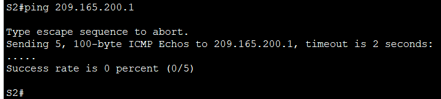    

#### В Packet Tracer сообщения %NAT-6-ADDR_ALLOC_FAILURE не отображаются на консоли R2.     
#### Однако это не означает, что NAT не работает.     
#### 1. Проверяем, что все три адреса пула заняты 
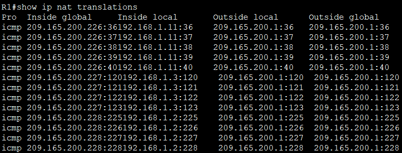       

#### 2. Запускаем пинг с S2 и сразу проверяем таблицу NAT    
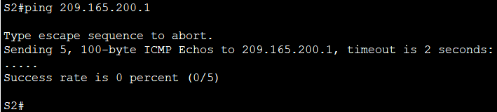     

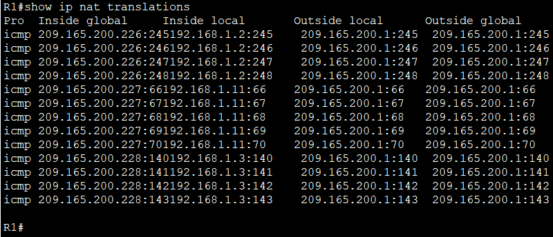     

#### В таблице нет записи для внутреннего локального адреса 192.168.1.12, значит трансляция не состоялась, и это подтверждает исчерпание пула.      

#### &nbsp;&nbsp;&nbsp;&nbsp;e.	Это ожидаемый результат, потому что выделено только 3 адреса, и мы попытались ping Lo1 с четырех устройств. Напомним, что NAT — это трансляция «один-в-один». Как много выделено трансляций? Введите команду show ip nat translations verbose , и вы увидите, что ответ будет 24 часа.      
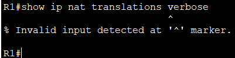    

#### В Packet Tracer команда **show ip nat translations verbose** не поддерживается, поэтому просто принимаем к сведению, что таймаут составляет 24 часа      
#### Вопрос: **Как много выделено трансляций?**     
####  Ответ: В пуле доступно 3 адреса (209.165.200.226–228).Таймаут 24 часа. Это означает, что после того как хост перестал передавать трафик, его трансляция будет храниться в таблице ещё сутки, прежде чем освободится адрес для нового хоста.     

#### &nbsp;&nbsp;&nbsp;&nbsp;f.	Учитывая, что пул ограничен тремя адресами, NAT для пула адресов недостаточно для нашего приложения. Очистите преобразование NAT и статистику, и мы перейдем к PAT.    
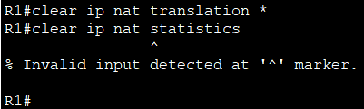     

#### В Packet Tracer команда **clear ip nat statistics** не поддерживается. Просто пропускаем. 
#### Проверяем, что таблица NAT пуста:    
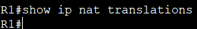     

## **Часть 3. Настройка и проверка PAT для IPv4.**       
### **Шаг 1. Удалите команду преобразования на R1.**       
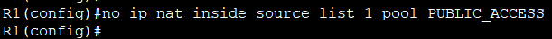     

### **Шаг 2. Добавьте команду PAT на R1.**      
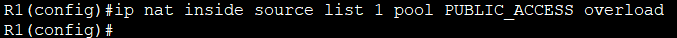      

### **Шаг 3. Протестируйте и проверьте конфигурацию.**      
#### &nbsp;&nbsp;&nbsp;&nbsp;a.	Давайте проверим, что PAT работает. С PC-B,  запустите эхо-запрос интерфейса Lo1 (209.165.200.1) на R2. Если эхо-запрос не прошел, выполните отладку. На R1 отобразите таблицу NAT на R1 с помощью команды show ip nat translations.     
#### 1. Запускаем эхо-запрос с PC-B      
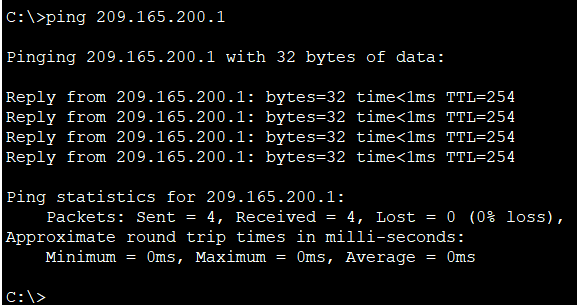      

#### 2. Посмотрим таблицу NAT на R1        
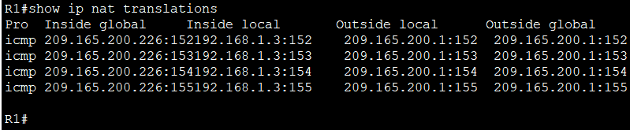     

#### **Вопрос 1: Во что был транслирован внутренний локальный адрес PC-B?**     
#### Ответ: В 209.165.200.226 (тот же адрес, что и при NAT, но теперь с перегрузкой по портам).    

#### **Вопрос 2: Какой тип адреса NAT является переведённым адресом?**      
#### Ответ: Это Inside Global – глобальный адрес, который видит внешняя сеть.     

#### **Вопрос 3: Чем отличаются выходные данные **show ip nat translations** от упражнения NAT?**        
#### Ответ:    
#### - В NAT каждая трансляция занимала уникальный глобальный адрес для каждого хоста, и были записи без портов (с таймаутом 24 часа).       
#### - В PAT все хосты используют один и тот же глобальный адрес, различаясь по портам, и записи содержат протокол (например, icmp) и номера портов. Таймаут таких записей – около 1 минуты.     

#### &nbsp;&nbsp;&nbsp;&nbsp;b.	С PC-A, запустите эхо-запрос интерфейса Lo1 (209.165.200.1) на R2. Если эхо-запрос не прошел, выполните отладку. На R1 отобразите таблицу NAT на R1 с помощью команды show ip nat translations.      
#### 1. Запускаем эхо-запрос с PC-A      
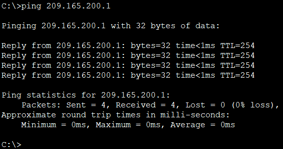     

#### 2. Посмотрим таблицу NAT на R1      
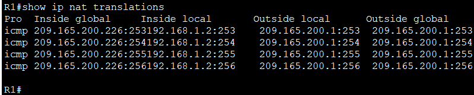      

#### Обратите внимание, что есть только одна трансляция. Отправьте ping еще раз, и быстро вернитесь к маршрутизатору и введите команду show ip nat translations verbose , и вы увидите, что произошло.    
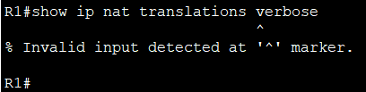      

#### В Packet Tracer команда **show ip nat translations verbose** не поддердивается. Поэтому просто принимаем к сведению данные из методички, что , время ожидания перевода было отменено с 24 часов до 1 минуты.     

#### &nbsp;&nbsp;&nbsp;&nbsp;c.	Генерирует трафик с нескольких устройств для наблюдения PAT. На PC-A и PC-B используйте параметр -t с командой ping, чтобы отправить безостановочный ping на интерфейс Lo1 R2 (ping -t 209.165.200.1), затем вернитесь к R1 и выполните команду show ip nat translations:       
#### 1. Запускаем безостановочные пинги с PC-A и PC-B      
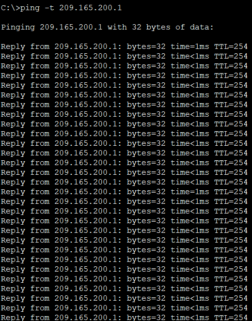      

#### 2. На R1 и выполним команду show ip nat translations     
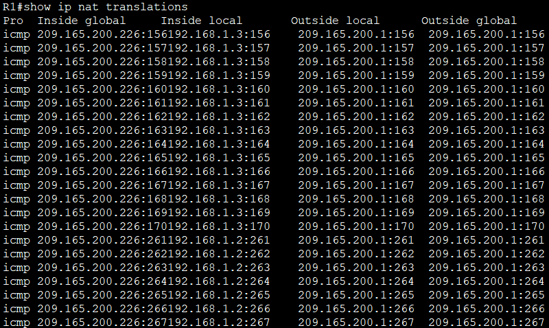     

#### Видим, что внутренний глобальный адрес одинаков для обоих сеансов.      
#### **Вопрос: Как маршрутизатор отслеживает, куда идут ответы?**   
#### Маршрутизатор использует таблицу трансляций NAT. Когда приходит ответный пакет от внешнего хоста, маршрутизатор смотрит на порт назначения (который соответствует внутреннему глобальному порту) и по таблице определяет, какому внутреннему локальному адресу и порту его перенаправить.        

#### &nbsp;&nbsp;&nbsp;&nbsp;d.	PAT в пул является очень эффективным решением для малых и средних организаций. Тем не менее есть неиспользуемые адреса IPv4, задействованные в этом сценарии. Мы перейдем к PAT с перегрузкой интерфейса, чтобы устранить эту трату IPv4 адресов. Остановите ping на PC-A и PC-B с помощью комбинации клавиш Control-C, затем очистите трансляции и статистику:     
#### 1. Остановливаем безостановочные пинги на PC-A и PC-B      
#### 2. Очищаем таблицу трансляций NAT      
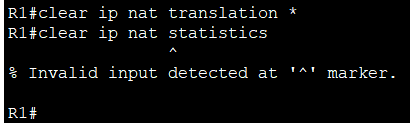     

#### Команда **clear ip nat statistics** не поддерживается. Пропускаем. 
#### Проверяем, что таблица NAT пуста     
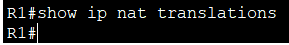      

### **Шаг 4. На R1 удалите команды преобразования nat pool.**      
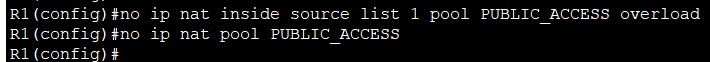     

### **Шаг 5. Добавьте команду PAT overload, указав внешний интерфейс.**       
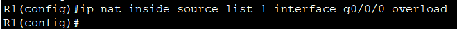      

### **Шаг 6. Протестируйте и проверьте конфигурацию.**      
#### &nbsp;&nbsp;&nbsp;&nbsp;a.	Давайте проверим PAT, чтобы интерфейс работал. С PC-B,  запустите эхо-запрос интерфейса Lo1 (209.165.200.1) на R2. Если эхо-запрос не прошел, выполните отладку. На R1 отобразите таблицу NAT на R1 с помощью команды show ip nat translations.      
#### 1. Запускаем эхо-запрос с PC-B    
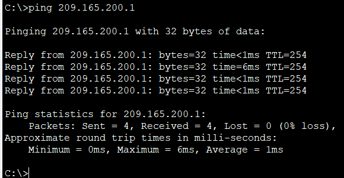     
#### 2. Посмотрим таблицу NAT на R1     
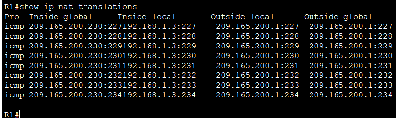      
    
#### &nbsp;&nbsp;&nbsp;&nbsp;b.	Сделайте трафик с нескольких устройств для наблюдения PAT. На PC-A и PC-B используйте параметр -t с командой ping для отправки безостановочного ping на интерфейс Lo1 R2 (ping -t 209.165.200.1). На S1 и S2 выполните привилегированную команду exec ping 209.165.200.1 повторить 2000. Затем вернитесь к R1 и выполните команду show ip nat translations.      
#### 1. Запускаем безостановочные пинги на PC-A и PC-B     
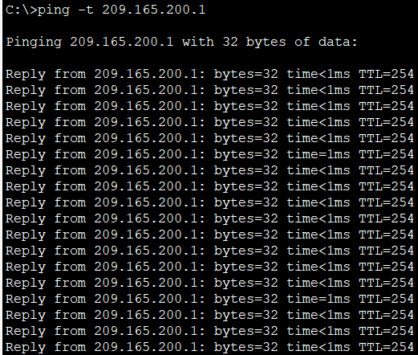     
#### 2.  Запускаем пинги с повторением на S1 и S2       
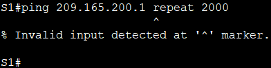     
#### В Packet Tracer команда ping не поддерживает параметр repeat. Несколько раз повторяем обычный пинг.     
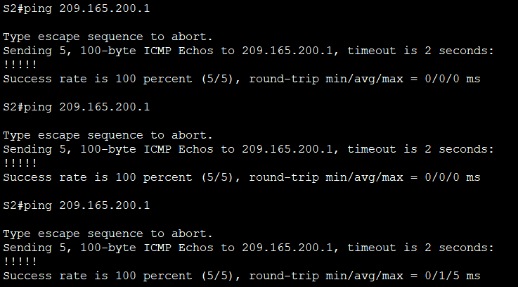    

#### 3. Посмотрим таблицу NAT на R1       
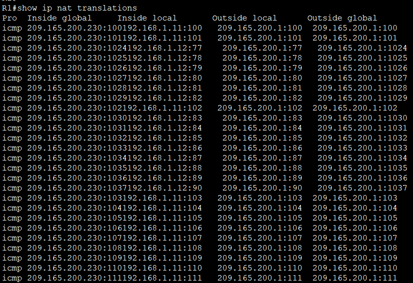    

#### Теперь все внутренние глобальные адреса сопоставляются с IP-адресом интерфейса g0/0/0.    
#### Остановите все пинги. На PC-A и PC-B, используя комбинацию клавиш CTRL-C.     

## **Часть 4. Настройка и проверка статического NAT для IPv4.**    
### **Шаг 1. На R1 очистите текущие трансляции и статистику.**    
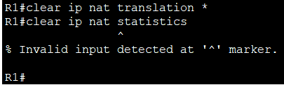     
#### Команда **clear ip nat statistics** не поддерживается. Пропускаем.    
#### Проверяем, что таблица NAT пуста:    
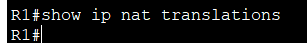    

### **Шаг 2. На R1 настройте команду NAT, необходимую для статического сопоставления внутреннего адреса с внешним адресом.**       
#### Для этого шага настройте статическое сопоставление между 192.168.1.11 и 209.165.200.1 с помощью следующей команды:    
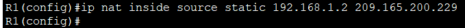     

### **Шаг 3. Протестируйте и проверьте конфигурацию.**     
#### &nbsp;&nbsp;&nbsp;&nbsp;a.	Давайте проверим, что статический NAT работает. На R1 отобразите таблицу NAT на R1 с помощью команды show ip nat translations, и вы увидите статическое сопоставление.    
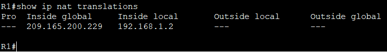     

#### &nbsp;&nbsp;&nbsp;&nbsp;b.	Таблица перевода показывает, что статическое преобразование действует. Проверьте это, запустив ping  с R2 на 209.165.200.229. Плинги должны работать.     
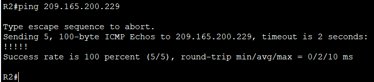     

#### &nbsp;&nbsp;&nbsp;&nbsp;c.	На R1 отобразите таблицу NAT на R1 с помощью команды show ip nat translations, и вы увидите статическое сопоставление и преобразование на уровне порта для входящих pings.      
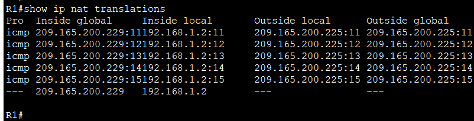     

#### Это подтверждает, что статический NAT работает.      

[Скачать конфиг лабораторной работы №11](https://github.com/nikolaishlyahtin1987-creator/NETWORK-ENGINEER_2026/blob/main/Лабораторные%20работы/Лабораторная%20работа%20№11/ACL.pkt "Нажмите для скачивания файла конфигурации")

  

