# **Настройка NAT для IPv4**     
## **Топология**    
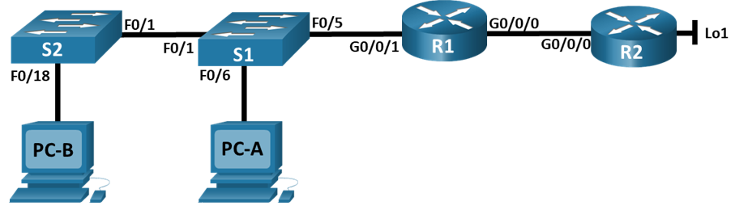     
## **Таблица адресации**     
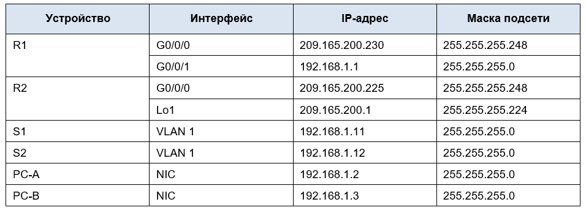     
## **Цели**       
## **Часть 1. Создание сети и настройка основных параметров устройства**       
## **Часть 2. Настройка и проверка NAT для IPv4**        
## **Часть 3. Настройка и проверка PAT для IPv4**      
## **Часть 4. Настройка и проверка статического NAT для IPv4.**      

## **Часть 1. Создание сети и настройка основных параметров устройства**     
### **Шаг 1. Подключите кабели сети согласно приведенной топологии.**       
#### Подключите устройства в соответствии с топологией и подсоедините соответствующие кабели.        
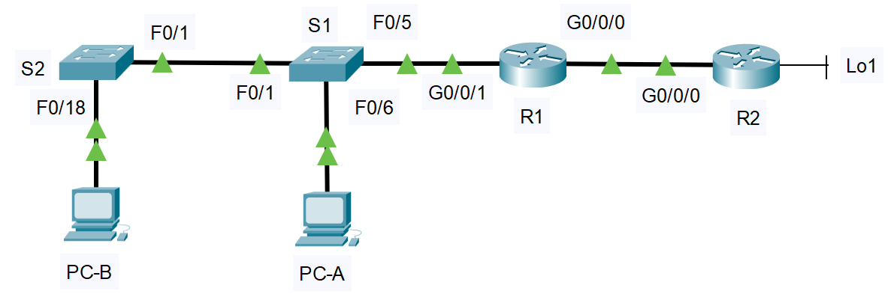        

### **Шаг 2. Произведите базовую настройку маршрутизаторов.**    
#### &nbsp;&nbsp;&nbsp;&nbsp;a.	Назначьте маршрутизатору имя устройства.      
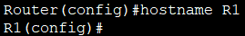     

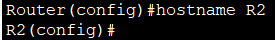     

#### &nbsp;&nbsp;&nbsp;&nbsp; b.	Отключите поиск DNS, чтобы предотвратить попытки маршрутизатора неверно преобразовывать введенные команды таким образом, как будто они являются именами узлов.       
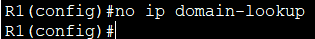     

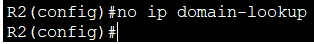    

#### &nbsp;&nbsp;&nbsp;&nbsp; c.	Назначьте **class** в качестве зашифрованного пароля привилегированного режима EXEC.    
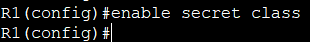     

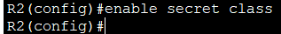     

#### &nbsp;&nbsp;&nbsp;&nbsp;d.	Назначьте **cisco** в качестве пароля консоли и включите вход в систему по паролю.     
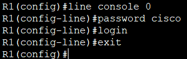      

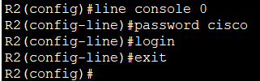     

#### &nbsp;&nbsp;&nbsp;&nbsp;e.	Назначьте **cisco** в качестве пароля VTY и включите вход в систему по паролю.     
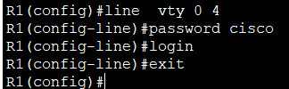     

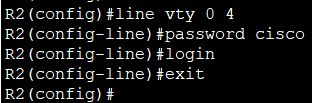     

#### &nbsp;&nbsp;&nbsp;&nbsp;f.	Зашифруйте открытые пароли.     
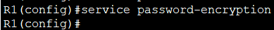     

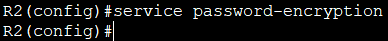    

#### &nbsp;&nbsp;&nbsp;&nbsp;g.	Создайте баннер с предупреждением о запрете несанкционированного доступа к устройству.    
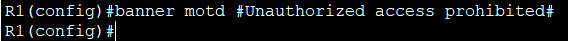    

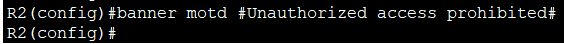    

#### &nbsp;&nbsp;&nbsp;&nbsp;h.	Настройте IP-адресации интерфейса, как указано в таблице выше.    
   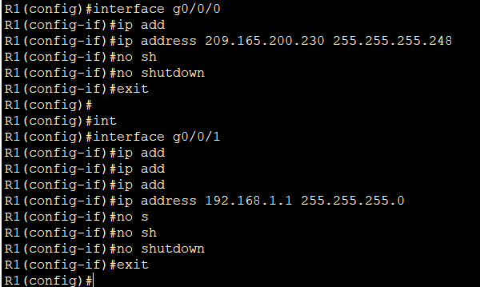    

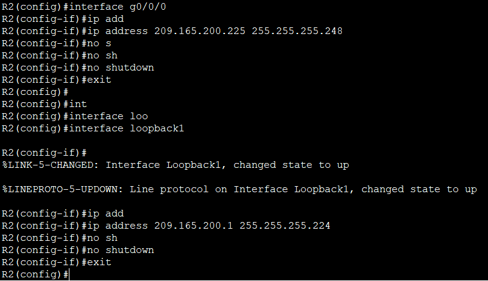     

#### &nbsp;&nbsp;&nbsp;&nbsp;i.	Настройте маршрут по умолчанию. от R2 до  R1.     
#### В тексте лабораторной работы опечатка. Согласно разделe «Общие сведения/сценарий» маршрут по умолчанию используется от R1 до R2.  
#### Кроме того, в таблице адресации и топологии R1 – это шлюз компании, а R2 – маршрутизатор провайдера (ISP). Для того чтобы внутренние хосты (PC-A, PC-B, коммутаторы) могли выходить в Интернет (в данном случае – к loopback-интерфейсу R2), на R1 должен быть настроен маршрут по умолчанию, направляющий весь трафик к R2.   
#### Поэтому считаю целесообразным настроить маршрут по умолчанию от R1 к R2.
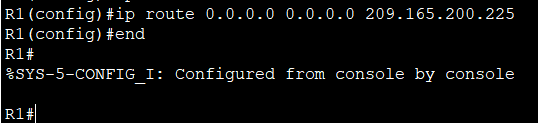      

#### &nbsp;&nbsp;&nbsp;&nbsp;j.	Сохраните текущую конфигурацию в файл загрузочной конфигурации.  
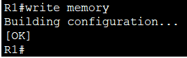    

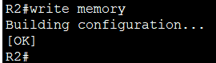    

### **Шаг 3. Настройте базовые параметры каждого коммутатора.**    
#### &nbsp;&nbsp;&nbsp;&nbsp;a.	Присвойте коммутатору имя устройства.     
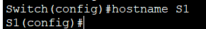     

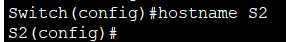    

#### &nbsp;&nbsp;&nbsp;&nbsp;b.	Отключите поиск DNS, чтобы предотвратить попытки маршрутизатора неверно преобразовывать введенные команды таким образом, как будто они являются именами узлов.     
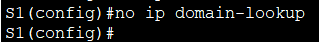     

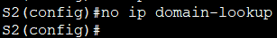      

#### &nbsp;&nbsp;&nbsp;&nbsp;c.	Назначьте **class** в качестве зашифрованного пароля привилегированного режима EXEC.    
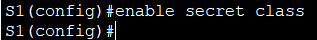     

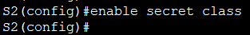     

#### d.	Назначьте **cisco** в качестве пароля консоли и включите вход в систему по паролю.     
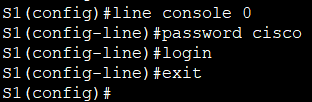     

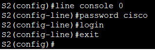    

#### &nbsp;&nbsp;&nbsp;&nbsp;e.	Назначьте cisco в качестве пароля VTY и включите вход в систему по паролю.     
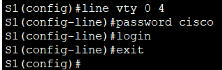     

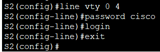     

#### &nbsp;&nbsp;&nbsp;&nbsp;f.	Зашифруйте открытые пароли.     
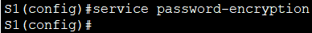     

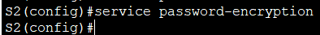    

#### &nbsp;&nbsp;&nbsp;&nbsp;g.	Создайте баннер с предупреждением о запрете несанкционированного доступа к устройству.     
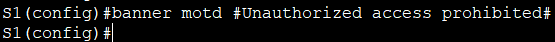     

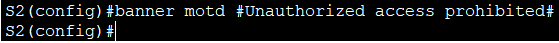    

#### &nbsp;&nbsp;&nbsp;&nbsp;h.	Выключите все интерфейсы, которые не будут использоваться. 
#### На S1:    
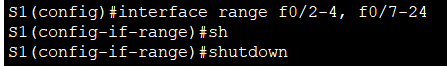  

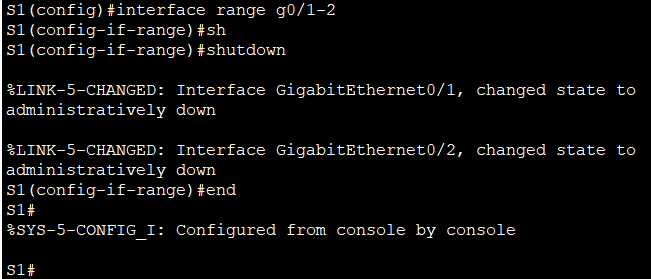      

#### На S2:    
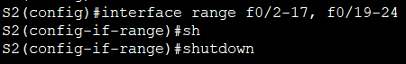    

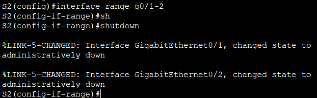     

#### &nbsp;&nbsp;&nbsp;&nbsp;i.	Настройте IP-адресации интерфейса, как указано в таблице выше.   
#### Для удалённого доступа к коммутаторам из других подсетей (например, с ПК) необходимо настроить шлюз по умолчанию – в данной сети это адрес R1 (192.168.1.1)  

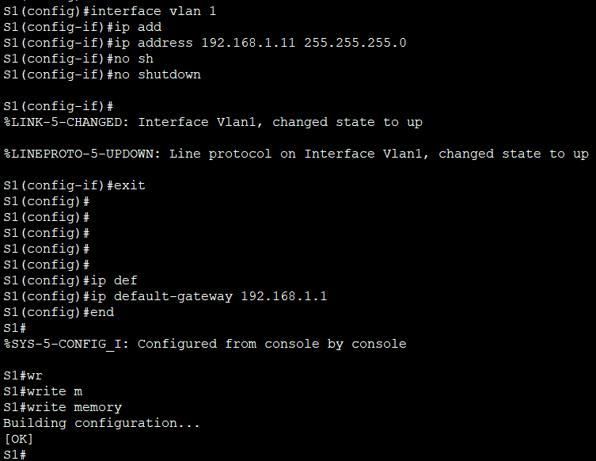     

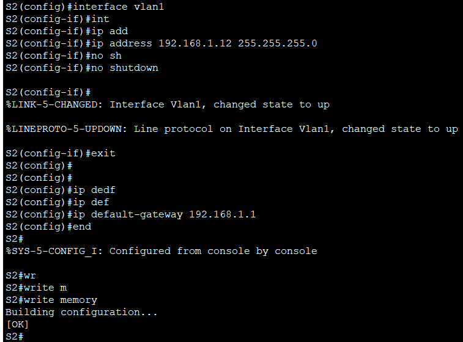      

#### &nbsp;&nbsp;&nbsp;&nbsp;j.	Сохраните текущую конфигурацию в файл загрузочной конфигурации.   
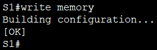     

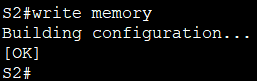     

