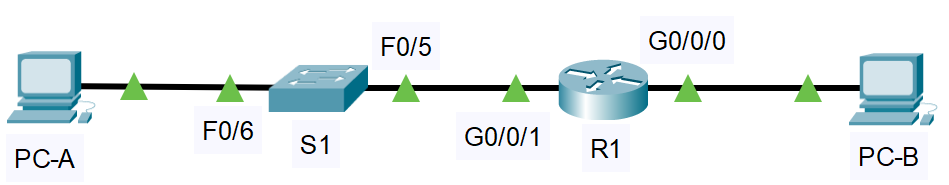
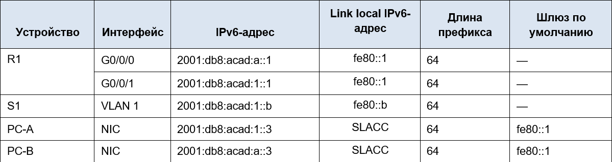
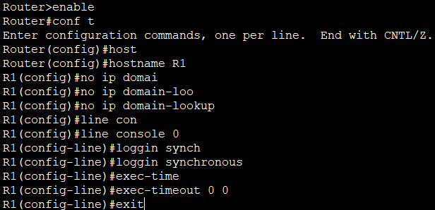
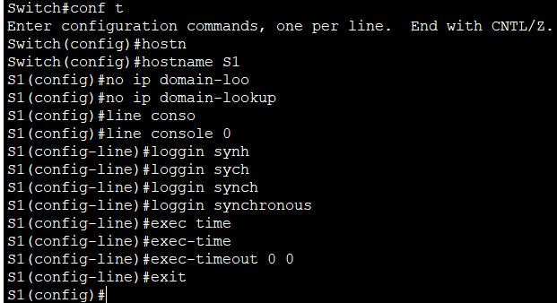
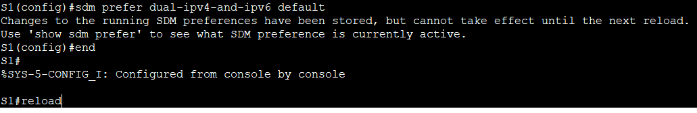

# **Настройка IPv6-адресов на сетевых устройствах**      
## **Топология**     
       
## **Таблица адресации**    
       
## **Задачи:**   
### &nbsp;&nbsp;&nbsp;&nbsp;**Часть 1. Настройка топологии и конфигурация основных параметров маршрутизатора и коммутатора**        
### &nbsp;&nbsp;&nbsp;&nbsp; **Часть 2. Ручная настройка IPv6-адресов**      
### &nbsp;&nbsp;&nbsp;&nbsp;**Часть 3. Проверка сквозного соединения**       

### **Часть 1. Настройка топологии и конфигурация основных параметров маршрутизатора и коммутатора**     
### **Шаг 1. Настройка маршрутизатора R1**    
           
### **Шаг 2. Настройка коммутатора S1**          
             

### **Настройка SDM для IPv6 на коммутаторе S1**     
           
      

