# **Настройка IPv6-адресов на сетевых устройствах**      
## **Топология**     
       
## **Таблица адресации**    
       
## **Задачи:**   
### &nbsp;&nbsp;&nbsp;&nbsp;**Часть 1. Настройка топологии и конфигурация основных параметров маршрутизатора и коммутатора**        
### &nbsp;&nbsp;&nbsp;&nbsp; **Часть 2. Ручная настройка IPv6-адресов**      
### &nbsp;&nbsp;&nbsp;&nbsp;**Часть 3. Проверка сквозного соединения**       

### **Часть 1. Настройка топологии и конфигурация основных параметров маршрутизатора и коммутатора**     
### **Шаг 1. Настройка маршрутизатора R1**    
           
### **Шаг 2. Настройка коммутатора S1**          
             

### **Настройка SDM для IPv6 на коммутаторе S1**     
           

### **Часть 2. Ручная настройка IPv6-адресов**    
### **Шаг 1. Назначение IPv6 на интерфейсах R1**      
#### &nbsp;&nbsp;&nbsp;&nbsp;a.	Назначить глобальные индивидуальные IPv6-адреса, указанные в таблице адресации обоим интерфейсам Ethernet на R1.          
          

         

#### &nbsp;&nbsp;&nbsp;&nbsp;b.	Введите команду **show ipv6 interface brief**, чтобы проверить, назначен ли каждому интерфейсу корректный индивидуальный IPv6-адрес.       
          
#### &nbsp;&nbsp;&nbsp;&nbsp;c.	Чтобы обеспечить соответствие локальных адресов канала индивидуальному адресу, вручную введите локальные адреса канала на каждом интерфейсе Ethernet на R1.          
       

           

#### &nbsp;&nbsp;&nbsp;&nbsp;d.	Используйте выбранную команду, чтобы убедиться, что локальный адрес связи изменен на fe80::1      

        

### **Вопрос:**
#### **Какие группы многоадресной рассылки назначены интерфейсу G0/0?**     
### **Ответ:**     
#### - FF02::1 (все узлы)
#### - FF02::1:FF00:1 (группа запрса узла)    
#### - FF02::2 (все маршрутизаторы) — **появится после включения IPv6-маршрутизации**     

### **Шаг 2. Активация IPv6-маршрутизации на R1**  
#### &nbsp;&nbsp;&nbsp;&nbsp;a.	В командной строке на PC-B введите команду ipconfig, чтобы получить данные IPv6-адреса, назначенного интерфейсу ПК.       
        

### **Вопрос:**     
#### **Назначен ли индивидуальный IPv6-адрес сетевой интерфейсной карте (NIC) на PC-B?**      
### **Ответ:**     
#### Нет, только link-local (FE80::20A:F3FF:FE08:7B5E).      

#### &nbsp;&nbsp;&nbsp;&nbsp;b.	Активируйте IPv6-маршрутизацию на R1 с помощью команды **IPv6 unicast-routing**.       
           

#### &nbsp;&nbsp;&nbsp;&nbsp;c.	Теперь, когда R1 входит в группу многоадресной рассылки всех маршрутизаторов, еще раз введите команду **ipconfig** на PC-B. Проверьте данные IPv6-адреса.     
      

### **Вопрос:**      
#### **Почему PC-B получил глобальный префикс маршрутизации и идентификатор подсети, которые вы настроили на R1?**      
### **Ответ:**     
####   R1 начал рассылать RA (Router Advertisement). PC-B использует SLAAC для автоматического формирования глобального IPv6-адреса.    

### **Шаг 3. Назначьте IPv6-адреса интерфейсу управления (SVI) на S1.**       
#### &nbsp;&nbsp;&nbsp;&nbsp;a.	Назначьте адрес IPv6 для S1. Также назначьте этому интерфейсу локальный адрес канала fe80::b.     
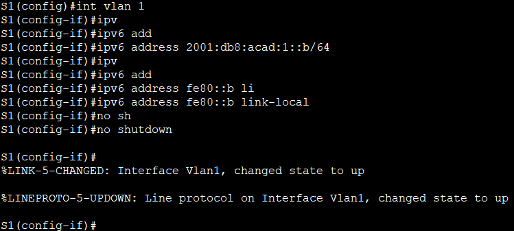         

#### &nbsp;&nbsp;&nbsp;&nbsp;b.	Проверьте правильность назначения IPv6-адресов интерфейсу управления с помощью команды show ipv6 interface vlan1.        
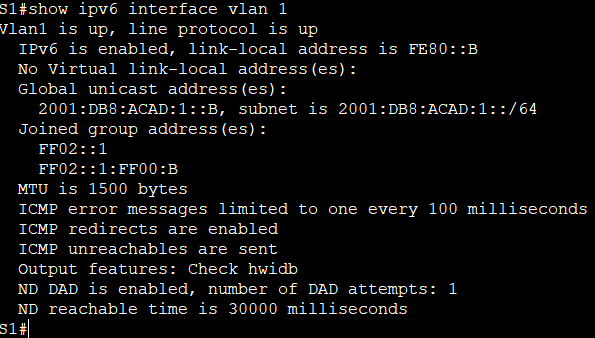         

### **Шаг 4. Назначьте компьютерам статические IPv6-адреса.**      
#### &nbsp;&nbsp;&nbsp;&nbsp;a.	Откройте окно Свойства Ethernet для каждого ПК и назначьте адресацию IPv6.
#### &nbsp;&nbsp;&nbsp;&nbsp;Убедитесь, что оба компьютера имеют правильную информацию адреса IPv6.   
#### **PC-A Static**          
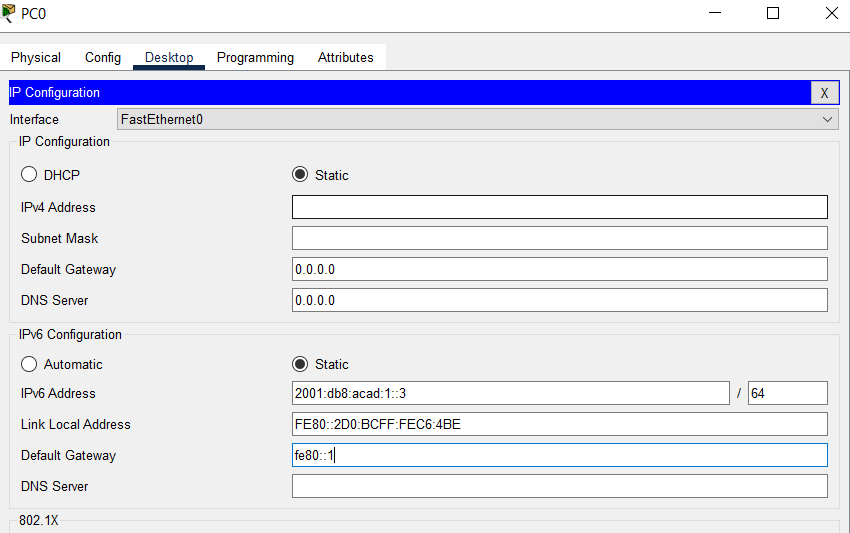      

#### **Для SLAAC**
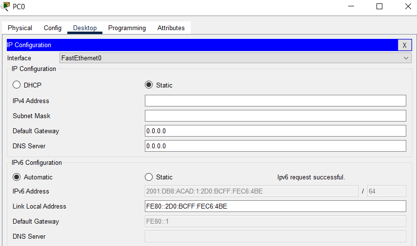  

#### **PC-B Static**      
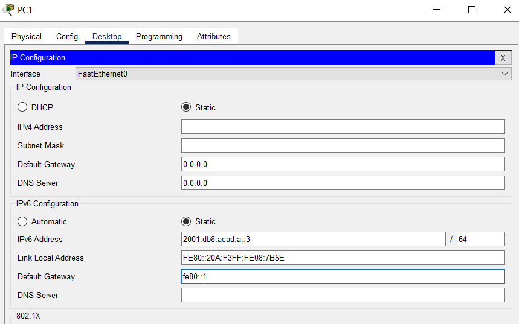       

#### **Для SLAAC**
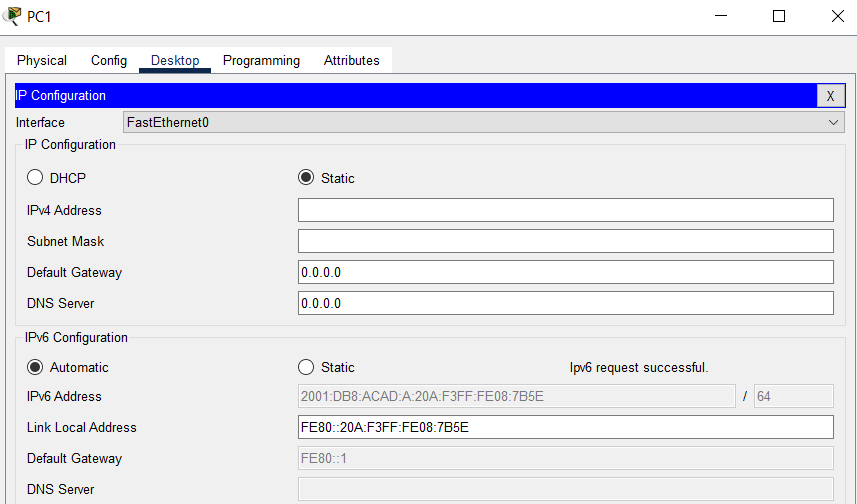   

### **Часть 3. Проверка сквозного подключения**     
#### &nbsp;&nbsp;&nbsp;&nbsp; С PC-A отправьте эхо-запрос на FE80::1. Это локальный адрес канала, назначенный G0/1 на R1.    
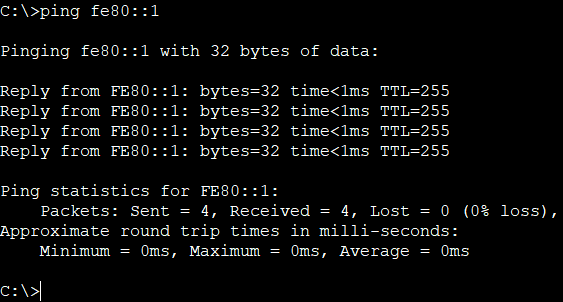       

#### &nbsp;&nbsp;&nbsp;&nbsp; Отправьте эхо-запрос на интерфейс управления S1 с PC-A.      
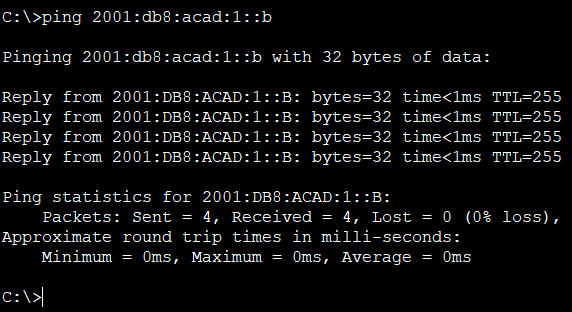       

#### &nbsp;&nbsp;&nbsp;&nbsp; Введите команду **tracert** на PC-A, чтобы проверить наличие сквозного подключения к PC-B.     
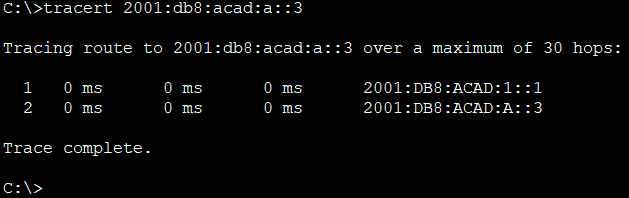        

#### &nbsp;&nbsp;&nbsp;&nbsp;С PC-B отправьте эхо-запрос на PC-A.      
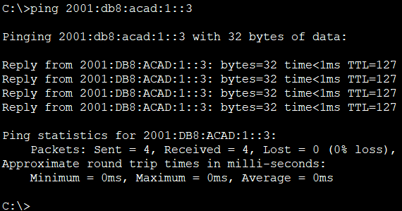       

#### &nbsp;&nbsp;&nbsp;&nbsp;С PC-B отправьте эхо-запрос на локальный адрес канала G0/0 на R1.      
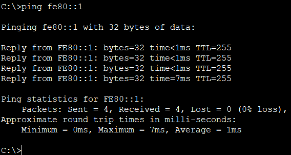        

### **Вопросы для повторения**    
#### **1.	Почему обоим интерфейсам Ethernet на R1 можно назначить один и тот же локальный адрес канала — FE80::1?**     
#### Ответ:     
#### Link-local адрес действует только в пределах одной сети (линка).
Разные интерфейсы R1 находятся в разных подсетях, поэтому конфликта не возникает.      

#### **2.	Какой идентификатор подсети в индивидуальном IPv6-адресе 2001:db8:acad::aaaa:1234/64?**   

#### Ответ:    
#### 2001:db8:acad::/64 — идентификатор подсети — первые 64 бита: 2001:0db8:acad:0000    
####     Или кратко: 2001:db8:acad::/64       

[Скачать конфиг лабораторной работы №4](https://github.com/nikolaishlyahtin1987-creator/NETWORK-ENGINEER_2026/blob/main/Лабораторные%20работы/Лабораторная%20работа%20№4/Config%20L4.pkt "Нажмите для скачивания файла конфигурации")

   

