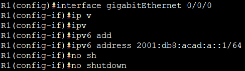
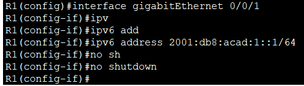
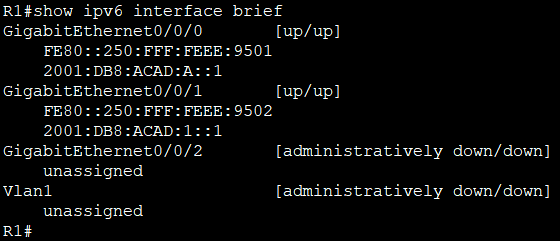
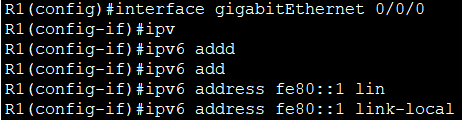
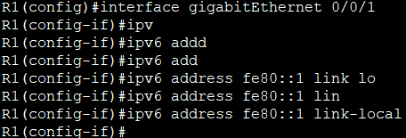
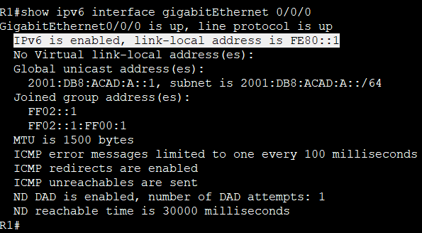
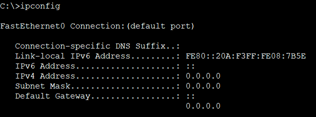
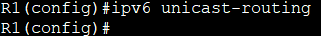
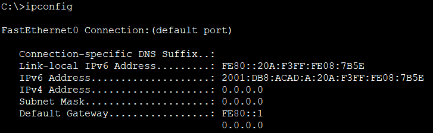

# **Настройка IPv6-адресов на сетевых устройствах**      
## **Топология**     
       
## **Таблица адресации**    
       
## **Задачи:**   
### &nbsp;&nbsp;&nbsp;&nbsp;**Часть 1. Настройка топологии и конфигурация основных параметров маршрутизатора и коммутатора**        
### &nbsp;&nbsp;&nbsp;&nbsp; **Часть 2. Ручная настройка IPv6-адресов**      
### &nbsp;&nbsp;&nbsp;&nbsp;**Часть 3. Проверка сквозного соединения**       

### **Часть 1. Настройка топологии и конфигурация основных параметров маршрутизатора и коммутатора**     
### **Шаг 1. Настройка маршрутизатора R1**    
           
### **Шаг 2. Настройка коммутатора S1**          
             

### **Настройка SDM для IPv6 на коммутаторе S1**     
           

### **Часть 2. Ручная настройка IPv6-адресов**    
### **Шаг 1. Назначение IPv6 на интерфейсах R1**      
#### &nbsp;&nbsp;&nbsp;&nbsp;a.	Назначить глобальные индивидуальные IPv6-адреса, указанные в таблице адресации обоим интерфейсам Ethernet на R1.          
          

         

#### &nbsp;&nbsp;&nbsp;&nbsp;b.	Введите команду **show ipv6 interface brief**, чтобы проверить, назначен ли каждому интерфейсу корректный индивидуальный IPv6-адрес.       
          
#### &nbsp;&nbsp;&nbsp;&nbsp;c.	Чтобы обеспечить соответствие локальных адресов канала индивидуальному адресу, вручную введите локальные адреса канала на каждом интерфейсе Ethernet на R1.          
       

           

#### &nbsp;&nbsp;&nbsp;&nbsp;d.	Используйте выбранную команду, чтобы убедиться, что локальный адрес связи изменен на fe80::1      

        

### **Вопрос:**
#### **Какие группы многоадресной рассылки назначены интерфейсу G0/0?**     
### **Ответ:**     
#### - FF02::1 (все узлы)
#### - FF02::1:FF00:1 (группа запрса узла)    
#### - FF02::2 (все маршрутизаторы) — **появится после включения IPv6-маршрутизации**     

### **Шаг 2. Активация IPv6-маршрутизации на R1**  
#### &nbsp;&nbsp;&nbsp;&nbsp;a.	В командной строке на PC-B введите команду ipconfig, чтобы получить данные IPv6-адреса, назначенного интерфейсу ПК.       
        

### **Вопрос:**     
#### **Назначен ли индивидуальный IPv6-адрес сетевой интерфейсной карте (NIC) на PC-B?**      
### **Ответ:**     
#### Нет, только link-local (FE80::20A:F3FF:FE08:7B5E).      

#### &nbsp;&nbsp;&nbsp;&nbsp;b.	Активируйте IPv6-маршрутизацию на R1 с помощью команды **IPv6 unicast-routing**.       
           

#### &nbsp;&nbsp;&nbsp;&nbsp;c.	Теперь, когда R1 входит в группу многоадресной рассылки всех маршрутизаторов, еще раз введите команду **ipconfig** на PC-B. Проверьте данные IPv6-адреса.     
      

### **Вопрос:**      
#### **Почему PC-B получил глобальный префикс маршрутизации и идентификатор подсети, которые вы настроили на R1?**      
### **Ответ:**     
####   R1 начал рассылать RA (Router Advertisement). PC-B использует SLAAC для автоматического формирования глобального IPv6-адреса.    

