# **Доступ к сетевым устройствам по протоколу SSH**        
## **Топология**        
         
## **Таблица адресации**       
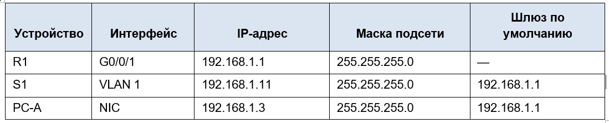         
## **Задачи**        
### &nbsp;&nbsp;&nbsp;&nbsp;**Часть 1. Настройка основных параметров устройства**    
### &nbsp;&nbsp;&nbsp;&nbsp;**Часть 2. Настройка маршрутизатора для доступа по протоколу SSH**        
### &nbsp;&nbsp;&nbsp;&nbsp;**Часть 3. Настройка коммутатора для доступа по протоколу SSH**       
### &nbsp;&nbsp;&nbsp;&nbsp;**Часть 4. SSH через интерфейс командной строки (CLI) коммутатора**        
## **Часть 1. Настройка основных параметров устройств**       
### **Шаг 1. Создайте сеть согласно топологии.**    
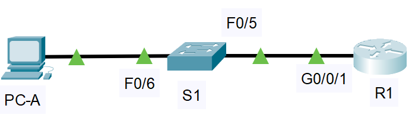          

### **Шаг 2. Выполните инициализацию и перезагрузку маршрутизатора и коммутатора.**        
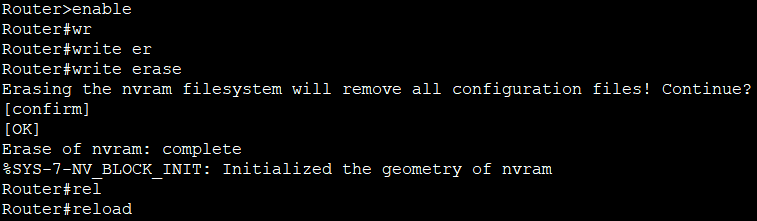    

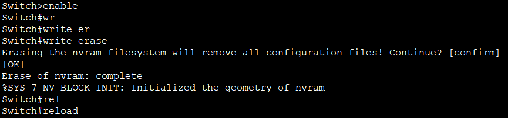       

### **Шаг 3. Настройте маршрутизатор.**     
#### &nbsp;&nbsp;&nbsp;&nbsp;a.	Подключитесь к маршрутизатору с помощью консоли и активируйте привилегированный режим EXEC.          
 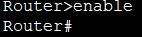        

#### &nbsp;&nbsp;&nbsp;&nbsp;b.	Войдите в режим конфигурации.    
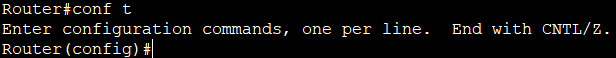        

#### &nbsp;&nbsp;&nbsp;&nbsp;c.	Отключите поиск DNS, чтобы предотвратить попытки маршрутизатора неверно преобразовывать введенные команды таким образом, как будто они являются именами узлов.       
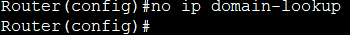         

#### &nbsp;&nbsp;&nbsp;&nbsp;d.	Назначьте class в качестве зашифрованного пароля привилегированного режима EXEC.     
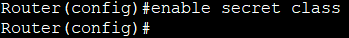         

#### &nbsp;&nbsp;&nbsp;&nbsp;e.	Назначьте cisco в качестве пароля консоли и включите вход в систему по паролю.       
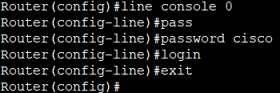        

#### &nbsp;&nbsp;&nbsp;&nbsp;f.	Назначьте cisco в качестве пароля VTY и включите вход в систему по паролю.        
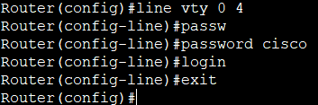         

#### &nbsp;&nbsp;&nbsp;&nbsp;g.	Зашифруйте открытые пароли.       
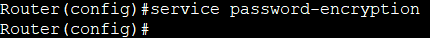        

#### &nbsp;&nbsp;&nbsp;&nbsp;h.	Создайте баннер, который предупреждает о запрете несанкционированного доступа.     
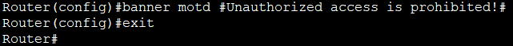       

#### &nbsp;&nbsp;&nbsp;&nbsp;i.	Настройте и активируйте на маршрутизаторе интерфейс G0/0/1, используя информацию, приведенную в таблице адресации.       
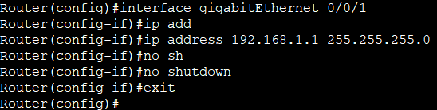       

#### &nbsp;&nbsp;&nbsp;&nbsp;j.	Сохраните текущую конфигурацию в файл загрузочной конфигурации.      
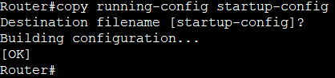       

### **Шаг 4. Настройте компьютер PC-A.**      
#### &nbsp;&nbsp;&nbsp;&nbsp;a.	Настройте для PC-A IP-адрес и маску подсети.       
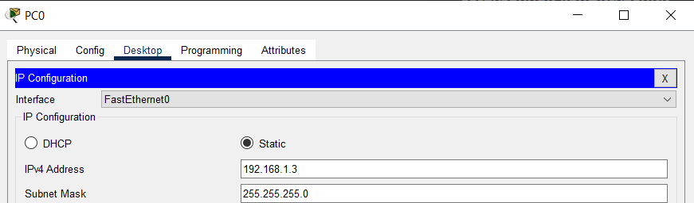      
 
#### &nbsp;&nbsp;&nbsp;&nbsp;b.	Настройте для PC-A шлюз по умолчанию.       
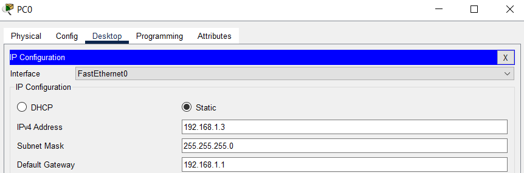        

### **Шаг 5. Проверьте подключение к сети.**     
#### Пошлите с PC-A команду **Ping** на маршрутизатор R1.     
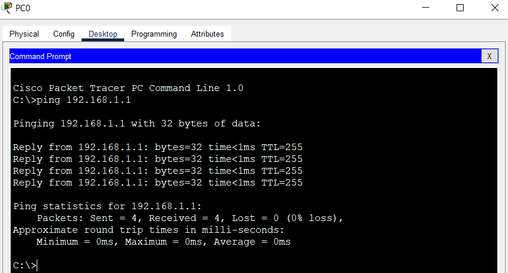      

## **Часть 2. Настройка маршрутизатора для доступа по протоколу SSH**     
### **Шаг 1. Настройте аутентификацию устройств.**    

#### &nbsp;&nbsp;&nbsp;&nbsp;a.	Задайте имя устройства.    
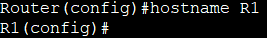       

#### &nbsp;&nbsp;&nbsp;&nbsp;b.	Задайте домен для устройства.     
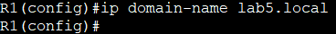       

### **Шаг 2. Создайте ключ шифрования с указанием его длины.**      
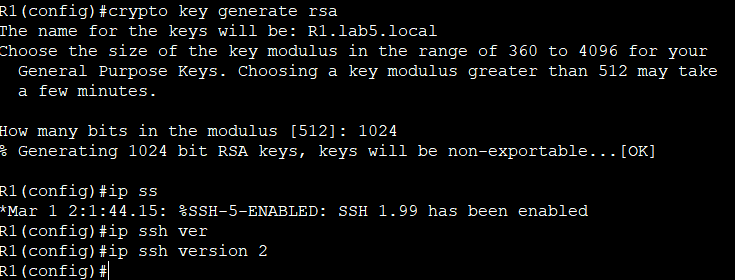       

### **Шаг 3. Создайте имя пользователя в локальной базе учетных записей.**        
#### Настройте имя пользователя, используя **admin** в качестве имени пользователя и **Adm1nP @55** в качестве пароля.      
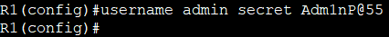        

### **Шаг 4. Активируйте протокол SSH на линиях VTY.**       
#### &nbsp;&nbsp;&nbsp;&nbsp;a.	Активируйте протоколы Telnet и SSH на входящих линиях VTY с помощью команды **transport input**.           
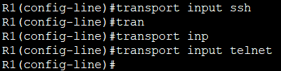       

#### &nbsp;&nbsp;&nbsp;&nbsp;b.	Измените способ входа в систему таким образом, чтобы использовалась проверка пользователей по локальной базе учетных записей.         
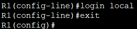        

### **Шаг 5. Сохраните текущую конфигурацию в файл загрузочной конфигурации.**       
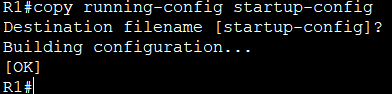       

### **Шаг 6. Установите соединение с маршрутизатором по протоколу SSH.**      
#### &nbsp;&nbsp;&nbsp;&nbsp;a.	Запустите Tera Term с PC-A      
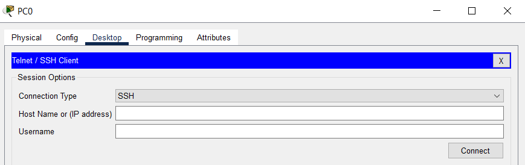        

#### &nbsp;&nbsp;&nbsp;&nbsp;b.	Установите SSH-подключение к R1. Use the username **admin** and password **Adm1nP@55**. У вас должно получиться установить SSH-подключение к R1.         
 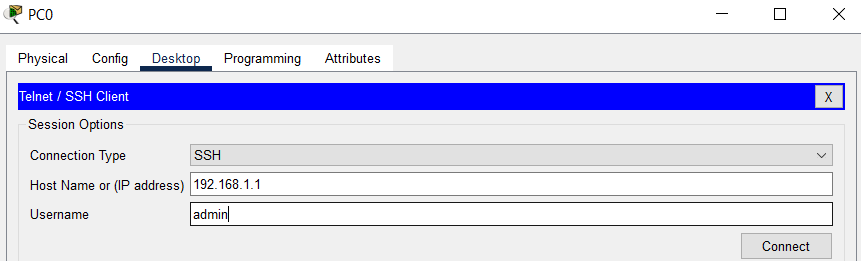         

 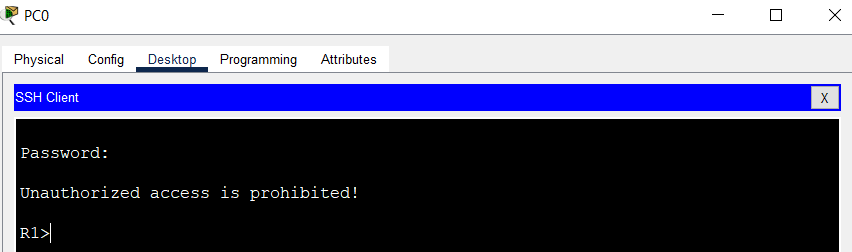       

 ## **Часть 3. Настройка коммутатора для доступа по протоколу SSH**       
 ### **Шаг 1. Настройте основные параметры коммутатора.**       
 #### &nbsp;&nbsp;&nbsp;&nbsp;a. Подключитесь к коммутатору с помощью консольного подключения и активируйте привилегированный режим EXEC.       
 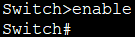        

 #### &nbsp;&nbsp;&nbsp;&nbsp;b. Войдите в режим конфигурации.      
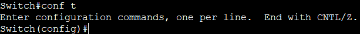       

#### &nbsp;&nbsp;&nbsp;&nbsp;c.	Отключите поиск DNS, чтобы предотвратить попытки маршрутизатора неверно преобразовывать введенные команды таким образом, как будто они являются именами узлов.        
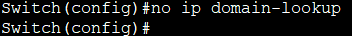         

#### &nbsp;&nbsp;&nbsp;&nbsp;d.	Назначьте class в качестве зашифрованного пароля привилегированного режима EXEC.       
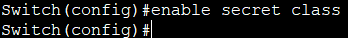        

#### &nbsp;&nbsp;&nbsp;&nbsp;e.	Назначьте cisco в качестве пароля консоли и включите вход в систему по паролю.        
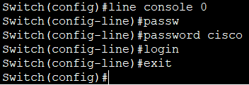       

#### &nbsp;&nbsp;&nbsp;&nbsp;f.	Назначьте cisco в качестве пароля VTY и включите вход в систему по паролю     
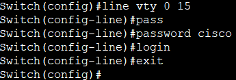       

#### &nbsp;&nbsp;&nbsp;&nbsp;g.	Зашифруйте открытые пароли.     
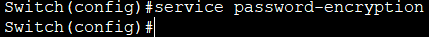        

#### &nbsp;&nbsp;&nbsp;&nbsp;h.	Создайте баннер, который предупреждает о запрете несанкционированного доступа.      
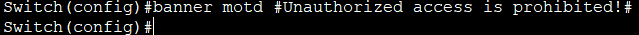        

#### &nbsp;&nbsp;&nbsp;&nbsp;i.	Настройте и активируйте на коммутаторе интерфейс VLAN 1, используя информацию, приведенную в таблице адресации.      
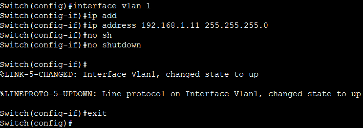 

#### &nbsp;&nbsp;&nbsp;&nbsp;Для коммутатора также нужно настроить шлюз по умолчанию          
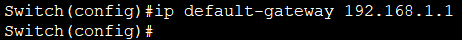        

#### &nbsp;&nbsp;&nbsp;&nbsp;j.	Сохраните текущую конфигурацию в файл загрузочной конфигурации.    
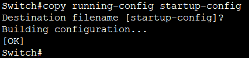       

### **Шаг 2. Настройте коммутатор для соединения по протоколу SSH.**     
#### &nbsp;&nbsp;&nbsp;&nbsp;a.	Настройте имя устройства, как указано в таблице адресации.     
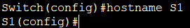       

#### &nbsp;&nbsp;&nbsp;&nbsp;b.	Задайте домен для устройства.     
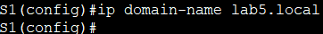       

#### &nbsp;&nbsp;&nbsp;&nbsp;c.	Создайте ключ шифрования с указанием его длины.     
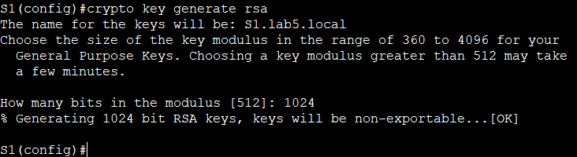        

#### &nbsp;&nbsp;&nbsp;&nbsp;d.	Создайте имя пользователя в локальной базе учетных записей.    
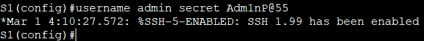       

#### &nbsp;&nbsp;&nbsp;&nbsp;e.	Активируйте протоколы Telnet и SSH на линиях VTY.        
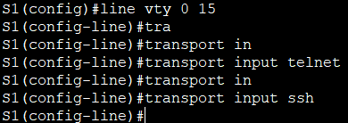       

#### &nbsp;&nbsp;&nbsp;&nbsp;f.	Измените способ входа в систему таким образом, чтобы использовалась проверка пользователей по локальной базе учетных записей.      
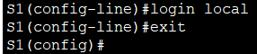      

#### &nbsp;&nbsp;&nbsp;&nbsp;Укажем версию SSH     
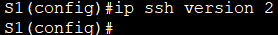     

#### &nbsp;&nbsp;&nbsp;&nbsp;Сохраним конфигурацию      
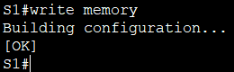    

### **Шаг 3. Установите соединение с коммутатором по протоколу SSH.**     
#### Запустите программу Tera Term на PC-A, затем установите подключение по протоколу SSH к интерфейсу SVI коммутатора S1.     
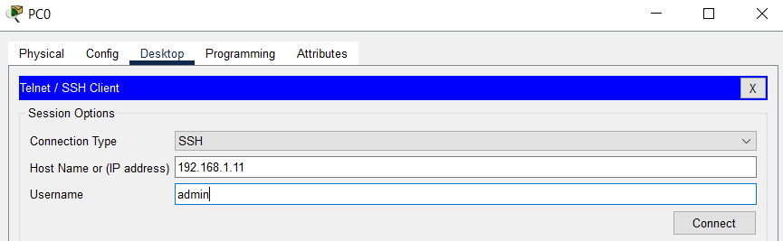       

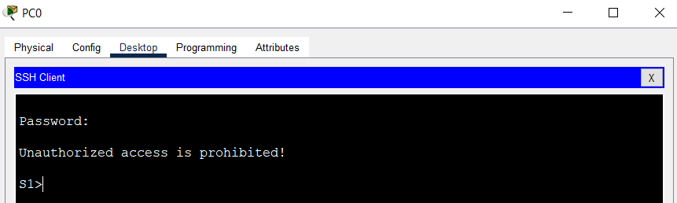      

#### Удалось ли вам установить SSH-соединение с коммутатором?  
#### Да, удалось.      

## **Часть 4. Настройка протокола SSH с использованием интерфейса командной строки (CLI) коммутатора**      
### **Шаг 1. Посмотрите доступные параметры для клиента SSH в Cisco IOS.**       
#### &nbsp;&nbsp;&nbsp;&nbsp;Используйте вопросительный знак (?), чтобы отобразить варианты параметров для команды ssh.     
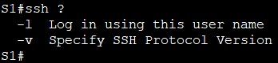      

### **Шаг 2. Установите с коммутатора S1 соединение с маршрутизатором R1 по протоколу SSH.**       
#### &nbsp;&nbsp;&nbsp;&nbsp;a.	Чтобы подключиться к маршрутизатору R1 по протоколу SSH, введите команду **–l admin**. Это позволит вам войти в систему под именем **admin**. При появлении приглашения введите в качестве пароля **Adm1nP@55**     
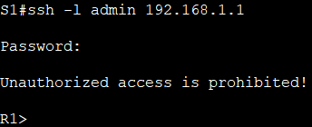      

#### &nbsp;&nbsp;&nbsp;&nbsp;b.	Чтобы вернуться к коммутатору S1, не закрывая сеанс SSH с маршрутизатором R1, нажмите комбинацию клавиш **Ctrl+Shift+6**. Отпустите клавиши **Ctrl+Shift+6** и нажмите **x**. Отображается приглашение привилегированного режима EXEC коммутатора.       
    

#### &nbsp;&nbsp;&nbsp;&nbsp;c.	Чтобы вернуться к сеансу SSH на R1, нажмите клавишу Enter в пустой строке интерфейса командной строки. Чтобы увидеть окно командной строки маршрутизатора, нажмите клавишу Enter еще раз.       
      

#### &nbsp;&nbsp;&nbsp;&nbsp;d.	Чтобы завершить сеанс SSH на маршрутизаторе R1, введите в командной строке маршрутизатора команду **exit**.     
       

#### &nbsp;&nbsp;&nbsp;&nbsp;**Какие версии протокола SSH поддерживаются при использовании интерфейса командной строки?**     

#### &nbsp;&nbsp;&nbsp;&nbsp;Поддерживаются обе версии протокола SSH: версия 1 и версия 2. Однако, версия 1 считается устаревшей и небезопасной. Рекомендуется использовать версию 2.    

### **Вопрос для повторения**   
#### **Как предоставить доступ к сетевому устройству нескольким пользователям, у каждого из которых есть собственное имя пользователя?**     

#### 1. Создать локальных пользователей с помощью команды **username**     
#### 2. Настроить линии VTY на использование локальной аутентификации (login local)    
#### 3. Можно настроить внешний сервер аутентификации (например, RADIUS) для центализованного управления.