# **Внедрение маршрутизации между виртуальными локальными сетями**     
## **Топология**        
       
## **Таблица адресации**      
       

## **Таблица VLAN**        
        

## **Задачи**       
### &nbsp;&nbsp;&nbsp;&nbsp;**Часть 1. Создание сети и настройка основных параметров устройства**              
### &nbsp;&nbsp;&nbsp;&nbsp;**Часть 2. Создание сетей VLAN и назначение портов коммутатора**      
### &nbsp;&nbsp;&nbsp;&nbsp;**Часть 3. Настройка транка 802.1Q между коммутаторами.**       
### &nbsp;&nbsp;&nbsp;&nbsp;**Часть 4. Настройка маршрутизации между сетями VLAN**       
### &nbsp;&nbsp;&nbsp;&nbsp;**Часть 5. Проверка, что маршрутизация между VLAN работает**        

## **Часть 1. Создание сети и настройка основных параметров устройства**       
### **Шаг 1. Создайте сеть согласно топологии.**     
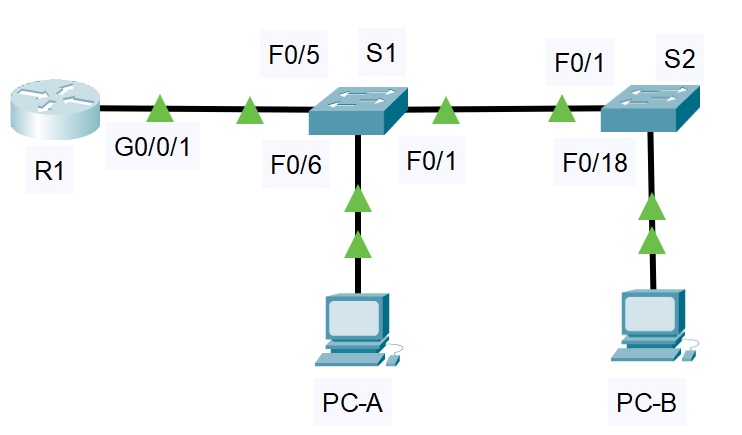       

### **Шаг 2. Настройте базовые параметры для маршрутизатора.**      
#### &nbsp;&nbsp;&nbsp;&nbsp;a.	Подключитесь к маршрутизатору с помощью консоли и активируйте привилегированный режим EXEC.    
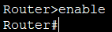     

#### &nbsp;&nbsp;&nbsp;&nbsp;b.	Войдите в режим конфигурации.   
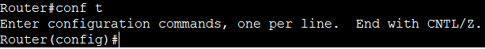      

#### &nbsp;&nbsp;&nbsp;&nbsp;c.	Назначьте маршрутизатору имя устройства.      
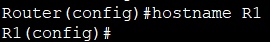      

#### &nbsp;&nbsp;&nbsp;&nbsp;d.	Отключите поиск DNS, чтобы предотвратить попытки маршрутизатора неверно преобразовывать введенные команды таким образом, как будто они являются именами узлов.      
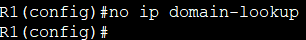      

#### &nbsp;&nbsp;&nbsp;&nbsp;e.	Назначьте **class** в качестве зашифрованного пароля привилегированного режима EXEC.      
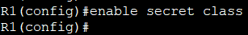      

#### &nbsp;&nbsp;&nbsp;&nbsp;f.	Назначьте **cisco** в качестве пароля консоли и включите вход в систему по паролю.      
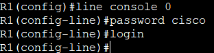        

#### &nbsp;&nbsp;&nbsp;&nbsp;g.	Установите **cisco** в качестве пароля виртуального терминала и активируйте вход.      
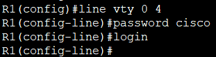      

#### &nbsp;&nbsp;&nbsp;&nbsp;h.	Зашифруйте открытые пароли.     
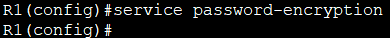       

#### &nbsp;&nbsp;&nbsp;&nbsp;i.	Создайте баннер с предупреждением о запрете несанкционированного доступа к устройству.      
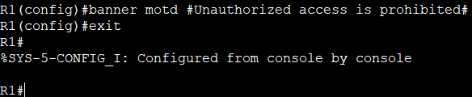      

#### &nbsp;&nbsp;&nbsp;&nbsp;j.	Сохраните текущую конфигурацию в файл загрузочной конфигурации.      
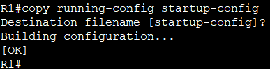      

#### &nbsp;&nbsp;&nbsp;&nbsp;k.	Настройте на маршрутизаторе время.      
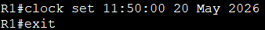      

### **Шаг 3. Настройте базовые параметры каждого коммутатора.** 
### **Для комутатора S1**      
#### &nbsp;&nbsp;&nbsp;&nbsp;a.	Присвойте коммутатору имя устройства.    
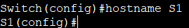     

#### &nbsp;&nbsp;&nbsp;&nbsp;b.	Отключите поиск DNS, чтобы предотвратить попытки маршрутизатора неверно преобразовывать введенные команды таким образом, как будто они являются именами узлов.     
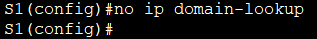     

#### &nbsp;&nbsp;&nbsp;&nbsp;c.	Назначьте **class** в качестве зашифрованного пароля привилегированного режима EXEC.     
  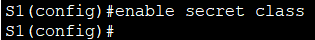        

#### &nbsp;&nbsp;&nbsp;&nbsp;d.	Назначьте **cisco** в качестве пароля консоли и включите вход в систему по паролю.     
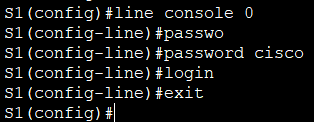       

#### &nbsp;&nbsp;&nbsp;&nbsp;e.	Установите **cisco** в качестве пароля виртуального терминала и активируйте вход.       
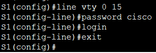      

#### &nbsp;&nbsp;&nbsp;&nbsp;f.	Зашифруйте открытые пароли.    
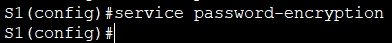      

#### &nbsp;&nbsp;&nbsp;&nbsp;g.	Создайте баннер с предупреждением о запрете несанкционированного доступа к устройству.      
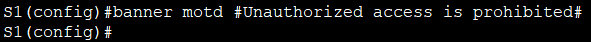     

#### &nbsp;&nbsp;&nbsp;&nbsp;h.	Настройте на коммутаторах время.      
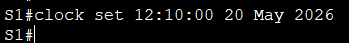      

#### &nbsp;&nbsp;&nbsp;&nbsp;i.	Сохранение текущей конфигурации в качестве начальной.     
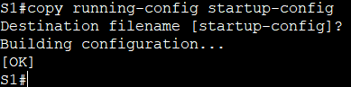      

### **Для коммутатора S2**   
#### Процедура настройки аналогична (шаги указаны выше)        
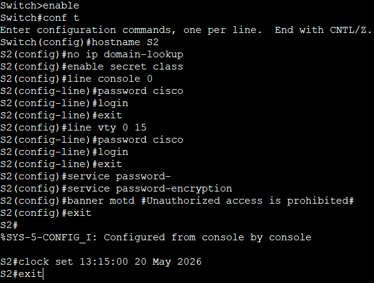    
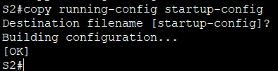     

### **Шаг 4. Настройте узлы ПК.**      
#### **Настройка PC-A**    
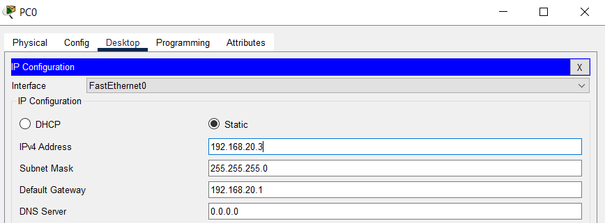     

#### **Настройка PC-B**   
 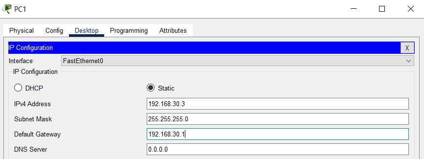     

 

