# **Внедрение маршрутизации между виртуальными локальными сетями**     
## **Топология**        
       
## **Таблица адресации**      
       

## **Таблица VLAN**        
        

## **Задачи**       
### &nbsp;&nbsp;&nbsp;&nbsp;**Часть 1. Создание сети и настройка основных параметров устройства**              
### &nbsp;&nbsp;&nbsp;&nbsp;**Часть 2. Создание сетей VLAN и назначение портов коммутатора**      
### &nbsp;&nbsp;&nbsp;&nbsp;**Часть 3. Настройка транка 802.1Q между коммутаторами.**       
### &nbsp;&nbsp;&nbsp;&nbsp;**Часть 4. Настройка маршрутизации между сетями VLAN**       
### &nbsp;&nbsp;&nbsp;&nbsp;**Часть 5. Проверка, что маршрутизация между VLAN работает**        

## **Часть 1. Создание сети и настройка основных параметров устройства**       
### **Шаг 1. Создайте сеть согласно топологии.**     
       

### **Шаг 2. Настройте базовые параметры для маршрутизатора.**      
#### &nbsp;&nbsp;&nbsp;&nbsp;a.	Подключитесь к маршрутизатору с помощью консоли и активируйте привилегированный режим EXEC.    
     

#### &nbsp;&nbsp;&nbsp;&nbsp;b.	Войдите в режим конфигурации.   
      

#### &nbsp;&nbsp;&nbsp;&nbsp;c.	Назначьте маршрутизатору имя устройства.      
      

#### &nbsp;&nbsp;&nbsp;&nbsp;d.	Отключите поиск DNS, чтобы предотвратить попытки маршрутизатора неверно преобразовывать введенные команды таким образом, как будто они являются именами узлов.      
      

#### &nbsp;&nbsp;&nbsp;&nbsp;e.	Назначьте **class** в качестве зашифрованного пароля привилегированного режима EXEC.      
      

#### &nbsp;&nbsp;&nbsp;&nbsp;f.	Назначьте **cisco** в качестве пароля консоли и включите вход в систему по паролю.      
        

#### &nbsp;&nbsp;&nbsp;&nbsp;g.	Установите **cisco** в качестве пароля виртуального терминала и активируйте вход.      
      

#### &nbsp;&nbsp;&nbsp;&nbsp;h.	Зашифруйте открытые пароли.     
       

#### &nbsp;&nbsp;&nbsp;&nbsp;i.	Создайте баннер с предупреждением о запрете несанкционированного доступа к устройству.      
      

#### &nbsp;&nbsp;&nbsp;&nbsp;j.	Сохраните текущую конфигурацию в файл загрузочной конфигурации.      
      

#### &nbsp;&nbsp;&nbsp;&nbsp;k.	Настройте на маршрутизаторе время.      
      

### **Шаг 3. Настройте базовые параметры каждого коммутатора.** 
### **Для комутатора S1**      
#### &nbsp;&nbsp;&nbsp;&nbsp;a.	Присвойте коммутатору имя устройства.    
     

#### &nbsp;&nbsp;&nbsp;&nbsp;b.	Отключите поиск DNS, чтобы предотвратить попытки маршрутизатора неверно преобразовывать введенные команды таким образом, как будто они являются именами узлов.     
     

#### &nbsp;&nbsp;&nbsp;&nbsp;c.	Назначьте **class** в качестве зашифрованного пароля привилегированного режима EXEC.     
          

#### &nbsp;&nbsp;&nbsp;&nbsp;d.	Назначьте **cisco** в качестве пароля консоли и включите вход в систему по паролю.     
       

#### &nbsp;&nbsp;&nbsp;&nbsp;e.	Установите **cisco** в качестве пароля виртуального терминала и активируйте вход.       
      

#### &nbsp;&nbsp;&nbsp;&nbsp;f.	Зашифруйте открытые пароли.    
      

#### &nbsp;&nbsp;&nbsp;&nbsp;g.	Создайте баннер с предупреждением о запрете несанкционированного доступа к устройству.      
     

#### &nbsp;&nbsp;&nbsp;&nbsp;h.	Настройте на коммутаторах время.      
      

#### &nbsp;&nbsp;&nbsp;&nbsp;i.	Сохранение текущей конфигурации в качестве начальной.     
      

### **Для коммутатора S2**   
#### Процедура настройки аналогична (шаги указаны выше)        
    
     

### **Шаг 4. Настройте узлы ПК.**      
#### **Настройка PC-A**    
     

#### **Настройка PC-B**   
      

 ## **Часть 2. Создание сетей VLAN и назначение портов коммутатора**     
 ### **Шаг 1. Создайте сети VLAN на коммутаторах.**     
#### **Настройка коммутатора S1**        
#### &nbsp;&nbsp;&nbsp;&nbsp;a.	Создайте и назовите необходимые VLAN на коммутаторе из таблицы выше.     
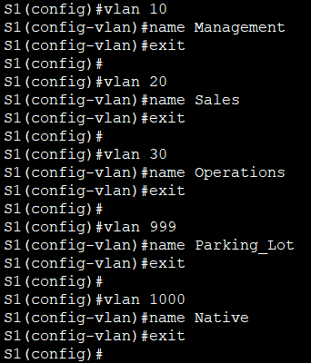      

#### &nbsp;&nbsp;&nbsp;&nbsp;b.	Настройте интерфейс управления и шлюз по умолчанию на коммутаторе, используя информацию об IP-адресе в таблице адресации
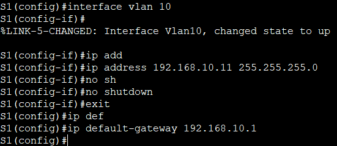      

#### &nbsp;&nbsp;&nbsp;&nbsp;c.	Назначьте все неиспользуемые порты коммутатора VLAN Parking_Lot, настройте их для статического режима доступа и административно деактивируйте их.    
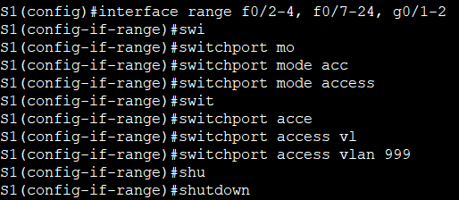     

#### &nbsp;&nbsp;&nbsp;&nbsp;Сохраним конфигурацию  
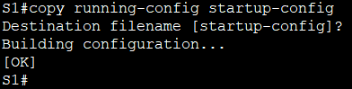     

#### **Настройка коммутатора S2**     
#### Настраиваем по аналогии с S1     
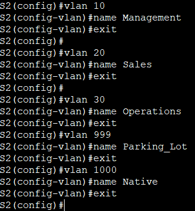     

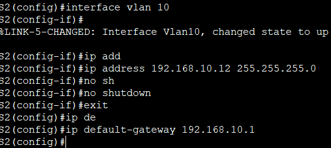    

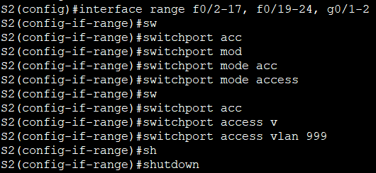     

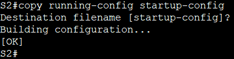     

### **Шаг 2. Назначьте сети VLAN соответствующим интерфейсам коммутатора.**  
#### **Настройка коммутатора S1**         
#### &nbsp;&nbsp;&nbsp;&nbsp;a.	Назначьте используемые порты соответствующей VLAN (указанной в таблице VLAN выше) и настройте их для режима статического доступа.    
  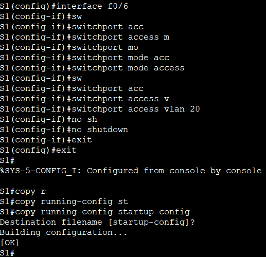     

#### **Настройка коммутатора S2**    
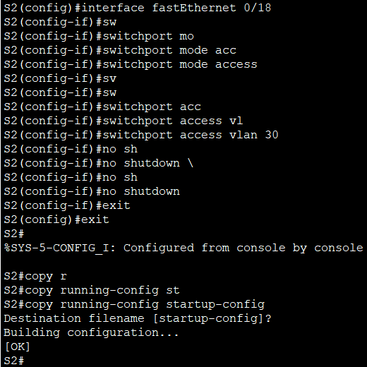     

#### &nbsp;&nbsp;&nbsp;&nbsp;b.	Убедитесь, что VLAN назначены на правильные интерфейсы.      
#### **На коммутаторе S1**    
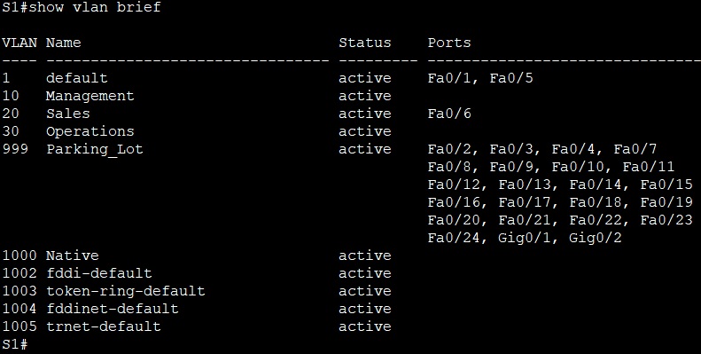    

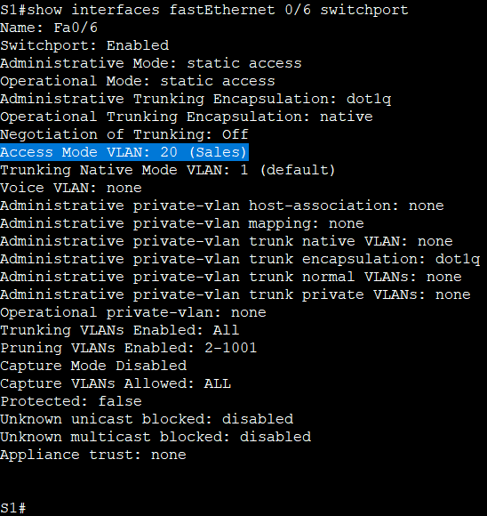      

#### **На коммутаторе S2:**    
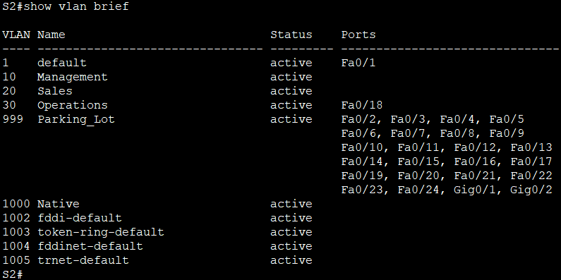     

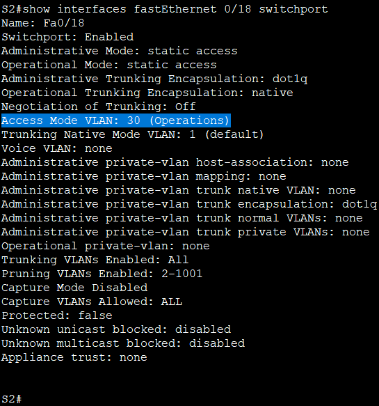     

## **Часть 3. Конфигурация магистрального канала стандарта 802.1Q между коммутаторами**    
### **Шаг 1. Вручную настройте магистральный интерфейс F0/1 на коммутаторах S1 и S2.**    
#### **Настройка коммутатора S1**    
#### &nbsp;&nbsp;&nbsp;&nbsp;a.	Настройка статического транкинга на интерфейсе F0/1 
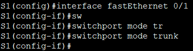    

#### &nbsp;&nbsp;&nbsp;&nbsp;b.	Установите native VLAN 1000 на  коммутаторе       
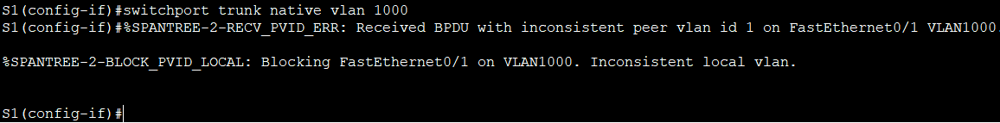     

#### &nbsp;&nbsp;&nbsp;&nbsp;c.	Укажите, что VLAN 10, 20, 30 и 1000 могут проходить по транку.     
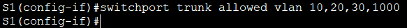      

#### &nbsp;&nbsp;&nbsp;&nbsp;Сохраняем конфигурацию 
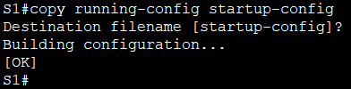    

#### &nbsp;&nbsp;&nbsp;&nbsp;d.	Проверьте транки, native VLAN и разрешенные VLAN через транк.   
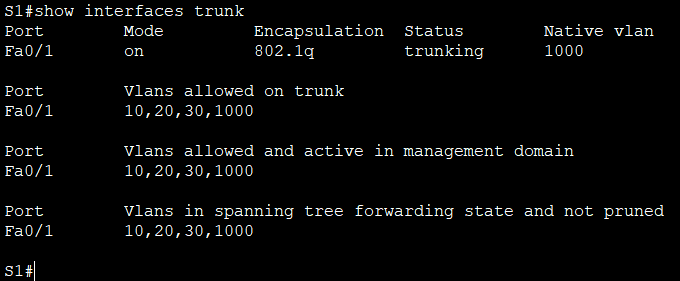    

#### **Настройка коммутатора S2**   
#### Настраиваем по аналогии с S1   
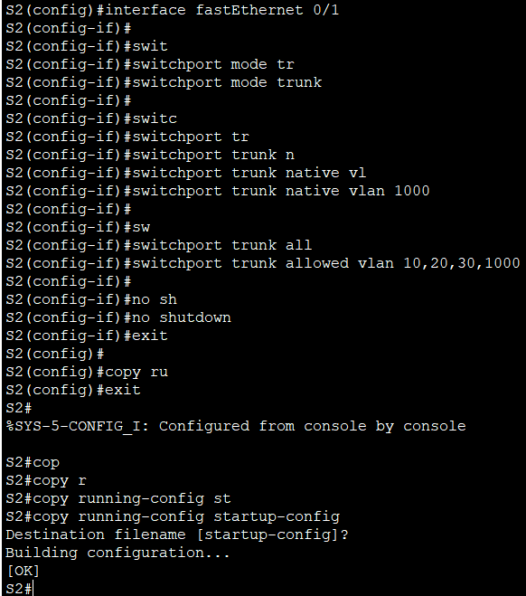    

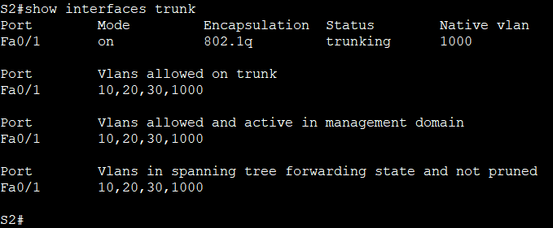    

### **Шаг 2. Вручную настройте магистральный интерфейс F0/5 на коммутаторе S1.**   
#### &nbsp;&nbsp;&nbsp;&nbsp;a.	Настройте интерфейс S1 F0/5 с теми же параметрами транка, что и F0/1. Это транк до маршрутизатора.    
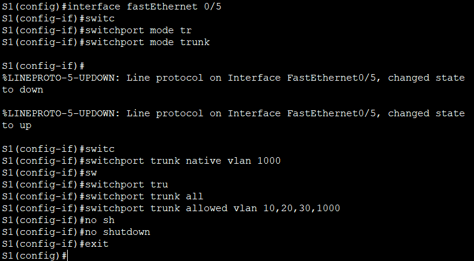    

#### &nbsp;&nbsp;&nbsp;&nbsp;b.	Сохраните текущую конфигурацию в файл загрузочной конфигурации.     
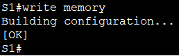     

#### &nbsp;&nbsp;&nbsp;&nbsp;c.	Проверка транкинга.   
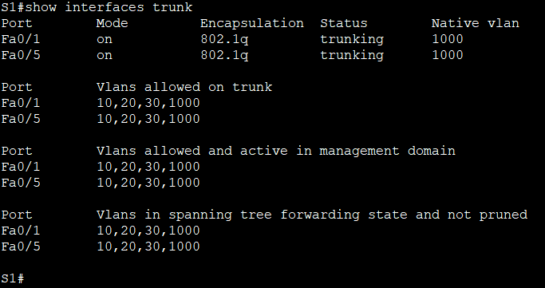    

#### **Что произойдет, если G0/0/1 на R1 будет отключен?**   

#### Если интерфейс G0/0/1 на R1 будет отключён, маршрутизация между VLAN полностью прекратится. Хосты из разных VLAN (например, PC-A и PC-B) не смогут обмениваться данными.

## **Часть 4. Настройка маршрутизации между сетями VLAN**     
### **Шаг 1. Настройте маршрутизатор.**     
#### &nbsp;&nbsp;&nbsp;&nbsp;a.	При необходимости активируйте интерфейс G0/0/1 на маршрутизаторе.    
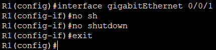    

#### &nbsp;&nbsp;&nbsp;&nbsp;b.	Настройте подинтерфейсы для каждой VLAN, как указано в таблице IP-адресации. Все подинтерфейсы используют инкапсуляцию 802.1Q. Убедитесь, что подинтерфейсу для native VLAN не назначен IP-адрес. Включите описание для каждого подинтерфейса.     
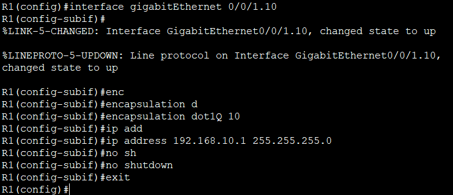       

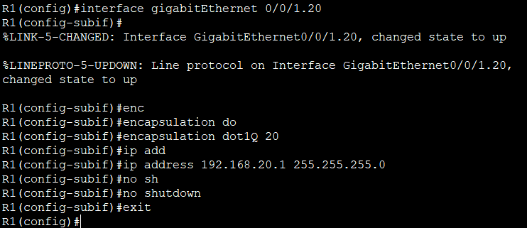   

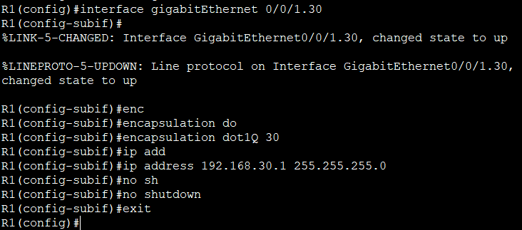    

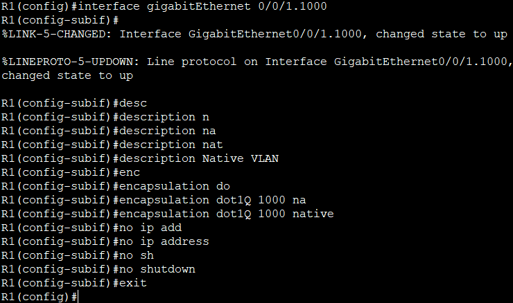     

#### &nbsp;&nbsp;&nbsp;&nbsp;c.	Убедитесь, что вспомогательные интерфейсы работают    
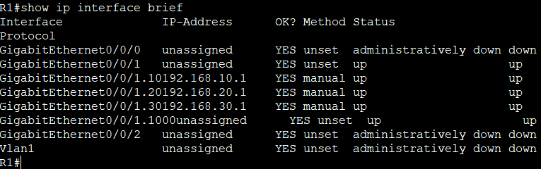     

#### сохраняем конфигурацию
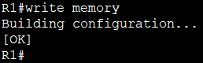    

## **Часть 5. Проверьте, работает ли маршрутизация между VLAN**     
### **Шаг 1. Выполните следующие тесты с PC-A. Все должно быть успешно.**    
#### &nbsp;&nbsp;&nbsp;&nbsp;a.	Отправьте эхо-запрос с PC-A на шлюз по умолчанию.    
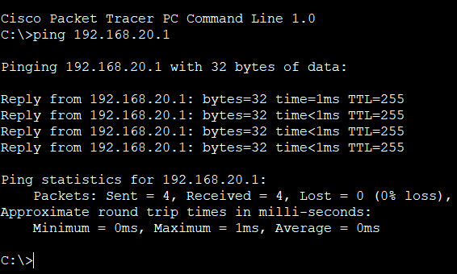     

#### &nbsp;&nbsp;&nbsp;&nbsp;b.	Отправьте эхо-запрос с PC-A на PC-B.   
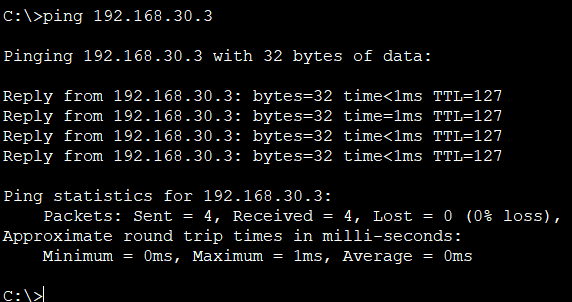     

#### &nbsp;&nbsp;&nbsp;&nbsp;c.	Отправьте команду ping с компьютера PC-A на коммутатор S2      
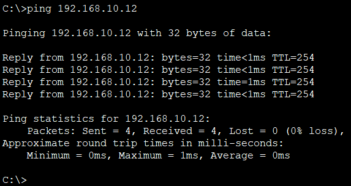    

### **Шаг 2. Пройдите следующий тест с PC-B**    
#### &nbsp;&nbsp;&nbsp;&nbsp;В окне командной строки на PC-B выполните команду tracert на адрес PC-A.     
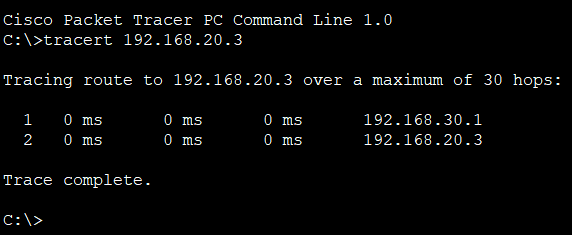    

#### &nbsp;&nbsp;&nbsp;&nbsp;**Какие промежуточные IP-адреса отображаются в результатах?**    
#### Отображается только один промежуточный IP-адрес: 192.168.30.1 (шлюз по умолчанию для PC-B)

[Скачать конфиг лабораторной работы №6](https://github.com/nikolaishlyahtin1987-creator/NETWORK-ENGINEER_2026/blob/main/Лабораторные%20работы/Лабораторная%20работа%20№6/Лабораторная%20работа%20№6.pkt "Нажмите для скачивания файла конфигурации")

