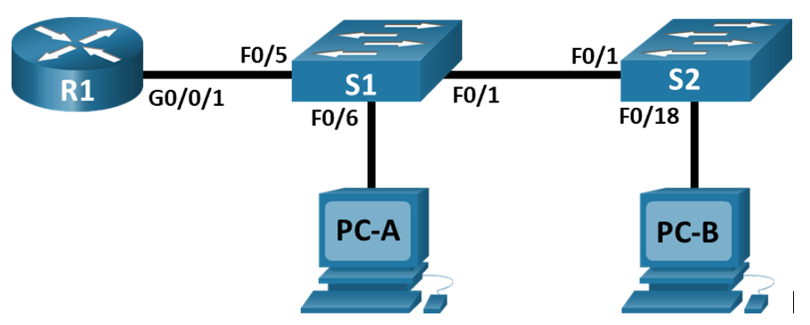
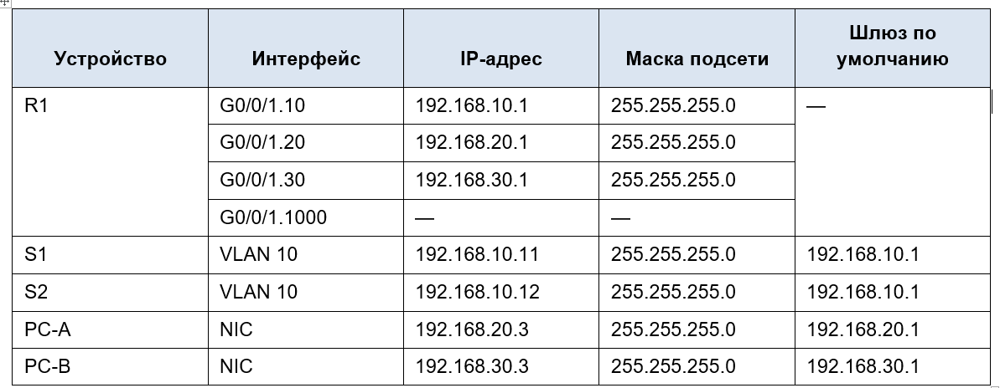
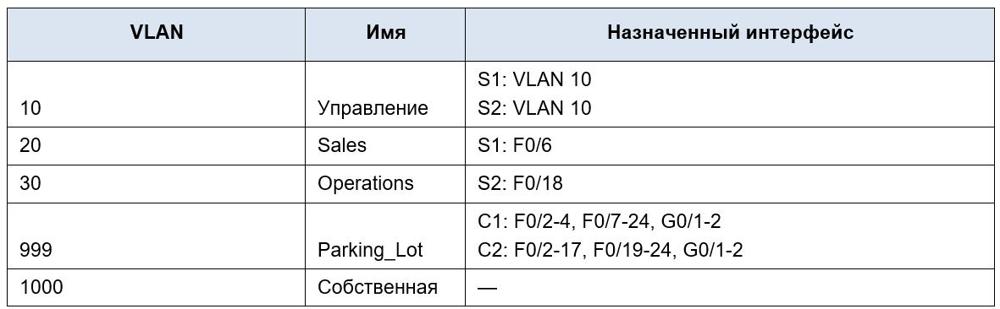

# **Внедрение маршрутизации между виртуальными локальными сетями**     
## **Топология**        
       
## **Таблица адресации**      
       

## **Таблица VLAN**        
        

## **Задачи**       
### &nbsp;&nbsp;&nbsp;&nbsp;**Часть 1. Создание сети и настройка основных параметров устройства**              
### **Часть 2. Создание сетей VLAN и назначение портов коммутатора**      
### **Часть 3. Настройка транка 802.1Q между коммутаторами.**       
### **Часть 4. Настройка маршрутизации между сетями VLAN**       
### **Часть 5. Проверка, что маршрутизация между VLAN работает**        

## **Часть 1. Создание сети и настройка основных параметров устройства**       
### **Шаг 1. Создайте сеть согласно топологии.**      

