# **Развертывание коммутируемой сети с резервными каналами**    
## **Топология**        
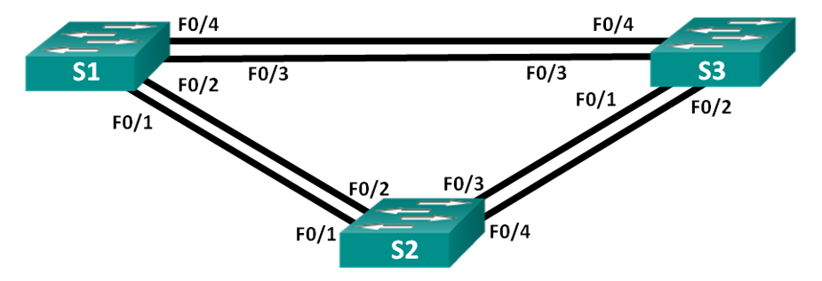        
## **Таблица адресации**      
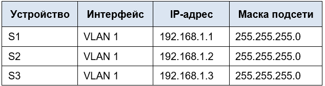       

## **Цели**      
### &nbsp;&nbsp;&nbsp;&nbsp;**Часть 1. Создание сети и настройка основных параметров устройства**         
### &nbsp;&nbsp;&nbsp;&nbsp;**Часть 2. Выбор корневого моста**        
### &nbsp;&nbsp;&nbsp;&nbsp;**Часть 3. Наблюдение за процессом выбора протоколом STP порта, исходя из стоимости портов**       
### &nbsp;&nbsp;&nbsp;&nbsp;**Часть 4. Наблюдение за процессом выбора протоколом STP порта, исходя из приоритета портов**      

## **Часть 1: Создание сети и настройка основных параметров устройства**       
### **Шаг 1: Создайте сеть согласно топологии.**     
  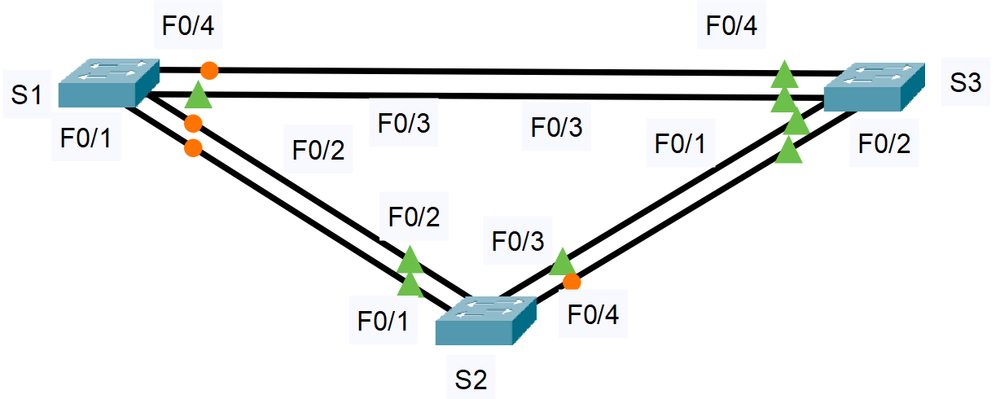       

### **Шаг 2:Выполните инициализацию и перезагрузку коммутаторов**     
#### Выполняем на каждом коммутаторе       
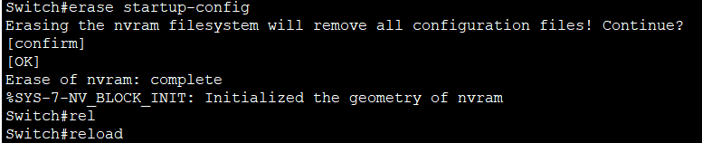      

### **Шаг 3: Настройте базовые параметры каждого коммутатора.**        
#### **Коммутатор S1**    
#### &nbsp;&nbsp;&nbsp;&nbsp;a.	Отключите поиск DNS   
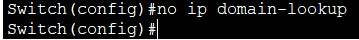 

#### &nbsp;&nbsp;&nbsp;&nbsp;b.	Присвойте имена устройствам в соответствии с топологией.     
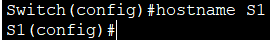      

#### &nbsp;&nbsp;&nbsp;&nbsp;c.	Назначьте class в качестве зашифрованного пароля доступа к привилегированному режиму.     
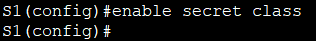     

#### &nbsp;&nbsp;&nbsp;&nbsp;d.	Назначьте cisco в качестве паролей консоли и VTY и активируйте вход для консоли и VTY каналов.      
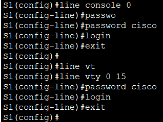      

#### &nbsp;&nbsp;&nbsp;&nbsp;e.	Настройте logging synchronous для консольного канала.    
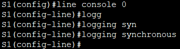     

#### &nbsp;&nbsp;&nbsp;&nbsp;f.	Настройте баннерное сообщение дня (MOTD) для предупреждения пользователей о запрете несанкционированного доступа.    
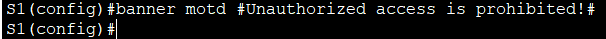     

#### &nbsp;&nbsp;&nbsp;&nbsp;g.	Задайте IP-адрес, указанный в таблице адресации для VLAN 1 на всех коммутаторах.     
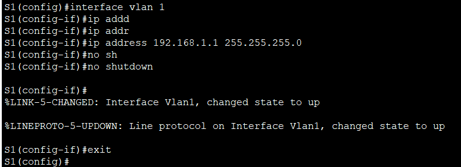    

#### &nbsp;&nbsp;&nbsp;&nbsp;h.	Скопируйте текущую конфигурацию в файл загрузочной конфигурации.     
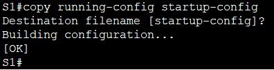    

#### **Коммутатор S2**      
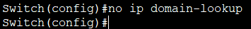    

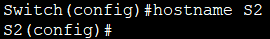     

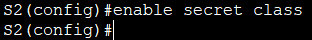     

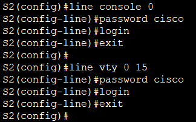      

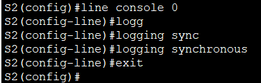     

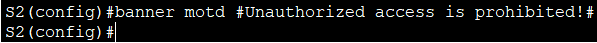     

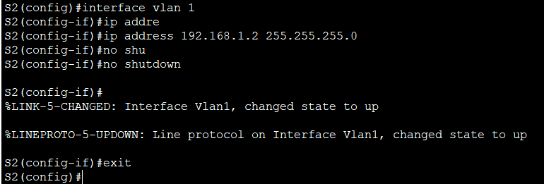     

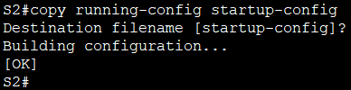      

#### **Коммутатор S3**    
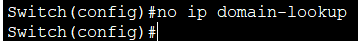     

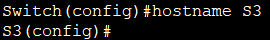     

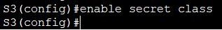     

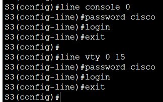     

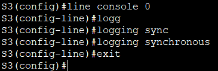     

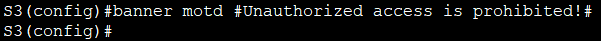     

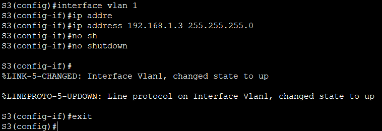     

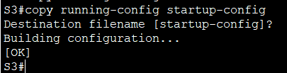    

### **Шаг 4: Проверьте связь**     
#### **Проверьте способность компьютеров обмениваться эхо-запросами.**     
#### **НА S1**   
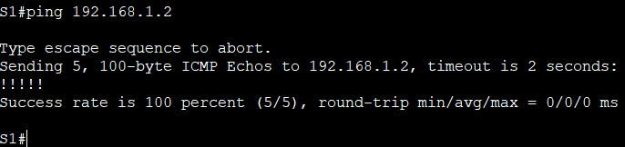    

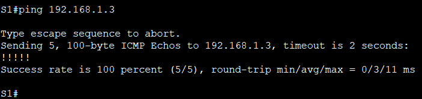     

#### **На S2**     
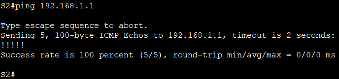     

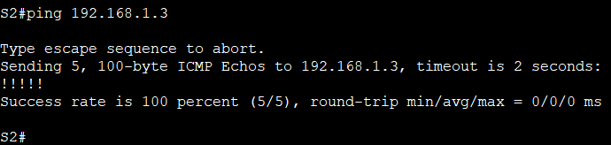     

#### **На S3**     
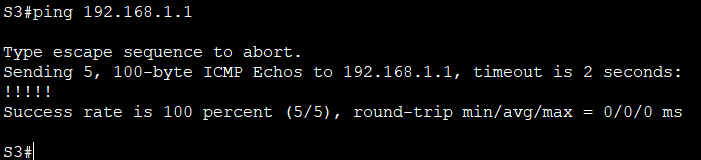     

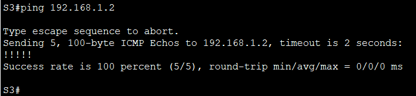     

#### Успешно ли выполняется эхо-запрос от коммутатора S1 на коммутатор S2?  **Да**
#### Успешно ли выполняется эхо-запрос от коммутатора S1 на коммутатор S3?  **Да**    
#### Успешно ли выполняется эхо-запрос от коммутатора S2 на коммутатор S3?   **Да**    

## **Часть 2: Определение корневого моста**        
### **Шаг 1: Отключите все порты на коммутаторах.**      
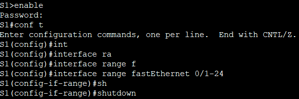     

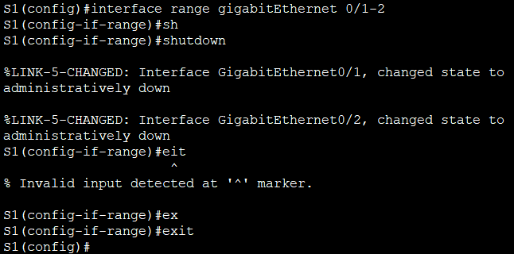    

#### Повторяем процедуру для коммутаторов S2 и S3.     

### **Шаг 2: Настройте подключенные порты в качестве транковых.**    
#### Выполняем на всех коммутаторах  
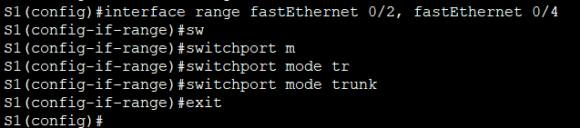     

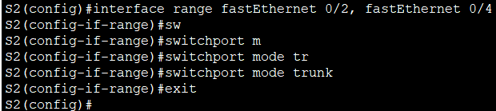     

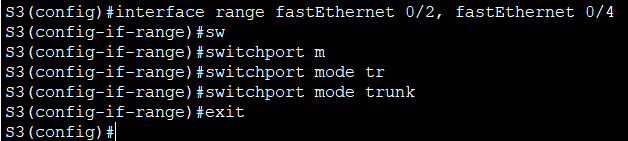     

### **Шаг 3: Включите порты F0/2 и F0/4 на всех коммутаторах.**      
#### Выполняем на каждом коммутаторе       
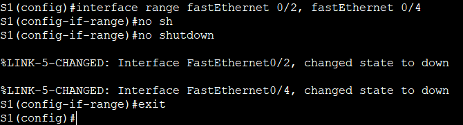      

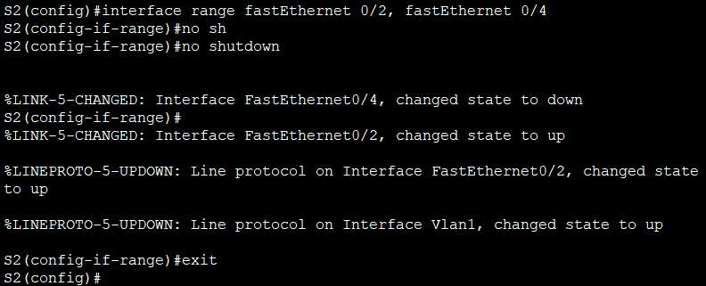      

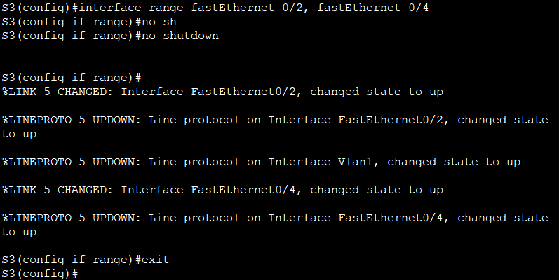    

### **Шаг 4: Отобразите данные протокола spanning-tree.**     
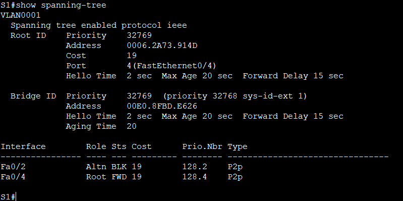      

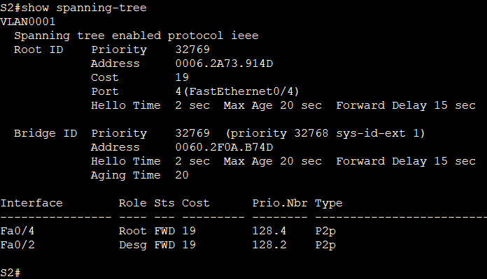    

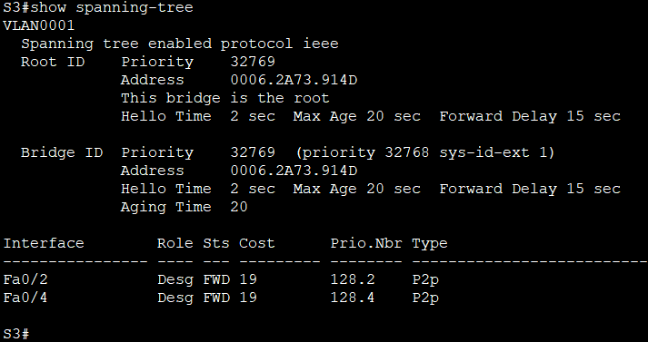    

#### В схему ниже запишите роль и состояние (Sts) активных портов на каждом коммутаторе в топологии.   
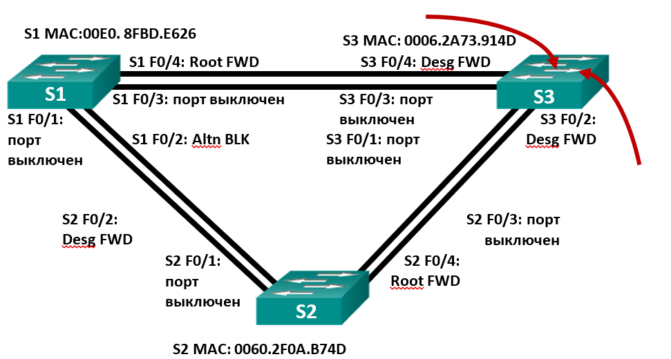     

#### С учетом выходных данных, поступающих с коммутаторов, ответьте на следующие вопросы.  

#### **1.Какой коммутатор является корневым мостом?**  
#### S3      

#### **2. Почему этот коммутатор был выбран протоколом spanning-tree в качестве корневого моста?**    
#### Все три коммутатора имеют одинаковый приоритет Bridge ID (32769 = 32768 + VLAN 1). Корневым мостом становится коммутатор с наименьшим MAC-адресом. MAC-адрес S3 (0006.2A73.914D) меньше, чем MAC-адрес S2 (0060.2F0A.B74D) и S1 (00E0.8FBD.E626), поэтому S3 выбран корнем.     

#### **3.Какие порты на коммутаторе являются корневыми портами?** 
#### На S1: порт Fa0/4
#### На S2: порт Fa0/4
#### На S3 (корневой мост): корневых портов нет     

#### **4. Какие порты на коммутаторе являются назначенными портами?**    
#### На S3: порты Fa0/2 и Fa0/4
#### На S2: порт Fa0/2    
#### На S1: назначенных портов нет     

#### **5. Какой порт отображается в качестве альтернативного и в настоящее время заблокирован?**     
#### Порт Fa0/2 на коммутаторе S1     

#### **6. Почему протокол spanning-tree выбрал этот порт в качестве невыделенного (заблокированного) порта?**     
#### У S1 есть два возможных пути к корневому мосту S3:   
#### &nbsp;&nbsp;&nbsp;&nbsp;1. Прямой через Fa0/4 (стоимость 19)      
#### &nbsp;&nbsp;&nbsp;&nbsp;2. Через Fa0/2 → S2 → S3 (стоимость 19 + 19 = 38)    
#### STP всегда выбирает путь с наименьшей стоимостью, поэтому порт Fa0/4 становится корневым, а Fa0/2 блокируется.      
#### Кроме того, на общем сегменте между S1 и S2 (линия Fa0/2–Fa0/2) коммутатор S2 имеет меньший Bridge ID (MAC 0060.2F0A.B74D < 00E0.8FBD.E626), поэтому S2 становится назначенным мостом для этого сегмента, а S1 вынужден заблокировать свой порт Fa0/2, чтобы предотвратить петлю.

## **Часть 3: Наблюдение за процессом выбора протоколом STP порта, исходя из стоимости портов**      
### **Шаг 1: Определите коммутатор с заблокированным портом.**       
#### Выполните команду show spanning-tree на обоих коммутаторах некорневого моста.       
 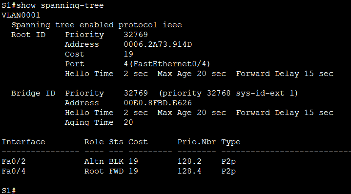      

 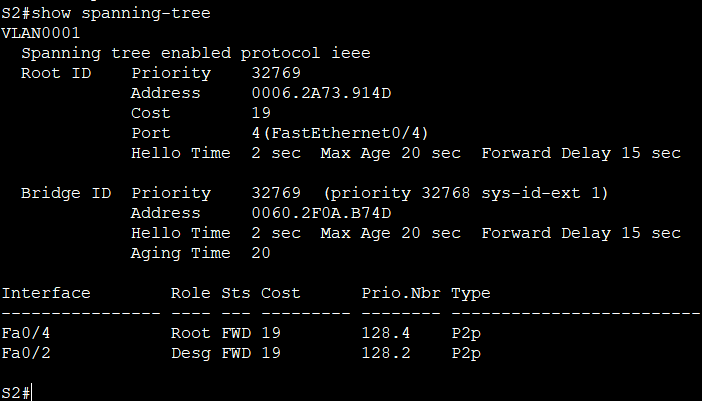     

 #### spanning-tree блокирует порт F0/2 на коммутаторе с самым высоким идентификатором BID (S1).

### **Шаг 2: Измените стоимость порта.**    
#### Помимо заблокированного порта, единственным активным портом на этом коммутаторе является порт, выделенный в качестве порта корневого моста. Уменьшите стоимость этого порта корневого моста до 18, выполнив команду **spanning-tree vlan 1 cost 18** режима конфигурации интерфейса.      
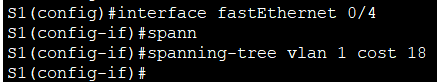     

### **Шаг 3:Просмотрите изменения протокола spanning-tree.**     
#### Повторно выполните команду **show spanning-tree** на обоих коммутаторах некорневого моста.      
      

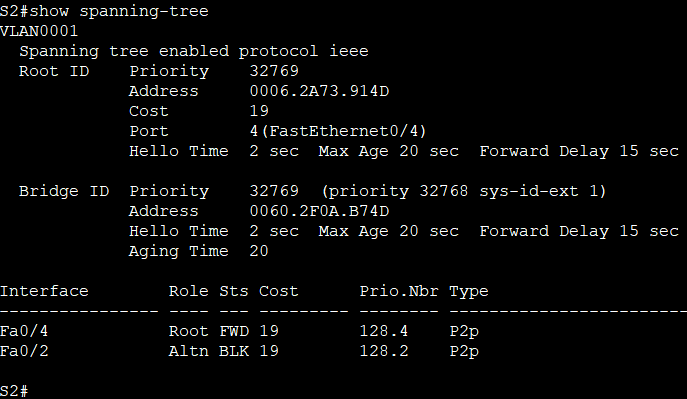    

#### Мы видим, что ранее на S1 был заблокирован порт Fa0/2, а после изменения стоимости порта Fa0/4 на S1 с 19 на 18, заблокированным стал порт Fa0/2 на S2.   

#### **Почему протокол spanning-tree заменяет ранее заблокированный порт на назначенный порт и блокирует порт, который был назначенным портом на другом коммутаторе?**

#### Когда мы уменьшили стоимость корневого порта на S1 (с 19 до 18), стоимость пути от S1 до корня стала меньше, чем у S2 (у которого осталась 19).
#### На сегменте между S1 и S2 (порты Fa0/2) теперь S1 имеет преимущество (18 < 19), поэтому его порт становится назначенным, а порт S2 – альтернативным (заблокированным).    
#### Ранее, когда стоимости были равны (19 = 19), назначенным был S2 (по критерию меньшего BID). Изменение стоимости сместило приоритет в пользу S1, что и вызвало перемещение блокировки.   

