# **Настройка DHCPv6**     
## **Топология**           
        
## **Таблица адресации**     
       
## **Задачи**    
### &nbsp;&nbsp;&nbsp;&nbsp;**Часть 1. Создание сети и настройка основных параметров устройства**      
### &nbsp;&nbsp;&nbsp;&nbsp;**Часть 2. Проверка назначения адреса SLAAC от R1**     
### &nbsp;&nbsp;&nbsp;&nbsp;**Часть 3. Настройка и проверка сервера DHCPv6 без гражданства на R1**      
### &nbsp;&nbsp;&nbsp;&nbsp;**Часть 4. Настройка и проверка состояния DHCPv6 сервера на R1**  
### &nbsp;&nbsp;&nbsp;&nbsp;**Часть 5. Настройка и проверка DHCPv6 Relay на R2**     
## **Часть 1. Создание сети и настройка основных параметров устройства**     
### **Шаг 1. Создайте сеть согласно топологии.**   
    
### **Шаг 2. Настройте базовые параметры каждого коммутатора.**    
#### &nbsp;&nbsp;&nbsp;&nbsp;a.	Присвойте коммутатору имя устройства.      
 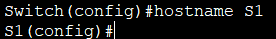     

 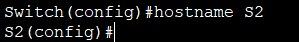      

#### &nbsp;&nbsp;&nbsp;&nbsp;b.	Отключите поиск DNS, чтобы предотвратить попытки маршрутизатора неверно преобразовывать введенные команды таким образом, как будто они являются именами узлов.     
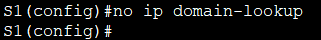     

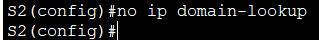     

#### &nbsp;&nbsp;&nbsp;&nbsp;c.	Назначьте **class** в качестве зашифрованного пароля привилегированного режима EXEC.    
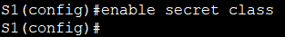      

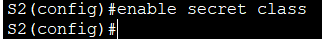     

#### &nbsp;&nbsp;&nbsp;&nbsp;d.	Назначьте **cisco** в качестве пароля консоли и включите вход в систему по паролю.      
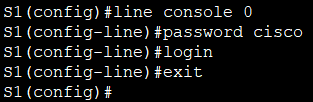      

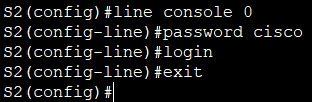     

#### &nbsp;&nbsp;&nbsp;&nbsp;e.	Назначьте **cisco** в качестве пароля VTY и включите вход в систему по паролю.      
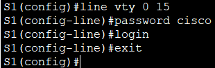     

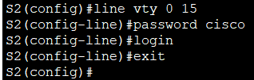     

#### &nbsp;&nbsp;&nbsp;&nbsp;f.	Зашифруйте открытые пароли.   
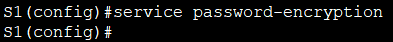     

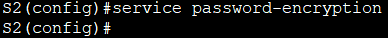     

#### &nbsp;&nbsp;&nbsp;&nbsp;g.	Создайте баннер с предупреждением о запрете несанкционированного доступа к устройству.     
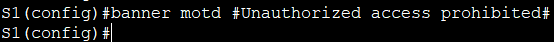       

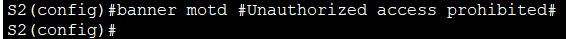     

#### &nbsp;&nbsp;&nbsp;&nbsp;h.	Отключите все неиспользуемые порты.     
#### Для S1:
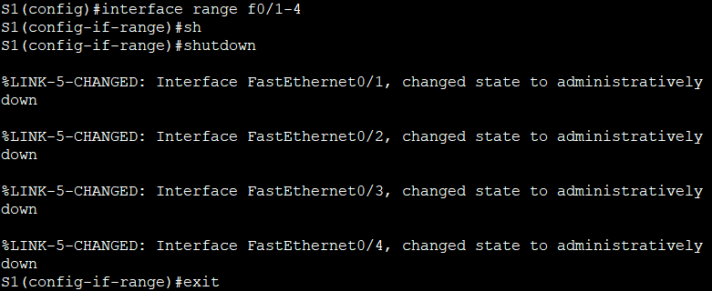    
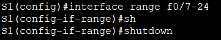     
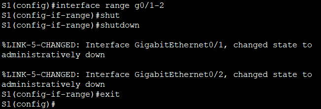     

#### Для S2:
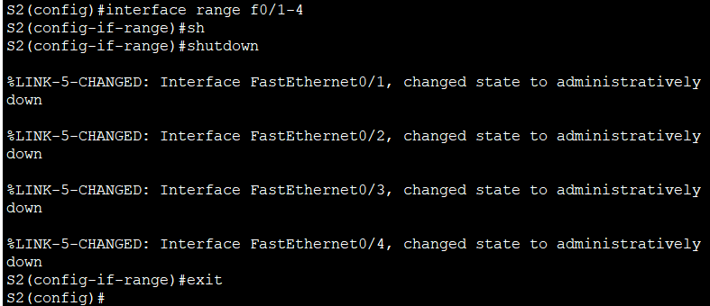     
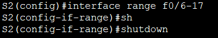    
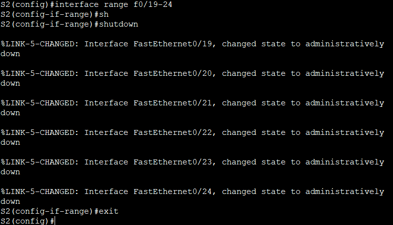    
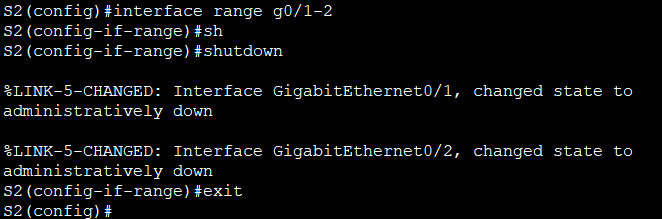    

#### &nbsp;&nbsp;&nbsp;&nbsp;i.	Сохраните текущую конфигурацию в файл загрузочной конфигурации.    
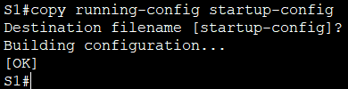    

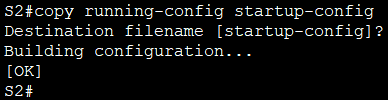     

### **Шаг 3. Произведите базовую настройку маршрутизаторов.**   
#### &nbsp;&nbsp;&nbsp;&nbsp;a.	Назначьте маршрутизатору имя устройства.   
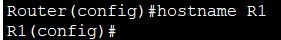    

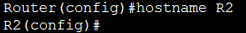    

#### &nbsp;&nbsp;&nbsp;&nbsp;b.	Отключите поиск DNS, чтобы предотвратить попытки маршрутизатора неверно преобразовывать введенные команды таким образом, как будто они являются именами узлов.   
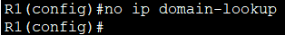    

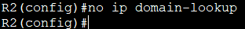    

#### &nbsp;&nbsp;&nbsp;&nbsp;c.	Назначьте **class** в качестве зашифрованного пароля привилегированного режима EXEC.   
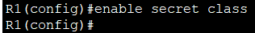     

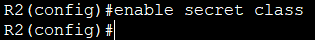    

#### &nbsp;&nbsp;&nbsp;&nbsp;d.	Назначьте **cisco** в качестве пароля консоли и включите вход в систему по паролю.     
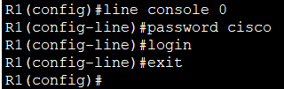     

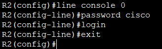     

#### &nbsp;&nbsp;&nbsp;&nbsp;e.	Назначьте **cisco** в качестве пароля VTY и включите вход в систему по паролю.    
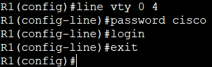     

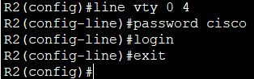     

#### &nbsp;&nbsp;&nbsp;&nbsp;f.	Зашифруйте открытые пароли.    
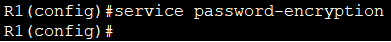    

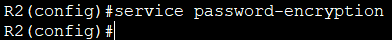    

#### &nbsp;&nbsp;&nbsp;&nbsp;g.	Создайте баннер с предупреждением о запрете несанкционированного доступа к устройству.     
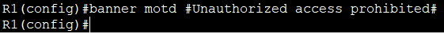    

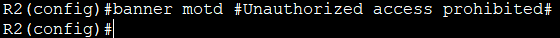    

#### &nbsp;&nbsp;&nbsp;&nbsp;h.	Активация IPv6-маршрутизации    
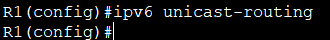     

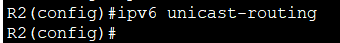    

#### &nbsp;&nbsp;&nbsp;&nbsp;i.	Сохраните текущую конфигурацию в файл загрузочной конфигурации.    
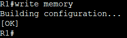    

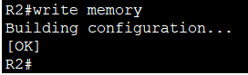    

### **Шаг 4. Настройка интерфейсов и маршрутизации для обоих маршрутизаторов.**    
#### &nbsp;&nbsp;&nbsp;&nbsp;a.	Настройте интерфейсы G0/0/0 и G0/1 на R1 и R2 с адресами IPv6, указанными в таблице выше.    
#### Для R1:
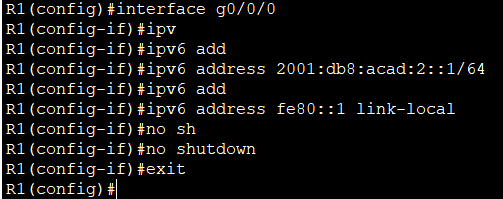    

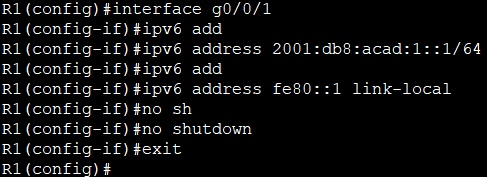     

#### Для R2:
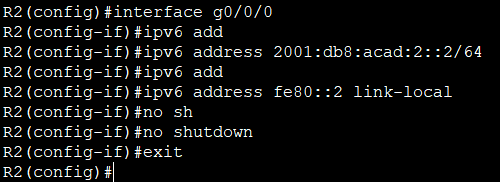     

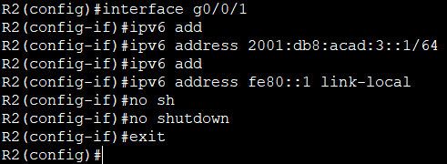    

#### &nbsp;&nbsp;&nbsp;&nbsp;b.	Настройте маршрут по умолчанию на каждом маршрутизаторе, который указывает на IP-адрес G0/0/0 на другом маршрутизаторе.

#### Для R1:
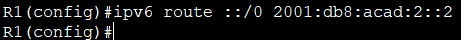    

#### Для R2:
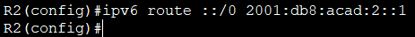     

#### &nbsp;&nbsp;&nbsp;&nbsp;c.	Убедитесь, что маршрутизация работает с помощью пинга адреса G0/0/1 R2 из R1    
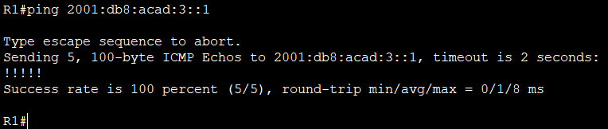     

#### &nbsp;&nbsp;&nbsp;&nbsp;d.	Сохраните текущую конфигурацию в файл загрузочной конфигурации.    
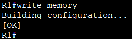    

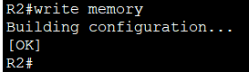    

## **Часть 2. Проверка назначения адреса SLAAC от R1**    
#### Включите PC-A и убедитесь, что сетевой адаптер настроен для автоматической настройки IPv6.
#### Через несколько минут результаты команды ipconfig должны показать, что PC-A присвоил себе адрес из сети 2001:db8:1::/64.    
    

#### **Откуда взялась часть адреса с идентификатором хоста?**    
#### Идентификатор хоста (последние 64 бита IPv6-адреса) сгенерирован самим компьютером PC‑A на основе метода SLAAC.
#### Узел сам назначает себе идентификатор хоста без участия DHCP-сервера, используя информацию из объявлений маршрутизатора (RA), которые R1 рассылает в локальной сети (префикс 2001:db8:acad:1::/64).

## **Часть 3. Настройка и проверка сервера DHCPv6 на R1**   
### **Шаг 1. Более подробно изучите конфигурацию PC-A.**    
#### &nbsp;&nbsp;&nbsp;&nbsp;a.	Выполните команду ipconfig /all на PC-A и посмотрите на результат     
    

#### &nbsp;&nbsp;&nbsp;&nbsp;b.	Обратите внимание, что основной DNS-суффикс отсутствует. Также обратите внимание, что предоставленные адреса DNS-сервера являются адресами «локального сайта anycast», а не одноадресные адреса, как ожидалось.   

