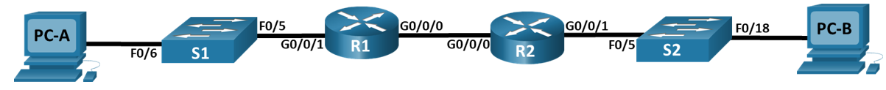
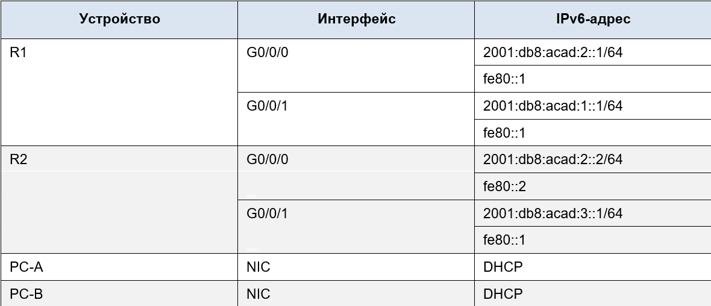
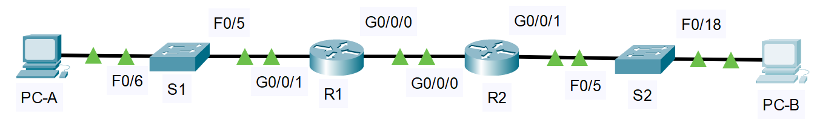

# **Настройка DHCPv6**     
## **Топология**    
      
## **Таблица адресации**     
     
## **Задачи**    
### &nbsp;&nbsp;&nbsp;&nbsp;**Часть 1. Создание сети и настройка основных параметров устройства**      
### &nbsp;&nbsp;&nbsp;&nbsp;**Часть 2. Проверка назначения адреса SLAAC от R1**     
### &nbsp;&nbsp;&nbsp;&nbsp;**Часть 3. Настройка и проверка сервера DHCPv6 без гражданства на R1**      
### &nbsp;&nbsp;&nbsp;&nbsp;**Часть 4. Настройка и проверка состояния DHCPv6 сервера на R1**  
### &nbsp;&nbsp;&nbsp;&nbsp;**Часть 5. Настройка и проверка DHCPv6 Relay на R2**     
## **Часть 1. Создание сети и настройка основных параметров устройства**     
### **Шаг 1. Создайте сеть согласно топологии.**   
      

