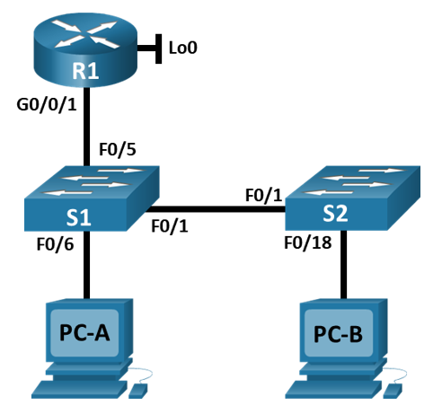
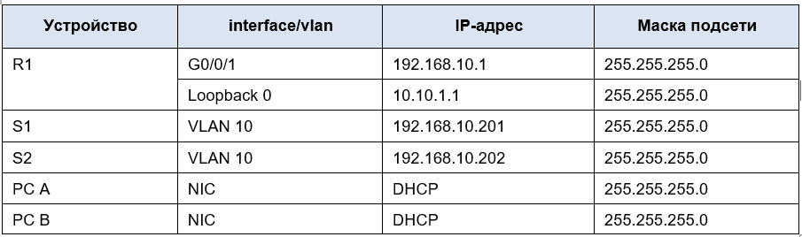
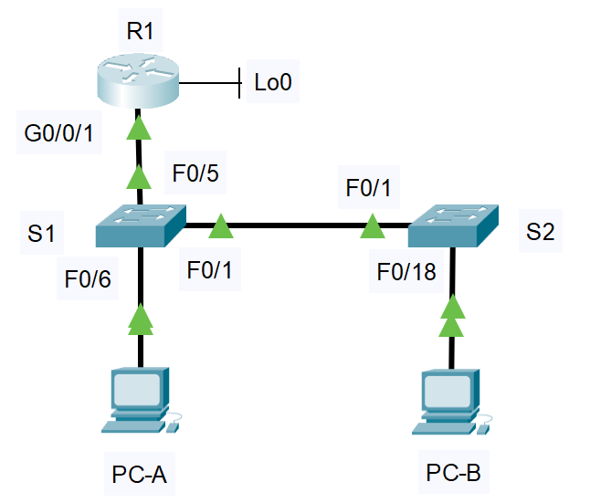

# **Лабораторная работа - Конфигурация безопасности коммутатора**      
## **Топология**    
     
## **Таблица адресации**    
      
## **Цели**      
## **Часть 1. Настройка основного сетевого устройства**      
## **Часть 2. Настройка сетей VLAN**     
## **Часть 3: Настройки безопасности коммутатора.**      

## **Часть 1. Настройка основного сетевого устройства**        
### **Шаг 1. Создайте сеть.**     
#### &nbsp;&nbsp;&nbsp;&nbsp;a.	Создайте сеть согласно топологии       
         
#### &nbsp;&nbsp;&nbsp;&nbsp;b.	Инициализация устройств     

