# **Лабораторная работа - Конфигурация безопасности коммутатора**      
## **Топология**    
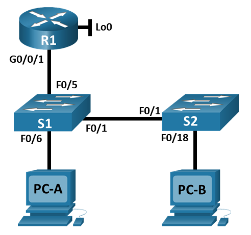     
## **Таблица адресации**    
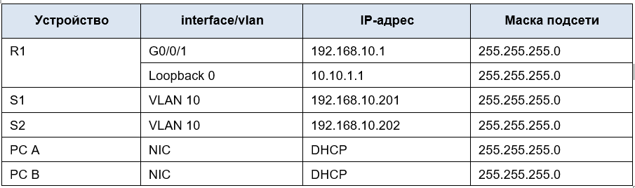      
## **Цели**      
## **Часть 1. Настройка основного сетевого устройства**      
## **Часть 2. Настройка сетей VLAN**     
## **Часть 3: Настройки безопасности коммутатора.**      

## **Часть 1. Настройка основного сетевого устройства**        
### **Шаг 1. Создайте сеть.**     
#### &nbsp;&nbsp;&nbsp;&nbsp;a.	Создайте сеть согласно топологии       
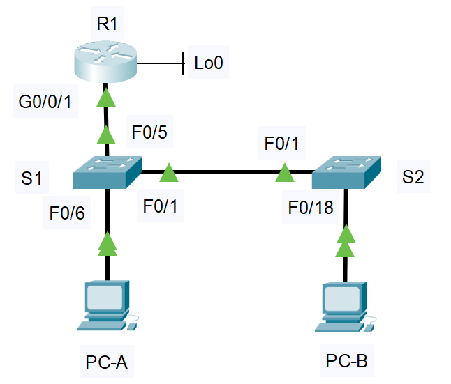         
#### &nbsp;&nbsp;&nbsp;&nbsp;b.	Инициализация устройств     
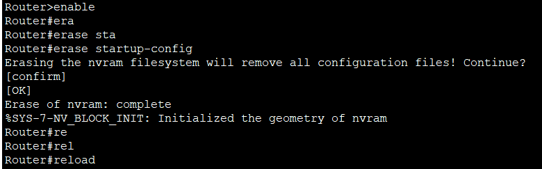    

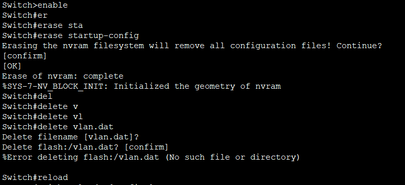     

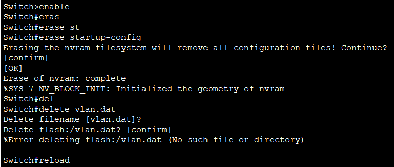      

### **Шаг 2. Настройте маршрутизатор R1.**      
#### &nbsp;&nbsp;&nbsp;&nbsp;a.	Загрузите следующий конфигурационный скрипт на R1.    
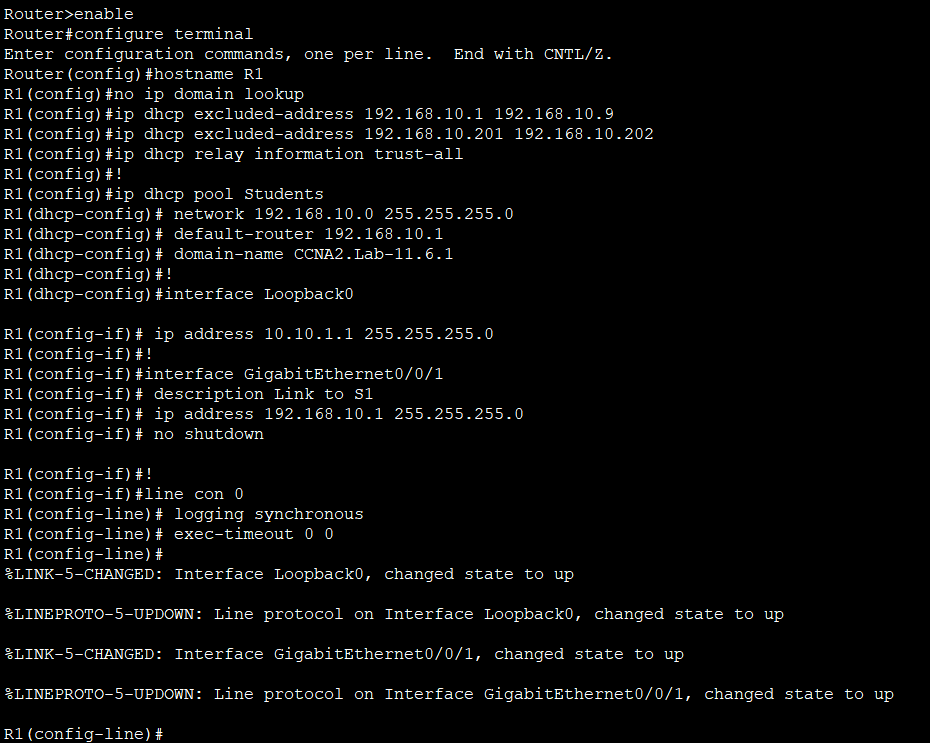       

#### &nbsp;&nbsp;&nbsp;&nbsp;b.	Проверьте текущую конфигурацию на R1, используя команду **show ip interface brief**:      
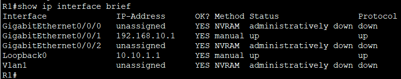      

#### &nbsp;&nbsp;&nbsp;&nbsp;c.	Убедитесь, что IP-адресация и интерфейсы находятся в состоянии up / up (при необходимости устраните неполадки).       

#### Исходя из пункта c, все настроенные интерфейсы на R1 активны.          

### **Шаг 3. Настройка и проверка основных параметров коммутатора**     
#### &nbsp;&nbsp;&nbsp;&nbsp;a.	Настройте имя хоста для коммутаторов S1 и S2.     
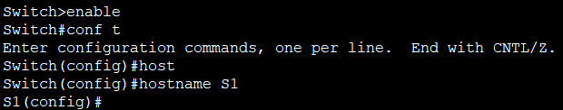       

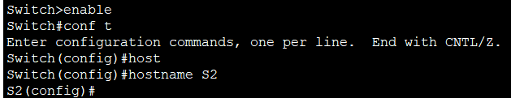    

#### &nbsp;&nbsp;&nbsp;&nbsp;b.	Запретите нежелательный поиск в DNS.       
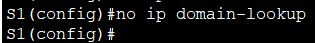     

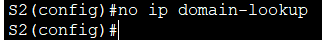     

#### &nbsp;&nbsp;&nbsp;&nbsp;c.	Настройте описания интерфейса для портов, которые используются в S1 и S2. 

#### Составим таблицу в соотвествии с топологией     
| Коммутатор | Порт | Подключение        |
|------------|----- |-------------       |
| S1         |F0/1  | Соединение с S2    |
| S1         |F0/5  | Соединение с R1    |
| S1         |F0/6  | Соединение с PC‑A  |
| S2         |F0/1  | Соединение с S1    |
| S2         |F0/18 |Соединение с PC‑B   |

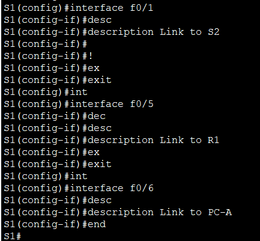    

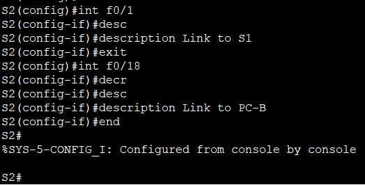    

#### &nbsp;&nbsp;&nbsp;&nbsp;d.	Установите для шлюза по умолчанию для VLAN управления значение 192.168.10.1 на обоих коммутаторах.       
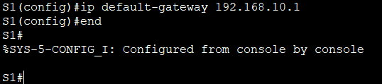    

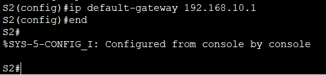    

## **Часть 2. Настройка сетей VLAN на коммутаторах.**     
### **Шаг 1. Сконфигруриуйте VLAN 10.**    
#### Добавьте VLAN 10 на S1 и S2 и назовите **VLAN - Management**.      
 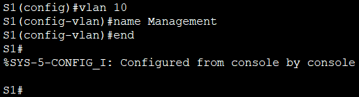      

 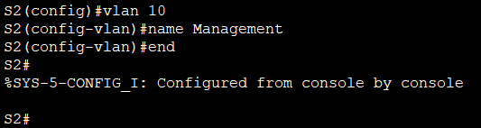    

### **Шаг 2. Сконфигруриуйте SVI для VLAN 10**      
#### Настройте IP-адрес в соответствии с таблицей адресации для SVI для VLAN 10 на S1 и S2. Включите интерфейсы SVI и предоставьте описание для интерфейса.     
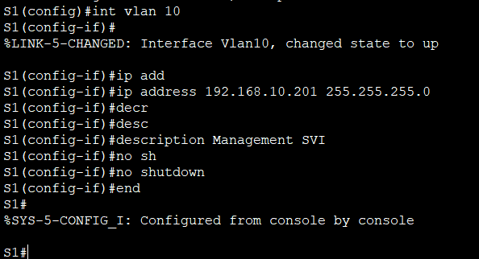     

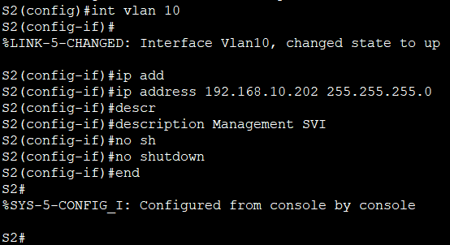      

### **Шаг 3. Настройте VLAN 333 с именем Native на S1 и S2**      
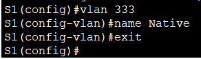      

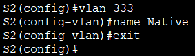     

### **Шаг 4. Настройте VLAN 999 с именем ParkingLot на S1 и S2**     
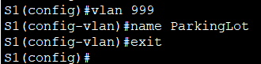     

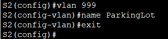     

## **Часть 3. Настройки безопасности коммутатора.**     
### **Шаг 1. Релизация магистральных соединений 802.1Q**       
#### &nbsp;&nbsp;&nbsp;&nbsp;a.	Настройте все магистральные порты Fa0/1 на обоих коммутаторах для использования VLAN 333 в качестве native VLAN.     
 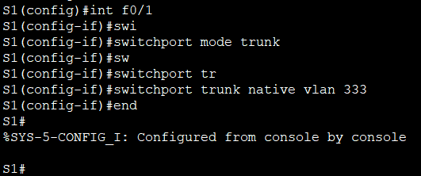      

 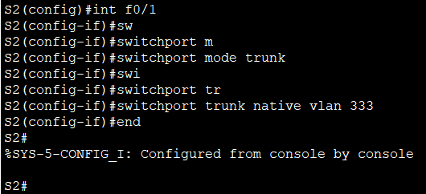     

#### &nbsp;&nbsp;&nbsp;&nbsp;b.	Убедитесь, что режим транкинга успешно настроен на всех коммутаторах.        
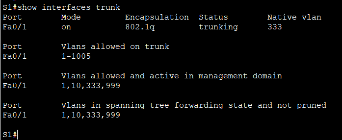      

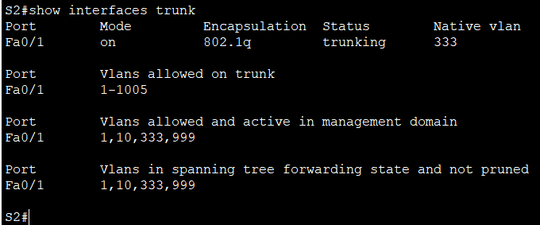        

#### &nbsp;&nbsp;&nbsp;&nbsp;c.	Отключить согласование DTP F0/1 на S1 и S2.      
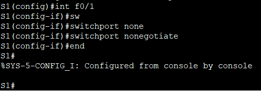      

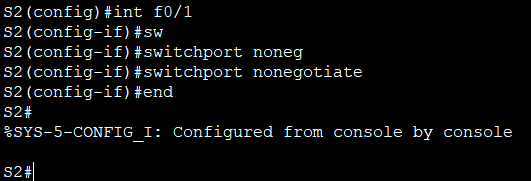     

#### &nbsp;&nbsp;&nbsp;&nbsp;d.	Проверьте с помощью команды show interfaces      
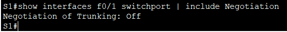    

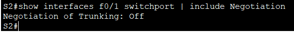     

### **Шаг 2. Настройка портов доступа**     
#### &nbsp;&nbsp;&nbsp;&nbsp;a.	На S1 настройте F0/5 и F0/6 в качестве портов доступа и свяжите их с VLAN 10.      
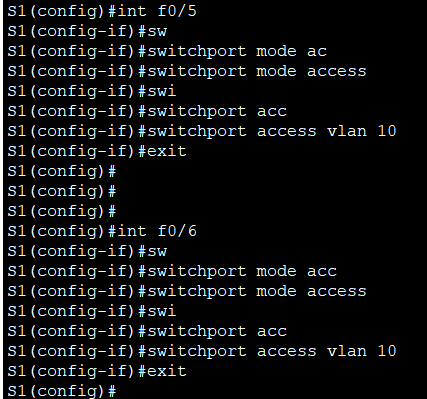      

#### &nbsp;&nbsp;&nbsp;&nbsp;b.	На S2 настройте порт доступа Fa0/18 и свяжите его с VLAN 10.      
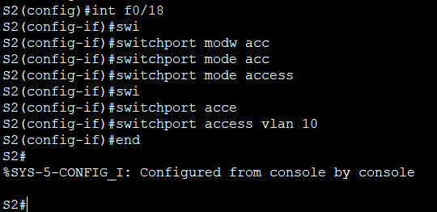     

### &nbsp;&nbsp;&nbsp;&nbsp;**Шаг 3. Безопасность неиспользуемых портов коммутатора**     
#### a.	На S1 и S2 переместите неиспользуемые порты из VLAN 1 в VLAN 999 и отключите неиспользуемые порты.        
#### Используемые порты на S1: Fa0/1 (транк), Fa0/5 (R1), Fa0/6 (PC‑A).     
#### Все остальные порты переводим в VLAN 999 и отключаем.     
 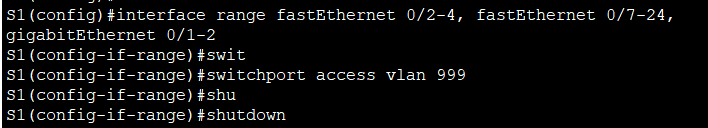    

#### Используемые порты на S2: Fa0/1 (транк), Fa0/18 (PC‑B).      
#### Все остальные порты переводим в VLAN 999 и отключаем.     
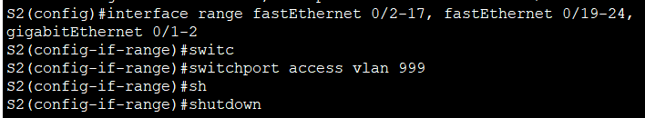        

#### &nbsp;&nbsp;&nbsp;&nbsp;b.	Убедитесь, что неиспользуемые порты отключены и связаны с VLAN 999, введя команду  show.        
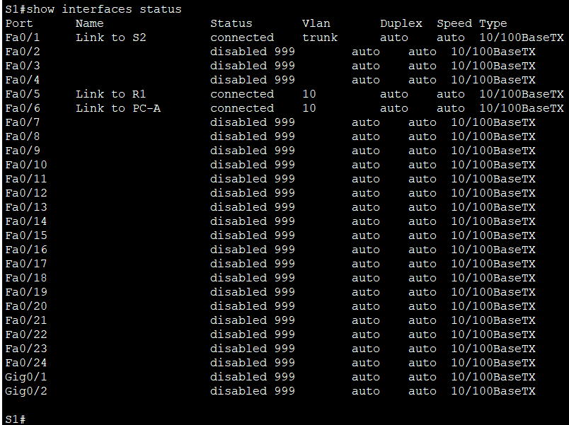      

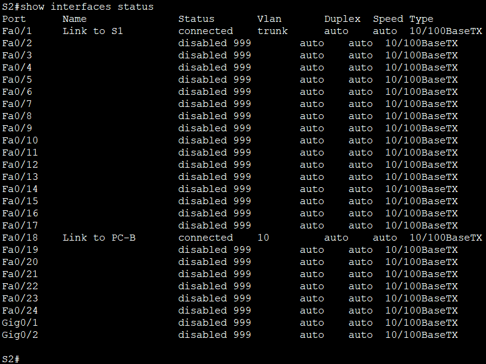       

### **Шаг 4. Документирование и реализация функций безопасности порта.**      
#### &nbsp;&nbsp;&nbsp;&nbsp;a.	На S1, введите команду show port-security interface f0/6  для отображения настроек по умолчанию безопасности порта для интерфейса F0/6. Запишите свои ответы ниже.         
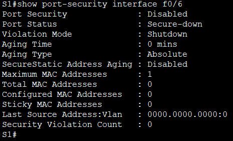      

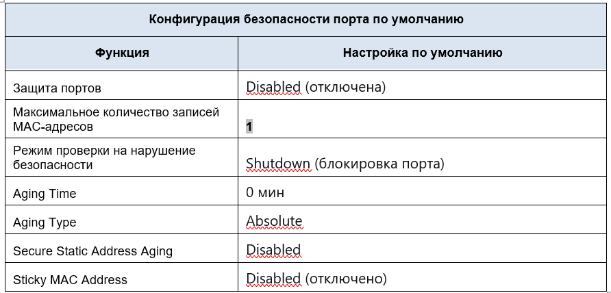      

#### &nbsp;&nbsp;&nbsp;&nbsp;b.	На S1 включите защиту порта на F0 / 6 со следующими настройками:
#### - Максимальное количество записей MAC-адресов: 3
#### - Режим безопасности: restrict
#### - Aging time: 60 мин.
#### - Aging type: неактивный
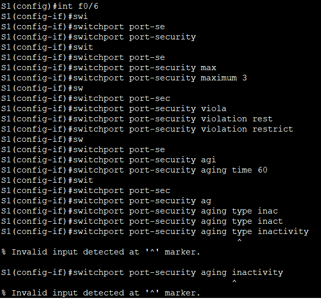      

#### В Packet Tracer команда **switchport port-security aging type inactivity** не работает, оставляем без изменений.    

#### c.	Verify port security on S1 F0/6.     
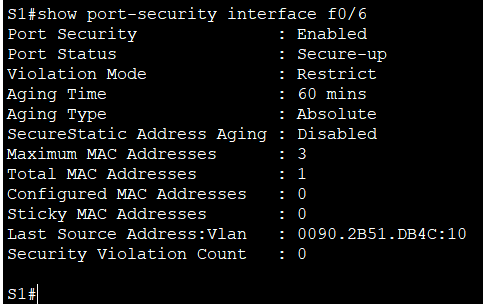    

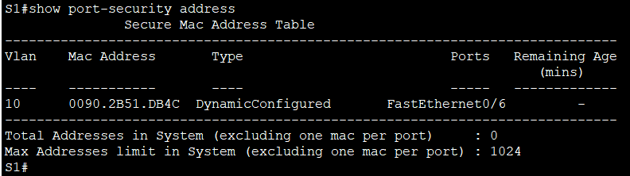      

#### &nbsp;&nbsp;&nbsp;&nbsp;d.	Включите безопасность порта для F0 / 18 на S2. Настройте каждый активный порт доступа таким образом, чтобы он автоматически добавлял адреса МАС, изученные на этом порту, в текущую конфигурацию.      
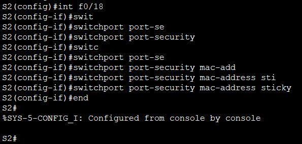      

#### &nbsp;&nbsp;&nbsp;&nbsp;e.	Настройте следующие параметры безопасности порта на S2 F / 18:
#### - Максимальное количество записей MAC-адресов: 2
#### - Тип безопасности: Protect
#### - Aging time: 60 мин.       
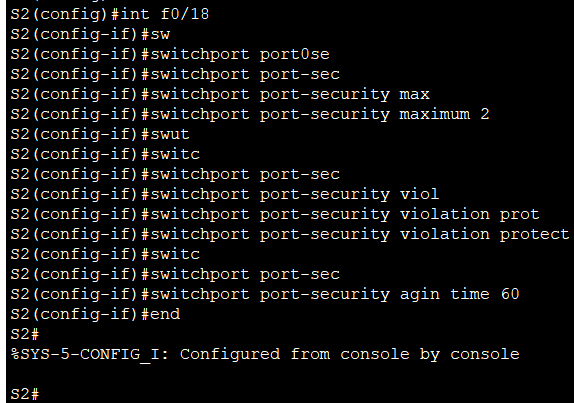      

#### &nbsp;&nbsp;&nbsp;&nbsp;f.	Проверка функции безопасности портов на S2 F0/18.         
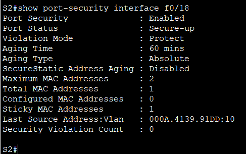     

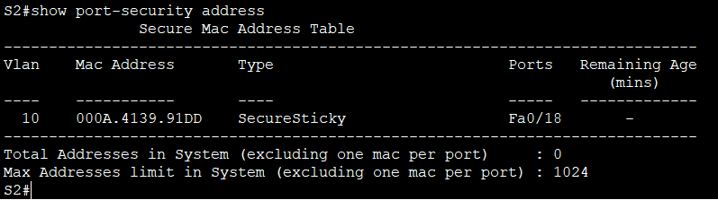      

### **Шаг 5. Реализовать безопасность DHCP snooping**      
#### &nbsp;&nbsp;&nbsp;&nbsp;a.	На S2 включите DHCP snooping и настройте DHCP snooping во VLAN 10         
 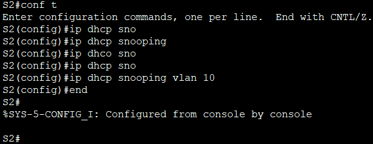        

#### &nbsp;&nbsp;&nbsp;&nbsp;b.	Настройте магистральные порты на S2 как доверенные порты.         
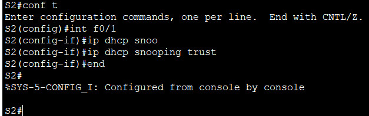       

#### &nbsp;&nbsp;&nbsp;&nbsp;c.	Ограничьте ненадежный порт Fa0/18 на S2 пятью DHCP-пакетами в секунду.       
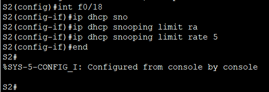       

#### &nbsp;&nbsp;&nbsp;&nbsp;d.	Проверка DHCP Snooping на S2.     
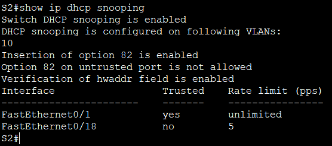      

#### &nbsp;&nbsp;&nbsp;&nbsp;e.	В командной строке на PC-B освободите, а затем обновите IP-адрес.       
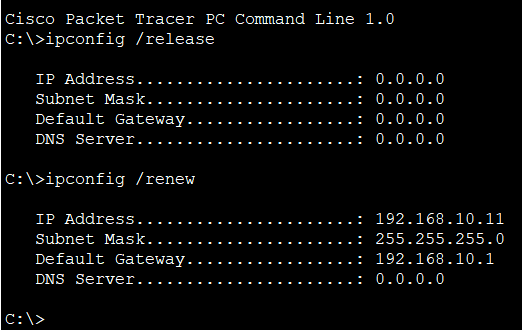     

#### &nbsp;&nbsp;&nbsp;&nbsp;f.	Проверьте привязку отслеживания DHCP с помощью команды **show ip dhcp snooping binding**.      
  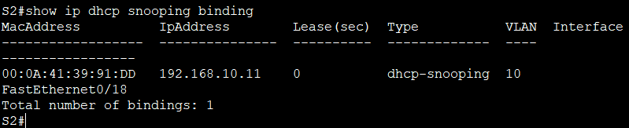       

### **Шаг 6. Реализация PortFast и BPDU Guard**      
#### &nbsp;&nbsp;&nbsp;&nbsp;a.	Настройте PortFast на всех портах доступа, которые используются на обоих коммутаторах.      
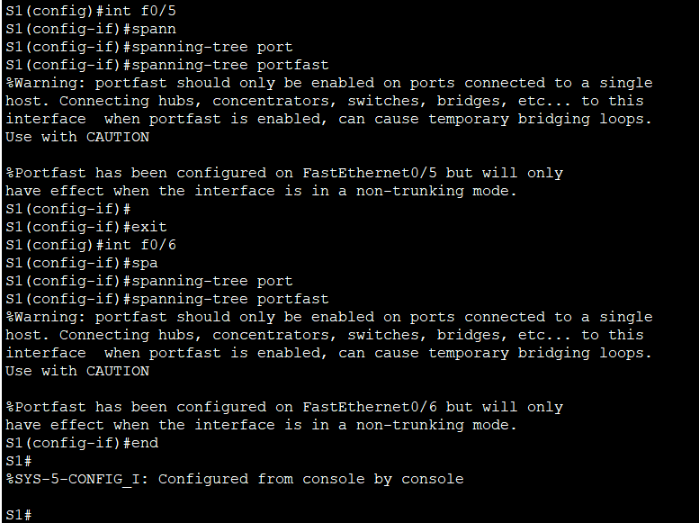     

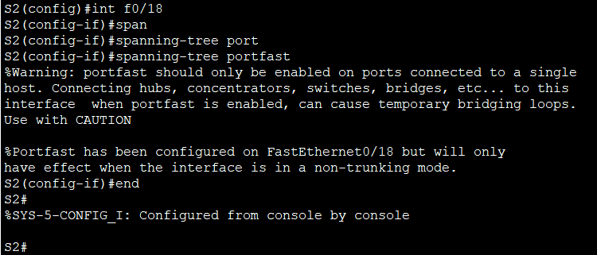      

#### &nbsp;&nbsp;&nbsp;&nbsp;b.	Включите защиту BPDU на портах доступа VLAN 10 S1 и S2, подключенных к PC-A и PC-B.      
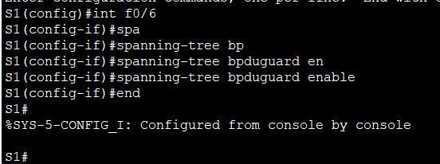    

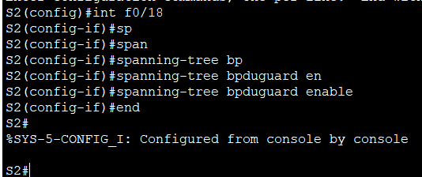    

#### &nbsp;&nbsp;&nbsp;&nbsp;c.	Убедитесь, что защита BPDU и PortFast включены на соответствующих портах.      
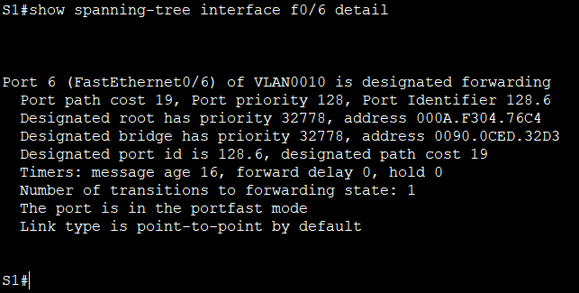         

#### Packet Tracer почему- то не отображает BPDU Guard командой **show spanning-tree interface f0/6 detail**, проверяем командой **show running-config | section FastEthernet0/6**    
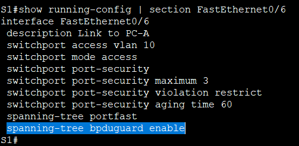    

#### Проверяем на S2     
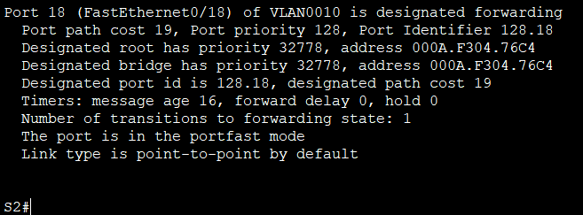   

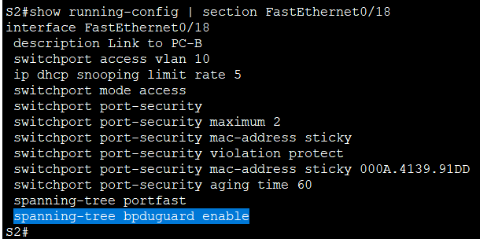      

### **Шаг 7. Проверьте наличие сквозного подключения**     
#### Проверьте PING свзяь между всеми устройствами в таблице IP-адресации. В случае сбоя проверки связи может потребоваться отключить брандмауэр на хостах.      
#### На PC-A:
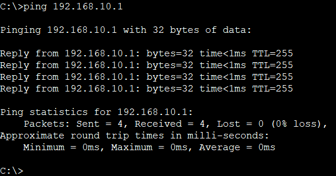    
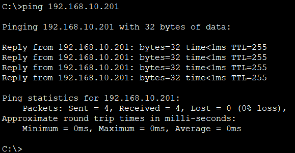      
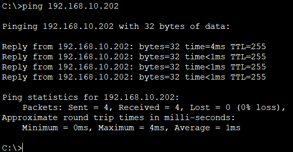     
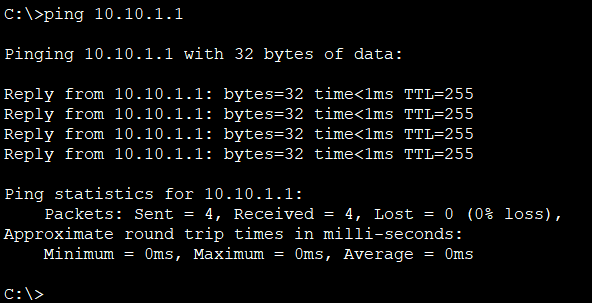       

#### На PC-B:     
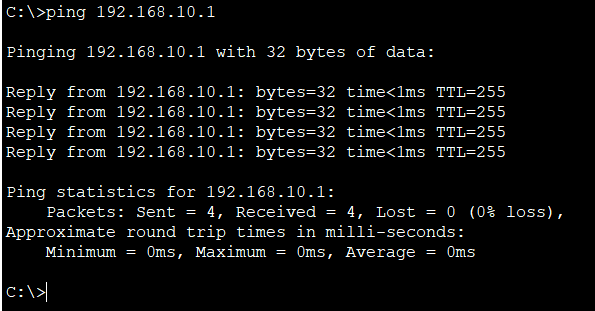     
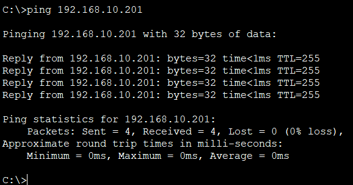      
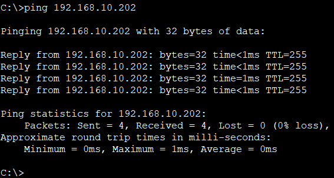      
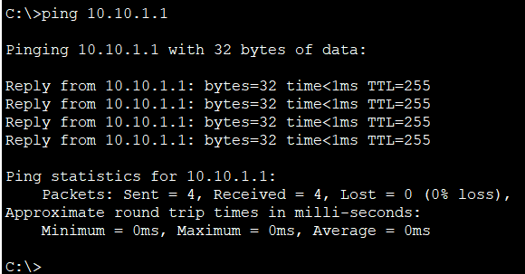       

#### На S1:     
 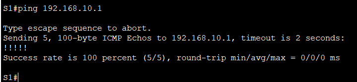      
 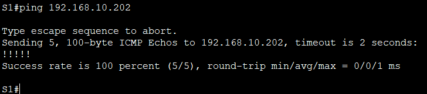       
 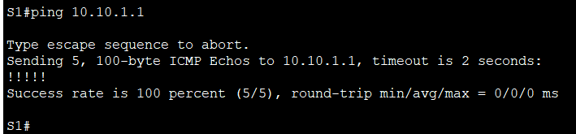       

#### На S2:      
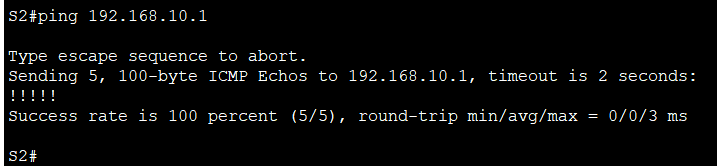       
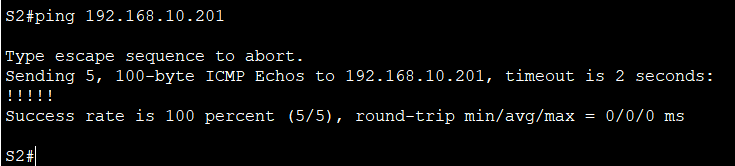      
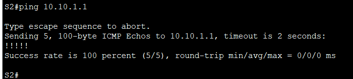       

#### На R1:      
#### Проверяем ping до PC-A       
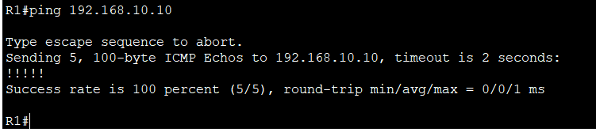       

#### Проверяем ping до PC-B     
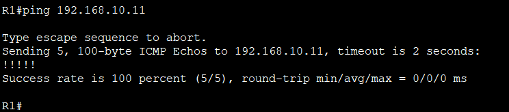      

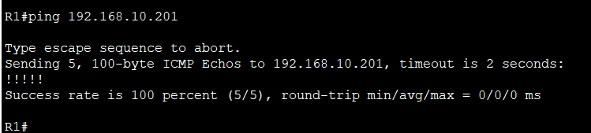      

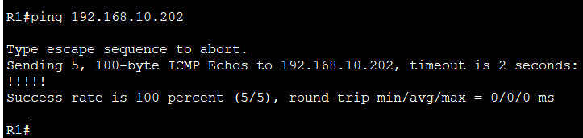     

## **Вопросы для повторения**      
#### **1.	С точки зрения безопасности порта на S2, почему нет значения таймера для оставшегося возраста в минутах, когда было сконфигурировано динамическое обучение - sticky?**       
#### При использовании режима sticky изученные MAC-адреса преобразуются в статичные и добавляются в текущую конфигурацию (running-config). Такие адреса не подвержены старению.       

#### **2.	Что касается безопасности порта на S2, если вы загружаете скрипт текущей конфигурации на S2, почему порту 18 на PC-B никогда не получит IP-адрес через DHCP?**      
#### После перезагрузки теряется таблица привязок DHCP snooping, а если порт Fa0/18 не настроен как доверенный, DHCP-ответы от сервера блокируются. Кроме того, если в скрипте прописан конкретный sticky MAC-адрес, не совпадающий с реальным MAC-адресом PC-B, порт безопасности блокирует все кадры от ПК, включая DHCP-запросы.

#### **3.	Что касается безопасности порта, в чем разница между типом абсолютного устаревания и типом устаревание по неактивности?**      
#### - Абсолютное старение – MAC‑адрес удаляется через фиксированное время независимо от того, был ли от него трафик.
#### - Старение по неактивности – MAC‑адрес удаляется только если в течение заданного времени не было трафика от этого адреса.

[Скачать конфиг лабораторной работы №9](https://github.com/nikolaishlyahtin1987-creator/NETWORK-ENGINEER_2026/blob/main/Лабораторные%20работы/Лабораторная%20работа%20№8/LAB%20№8_config.pkt "Нажмите для скачивания файла конфигурации")

 

