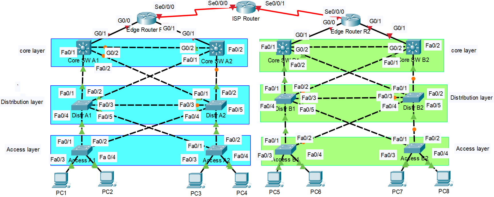
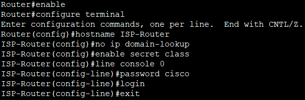
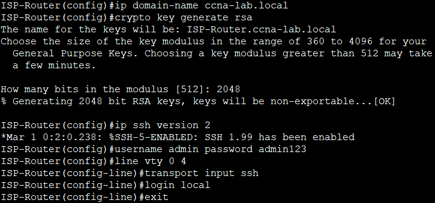
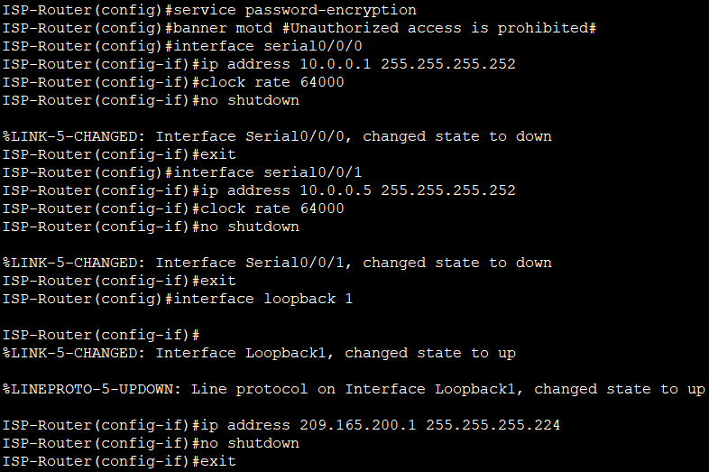
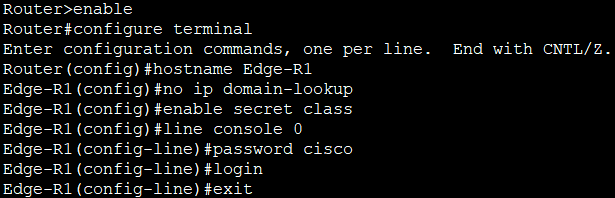
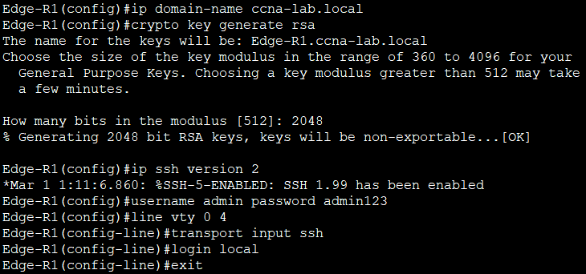
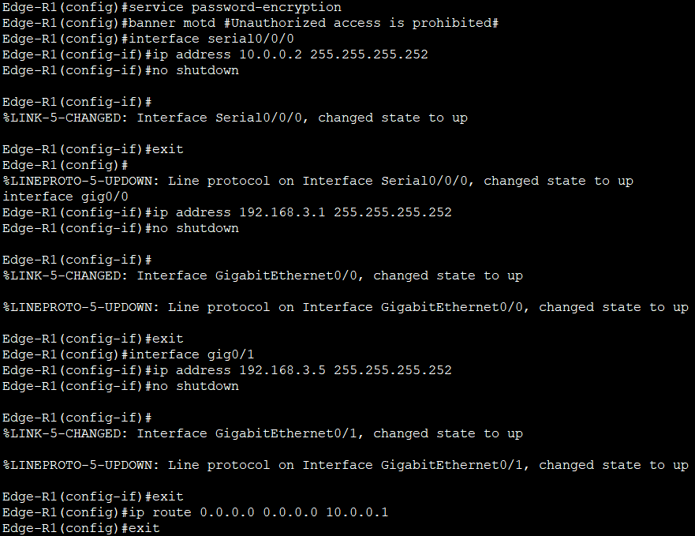
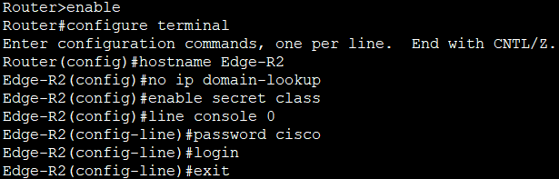
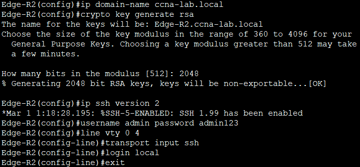
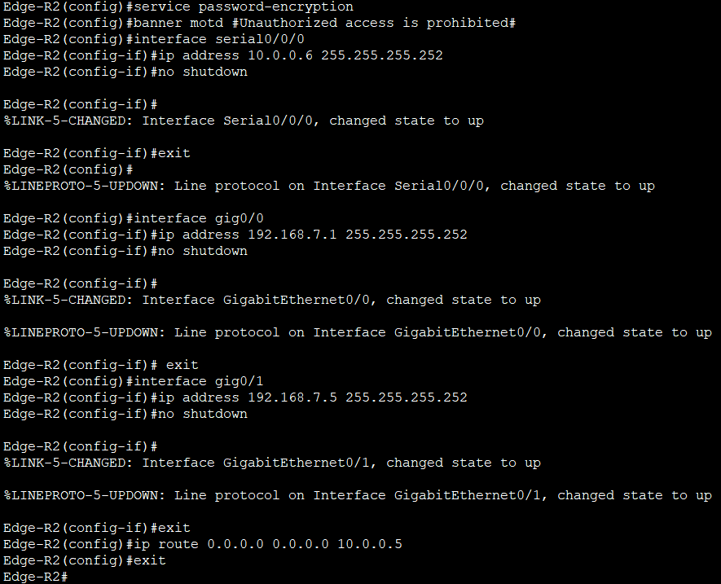

# **Проектирование и настройка корпоративной сети с двумя удалёнными филиалами**          
##       
## **Таблица адресации**    
## **Филиал А**     

|Устройство|Интерфейс|IP-адрес|Маска подсети|Шлюз по умолчанию|
|:--- |---|---|---|---:|    
|Edge R1|Se0/0/0|10.0.0.2|255.255.255.252|-|
|Edge R1|G0/0|192.168.3.1|255.255.255.252|-|
|Edge R1|G0/1|192.168.3.5|255.255.255.252|-|
|Core A1|G0/1|192.168.3.2|255.255.255.252|-|
|Core A1|SVI VLAN 10|192.168.0.1|255.255.255.0|-|
|Core A1|SVI VLAN 20|192.168.1.1|255.255.255.0|-|
|Core A1|SVI VLAN 100|192.168.2.1|255.255.255.240|-|
|Core A2|G0/1|192.168.3.6|255.255.255.252|-|
|Core A2|SVI VLAN 10|192.168.0.2|255.255.255.0|-|
|Core A2|SVI VLAN 20|192.168.1.2|255.255.255.0|-|
|Core A2|SVI VLAN 100|192.168.2.2|255.255.255.240|-|
|Distr A1|VLAN 100|192.168.2.10|255.255.255.240	|192.168.2.1|
|Distr A2|VLAN 100|192.168.2.11|255.255.255.240|192.168.2.1|
|Access A1|VLAN 100|192.168.2.12|255.255.255.240|192.168.2.1|
|Access A2|VLAN 100|192.168.2.13|255.255.255.240|192.168.2.1|     

## **Филиал В**      
|Устройство|Интерфейс|IP-адрес|Маска подсети|Шлюз по умолчанию|
|:--- |---|---|---|---:|    
|Edge R2|Se0/0/0|10.0.0.6|255.255.255.252|-|
|Edge R2|G0/0|192.168.7.1|255.255.255.252|-|
|Edge R2|G0/1|192.168.7.5|255.255.255.252|-|
|Core B1|G0/1|192.168.7.2|255.255.255.252|-|
|Core B1|SVI VLAN 10|192.168.4.1|255.255.255.0|-|
|Core B1|SVI VLAN 20|192.168.5.1|255.255.255.0|-|
|Core B1|SVI VLAN 100|192.168.6.1|255.255.255.240|-|
|Core B2|G0/1|192.168.7.6|255.255.255.252|-|
|Core B2|SVI VLAN 10|192.168.4.2|255.255.255.0|-|
|Core B2|SVI VLAN 20|192.168.5.2|255.255.255.0|-|
|Core B2|SVI VLAN 100|192.168.6.2|255.255.255.240|-|
|Distr B1|VLAN 100|192.168.6.10|255.255.255.240	|192.168.6.1|
|Distr B2|VLAN 100|192.168.6.11|255.255.255.240|192.168.6.1|
|Access B1|VLAN 100|192.168.6.12|255.255.255.240|192.168.6.1|
|Access B2|VLAN 100|192.168.6.13|255.255.255.240|192.168.6.1|

## **Провайдер и WAN**      
|Устройство|Интерфейс|IP-адрес|Маска подсети|
|:--- |---|---|---:|   
|ISP Router|Se0/0/0|10.0.0.1|255.255.255.252|
|ISP Router|Se0/0/1|10.0.0.5|255.255.255.252|
|ISP Router|Lo1|209.165.200.1|255.255.255.224|

## **Таблица VLAN**      
|VLAN|Имя|Назначенные интерфейсы|
|:--- |---|---:|
|10|PC_VLAN_10|Access-коммутаторы: Fa0/3|
|20|PC_VLAN_20|Access-коммутаторы: Fa0/4|
|100|Management|Все L2-коммутаторы: SVI VLAN 100|

## **Цели**    
## **Часть 1. Создание сети и настройка основных параметров устройства**       
## **Часть 2. Настройка VLAN и транковых (Trunk) портов**      
## **Часть 3. Настройка меж-VLAN маршрутизации (SVI)**     
## **Часть 4. Настройка DHCP-сервера**    
## **Часть 5. Настройка динамической маршрутизации OSPF**      
## **Часть 6. Настройка NAT/PAT для доступа в интернет**   
## **Часть 7. Настройка списков доступа (ACL)**    
## **Часть 8. Верификация работоспособности**    

## **Часть 1. Создание сети и настройка основных параметров устройства**     
### **Шаг 1. Подключаем кабели согласно топологии**     
### **Шаг 2. Бзовая настройка маршрутизаторов** 
#### **ISP Router (полная базовая настройка с SSH):**     
      
#### Настройка SSH
    
#### Остальная базовая настройка    
    

#### **Для Edge R1:**    
     
    
     

#### **Для Edge R2:**      
     
     
    

