# **Проектирование и настройка корпоративной сети с двумя удалёнными филиалами**          
##       
## **Таблица адресации**    
## **Филиал А**     

|Устройство|Интерфейс|IP-адрес|Маска подсети|Шлюз по умолчанию|
|:--- |---|---|---|---:|    
|Edge R1|Se0/0/0|10.0.0.2|255.255.255.252|-|
|Edge R1|G0/0|192.168.3.1|255.255.255.252|-|
|Edge R1|G0/1|192.168.3.5|255.255.255.252|-|
|Core A1|G0/1|192.168.3.2|255.255.255.252|-|
|Core A1|SVI VLAN 10|192.168.0.1|255.255.255.0|-|
|Core A1|SVI VLAN 20|192.168.1.1|255.255.255.0|-|
|Core A1|SVI VLAN 100|192.168.2.1|255.255.255.240|-|
|Core A2|G0/1|192.168.3.6|255.255.255.252|-|
|Core A2|SVI VLAN 10|192.168.0.2|255.255.255.0|-|
|Core A2|SVI VLAN 20|192.168.1.2|255.255.255.0|-|
|Core A2|SVI VLAN 100|192.168.2.2|255.255.255.240|-|
|Distr A1|VLAN 100|192.168.2.10|255.255.255.240	|192.168.2.1|
|Distr A2|VLAN 100|192.168.2.11|255.255.255.240|192.168.2.1|
|Access A1|VLAN 100|192.168.2.12|255.255.255.240|192.168.2.1|
|Access A2|VLAN 100|192.168.2.13|255.255.255.240|192.168.2.1|     

## **Филиал В**      
|Устройство|Интерфейс|IP-адрес|Маска подсети|Шлюз по умолчанию|
|:--- |---|---|---|---:|    
|Edge R2|Se0/0/0|10.0.0.6|255.255.255.252|-|
|Edge R2|G0/0|192.168.7.1|255.255.255.252|-|
|Edge R2|G0/1|192.168.7.5|255.255.255.252|-|
|Core B1|G0/1|192.168.7.2|255.255.255.252|-|
|Core B1|SVI VLAN 10|192.168.4.1|255.255.255.0|-|
|Core B1|SVI VLAN 20|192.168.5.1|255.255.255.0|-|
|Core B1|SVI VLAN 100|192.168.6.1|255.255.255.240|-|
|Core B2|G0/1|192.168.7.6|255.255.255.252|-|
|Core B2|SVI VLAN 10|192.168.4.2|255.255.255.0|-|
|Core B2|SVI VLAN 20|192.168.5.2|255.255.255.0|-|
|Core B2|SVI VLAN 100|192.168.6.2|255.255.255.240|-|
|Distr B1|VLAN 100|192.168.6.10|255.255.255.240	|192.168.6.1|
|Distr B2|VLAN 100|192.168.6.11|255.255.255.240|192.168.6.1|
|Access B1|VLAN 100|192.168.6.12|255.255.255.240|192.168.6.1|
|Access B2|VLAN 100|192.168.6.13|255.255.255.240|192.168.6.1|

## **Провайдер и WAN**      
|Устройство|Интерфейс|IP-адрес|Маска подсети|
|:--- |---|---|---:|   
|ISP Router|Se0/0/0|10.0.0.1|255.255.255.252|
|ISP Router|Se0/0/1|10.0.0.5|255.255.255.252|
|ISP Router|Lo1|209.165.200.1|255.255.255.224|

## **Таблица VLAN**      
|VLAN|Имя|Назначенные интерфейсы|
|:--- |---|---:|
|10|PC_VLAN_10|Access-коммутаторы: Fa0/3|
|20|PC_VLAN_20|Access-коммутаторы: Fa0/4|
|100|Management|Все L2-коммутаторы: SVI VLAN 100|

## **Цели**    
## **Часть 1. Создание сети и настройка основных параметров устройства**       
## **Часть 2. Настройка VLAN и транковых (Trunk) портов**      
## **Часть 3. Настройка меж-VLAN маршрутизации (SVI)**     
## **Часть 4. Настройка DHCP-сервера**    
## **Часть 5. Настройка динамической маршрутизации OSPF**      
## **Часть 6. Настройка NAT/PAT для доступа в интернет**   
## **Часть 7. Настройка списков доступа (ACL)**    
## **Часть 8. Верификация работоспособности**    

## **Часть 1. Создание сети и настройка основных параметров устройства**     
### **Шаг 1. Подключаем кабели согласно топологии**     
### **Шаг 2. Бзовая настройка маршрутизаторов** 
#### **ISP Router (полная базовая настройка с SSH):**     
      
#### Настройка SSH
    
#### Остальная базовая настройка    
    

#### **Для Edge R1:**    
     
    
     

#### **Для Edge R2:**      
     
     
    

### **Шаг 3. Настраиваем базовые параметры каждого коммутатора**    
#### **Для Core-A1**    
 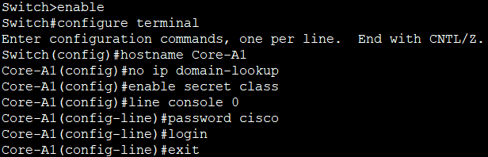     
#### Настройка SSH    
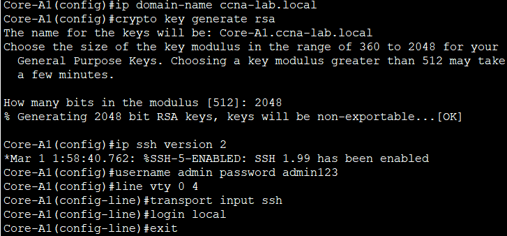     
#### Остальная базовая настройка    
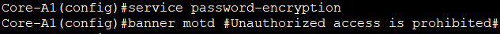    

#### Повторяем для всех остальных коммутаторов (Core A2, B1, B2, Distr A1, A2, B1, B2, Access A1, A2, B1, B2), меняя только hostname.     

## **Настройка VLAN и транковых (Trunk) портов**       
### **Шаг 1. Создаем VLAN на всех коммутаторах**      
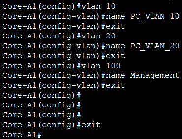   
#### Команда **vlan 10** создаёт виртуальную локальную сеть с номером 10. name PC_VLAN_10 присваивает ей имя для удобства идентификации. Без создания VLAN на коммутаторе трафик этой VLAN не будет обрабатываться. 

### **Шаг 2. Настраиваем порты доступа на Access-коммутаторах**     
#### **Выполняем на каждом Access-коммутаторе (A1, A2, B1, B2):**  
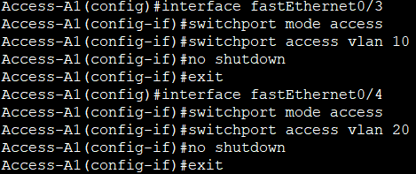      
#### **switchport mode access** - переводит порт в режим доступа (передаёт трафик только одного VLAN)
#### **switchport access vlan 10** -  назначает этот порт в VLAN 10     
#### **no shutdown**-  включает порт.

### **Шаг 3. Настройка Trunk-портов**   
#### **На L3-коммутаторах (Core A1, A2, B1, B2):**      
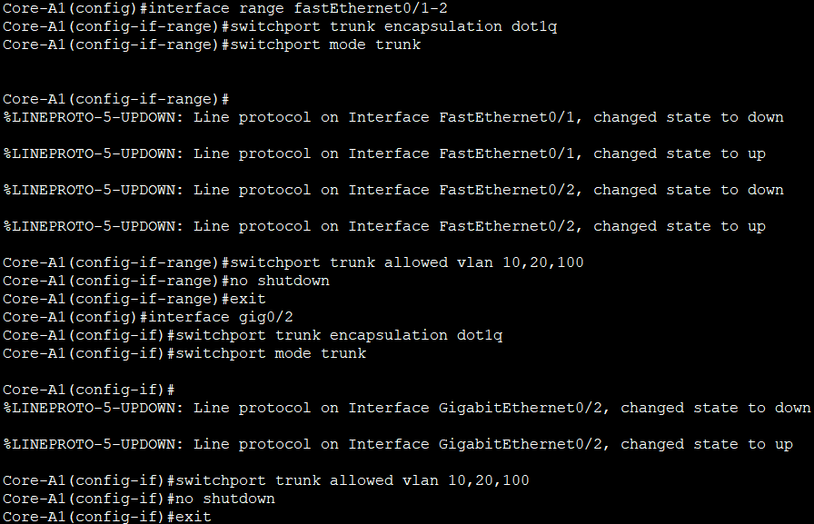     
#### **switchport mode trunk** — переводит порт в режим магистрали (транка).    
#### **switchport trunk allowed vlan 10,20,100** — разрешает передачу только указанных VLAN через этот транк.     

#### **На всех L2-коммутаторах (Distr и Access):**     
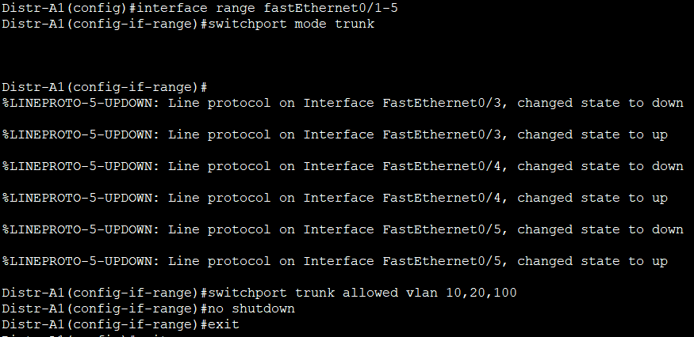     

### **Шаг 4. Настройка Management VLAN на L2-коммутаторах**      
#### Для Distr A1 (для остальных — другие IP):       
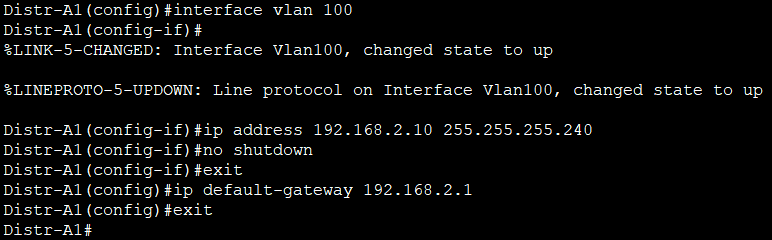     

#### **Адреса для всех L2-коммутаторов:**   
|Устройство|IP-адрес VLAN 100|     
|:--- |---:|  
|Distr A1|192.168.2.10/28|
|Distr A2|192.168.2.11/28|
|Distr B1|192.168.6.10/28|
|Distr B2|192.168.6.11/28|
|Access A1|192.168.2.12/28|
|Access A2|192.168.2.13/28|
|Access B1|192.168.6.12/28|
|Access B2|192.168.6.13/28|

## **Часть 3. Настройка меж-VLAN маршрутизации (SVI) на Core L3**       
### **Шаг 1. Включаем маршрутизацию на всех Core-коммутаторах**     
#### Выполняем на каждом Core (A1, A2, B1, B2):   
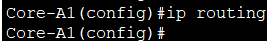     
#### ip routing включает глобальную маршрутизацию на L3-коммутаторе. Без этой команды коммутатор работает как обычный L2-коммутатор.     

### **Шаг 2. Настройка SVI на Core A1**     
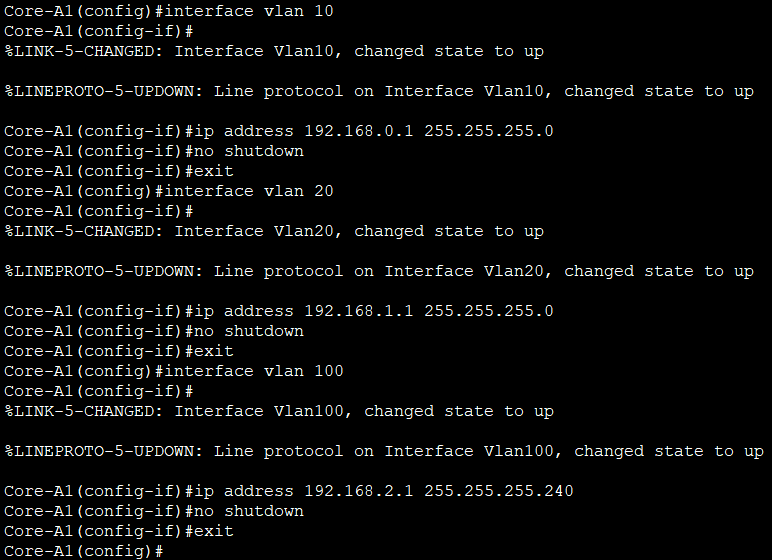     
#### interface vlan 10 — создаёт виртуальный интерфейс третьего уровня для VLAN 10.     
#### ip address ... — назначает ему IP-адрес, который будет шлюзом по умолчанию для устройств в этой VLAN.     
#### no shutdown — важная команда! По умолчанию SVI создаются в состоянии administratively down. Если не выполнить no shutdown, интерфейс останется выключенным, и DHCP не будет работать.     
#### Повторяем для Core A2, B1, B2 с соответствующими IP-адресами из таблицы.       

#### **Для Core A2:**    
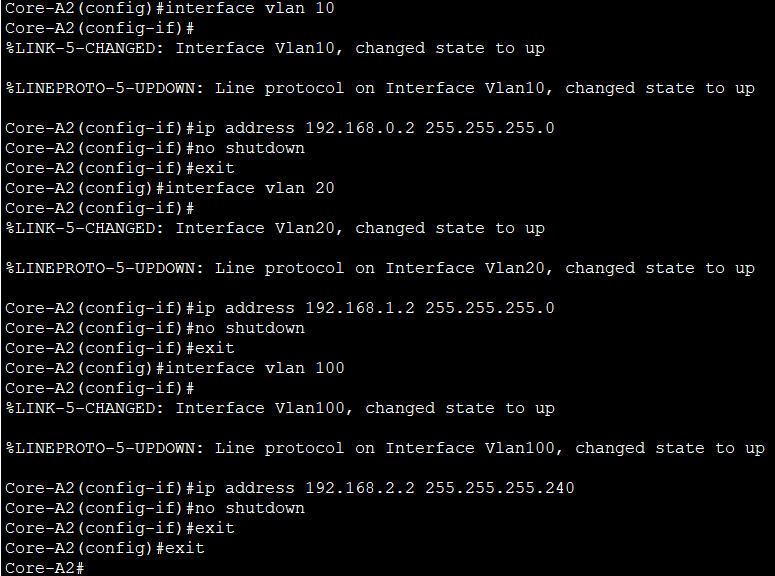     

#### **Для Core B1:**    
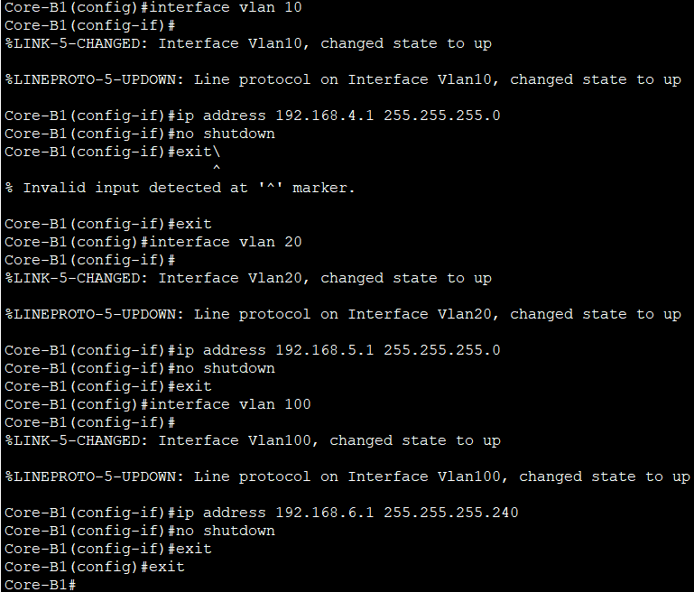     

#### **Для Core B2:**   
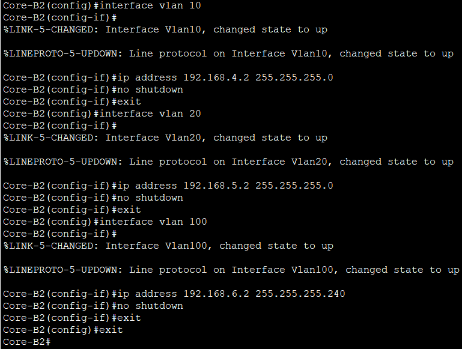    

## **Часть 4. Настройка DHCP-сервера**     
### **Шаг 1. Настройка DHCP на Core A1 (филиал А)**     
  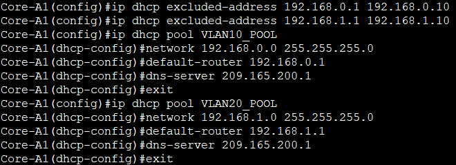    

#### ip dhcp excluded-address — исключает из автоматической раздачи указанный диапазон (первые 10 адресов зарезервированы для статических устройств, включая шлюз).       
#### ip dhcp pool VLAN10_POOL — создаёт пул адресов для VLAN 10.   
#### network 192.168.0.0 255.255.255.0 — указывает сеть, из которой будут выдаваться адреса.     
#### default-router 192.168.0.1 — передаёт клиентам адрес шлюза.      
#### dns-server 209.165.200.1 — loopback-адрес провайдера.      

### **Шаг 2. Настройка DHCP на Core B1 (филиал В)      
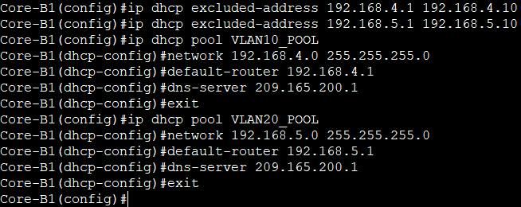    

## **Часть 5. Настройка динамической маршрутизации OSPF**   
### **Шаг 1. Настраиваем OSPF на ISP Router**     
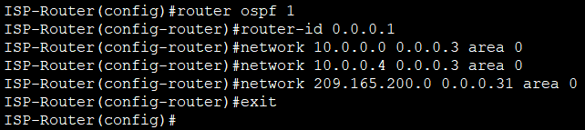    
#### router ospf 1 — запускает процесс OSPF с номером 1     
#### router-id 0.0.0.1 — уникальный идентификатор маршрутизатора в OSPF-области      
#### network ... area 0 — анонсирует сети в OSPF-область 0     
#### Сеть 209.165.200.0/27 включает loopback         

### **Шаг 2. Настройка OSPF на Edge R1 и Edge R2**      
#### **Edge R1:**     
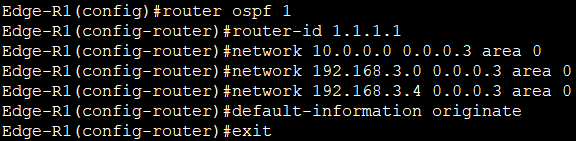      

#### **Edge R2:**       
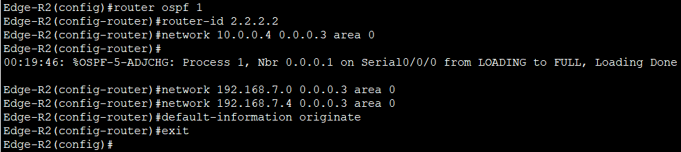    
#### default-information originate — эта команда заставляет маршрутизатор распространять в OSPF маршрут по умолчанию (0.0.0.0/0)      

### **Шаг 3. Настройка OSPF на Core A1**      
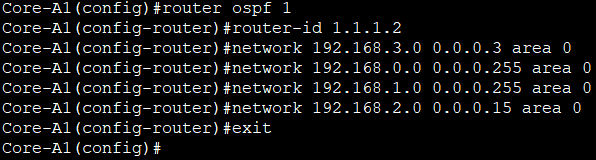     

#### Повторяем для Core A2, B1, B2 с уникальными Router ID и соответствующими сетями.    

#### **Core B1:**    
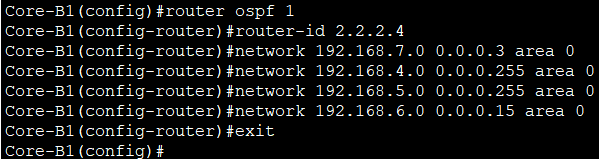    

#### **Core B2:**      
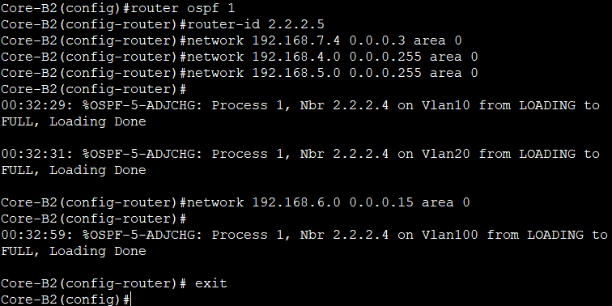     

#### **Core A2:**     
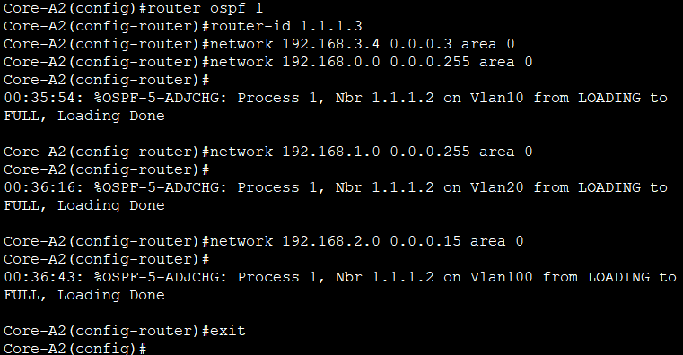     

## **Часть 6. Настройка NAT/PAT для доступа в интернет**     
### **Шаг 1. Настройка PAT на Edge R1**        
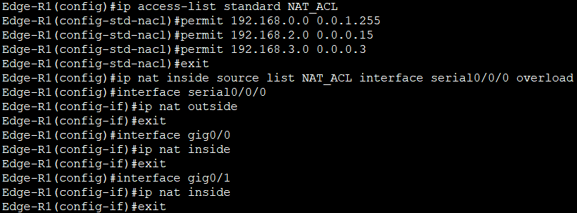     
#### ip access-list standard NAT_ACL — создаёт стандартный список доступа, определяющий, какие внутренние адреса подлежат трансляции.     
#### Маска 0.0.1.255 в строке permit 192.168.0.0 0.0.1.255 охватывает две сети: 192.168.0.0/24 и 192.168.1.0/24.     
#### ip nat inside source list NAT_ACL interface serial0/0/0 overload — настраивает PAT (перегрузку) с использованием адреса интерфейса Serial0/0/0 в качестве внешнего адреса.    
#### ip nat outside / ip nat inside — определяет, какие интерфейсы являются внутренними и внешними.                 

### **Шаг 2. Настройка PAT на Edge R2**          
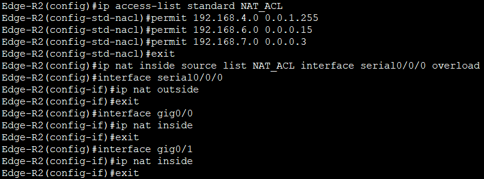    

### **Шаг 3. Настроим статические маршруты на ISP Router**      
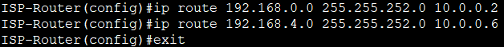    
#### Эти маршруты необходимы для обратного трафика от провайдера к внутренним сетям. Без них ответные пакеты не смогут вернуться.    

## **Часть 7. Настройка списков доступа (ACL)**     
### **Шаг 1. ACL для ограничения SSH-доступа**      
#### **Выполняем на всех коммутаторах (Core, Distr, Access):**        
 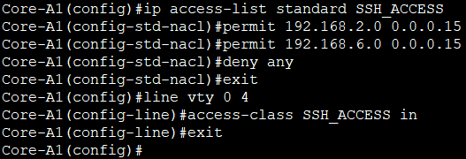     
#### Этот ACL разрешает подключение по SSH только с адресов из управляющей сети (VLAN 100).      
#### access-class SSH_ACCESS in применяет ACL к VTY-линиям (удалённому доступу).     
#### Все попытки SSH из VLAN 10 или 20 будут блокироваться.      

### **Шаг 2. ACL для изоляции VLAN 10 от VLAN 20**      
#### **На Core A1 (филиал А):**    
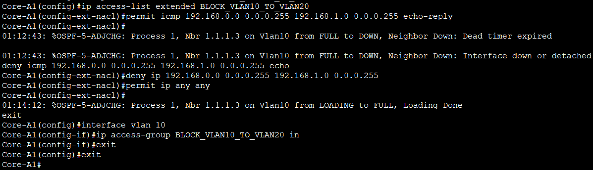        
#### Расширенный ACL блокирует весь IP-трафик из сети 192.168.0.0/24 (VLAN 10) в сеть 192.168.1.0/24 (VLAN 20)    
#### permit ip any any разрешает весь остальной трафик.     
#### ACL применяется на входе интерфейса VLAN 10.     
#### Трафик из VLAN 20 в VLAN 10 не блокируется.    

#### **На Core B1**    
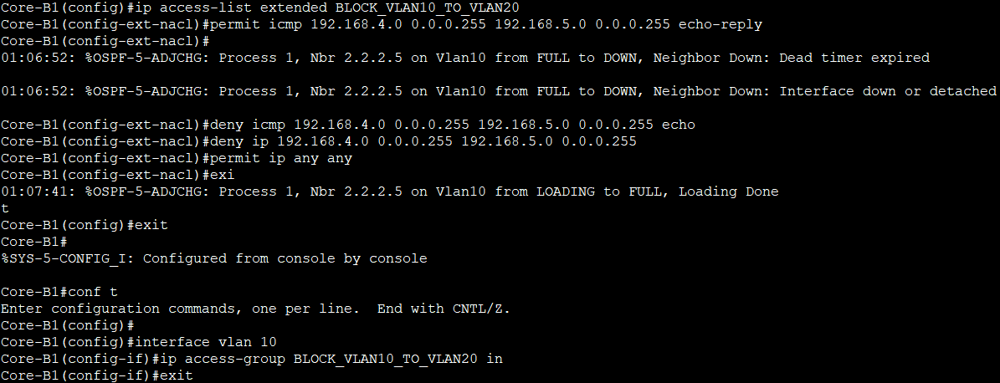       

### **Часть 8. Верификация работоспособности**     
#### **Шаг 1. Проверяем состояние интерфейсов**    
#### **На каждом устройстве:**    
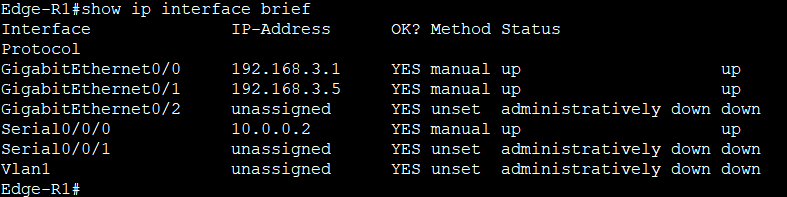    
#### все интерфейсы, которые должны быть активны, находятся в состоянии up/up    

#### **Шаг 2. Проверим OSPF-соседей**   
#### **На каждом маршрутизаторе и L3-коммутаторе:**    
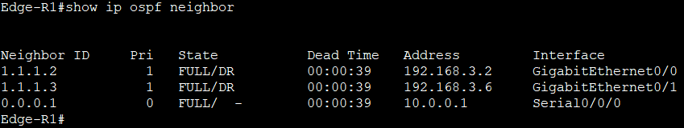       

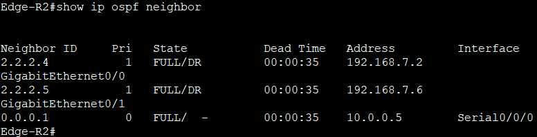     

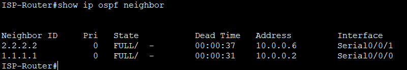    

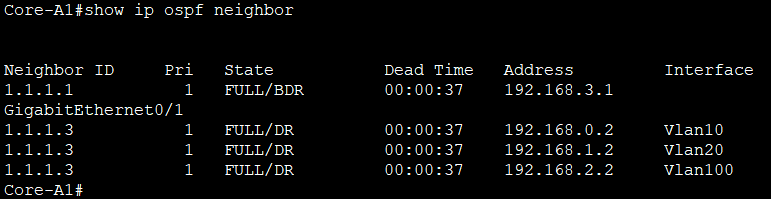    

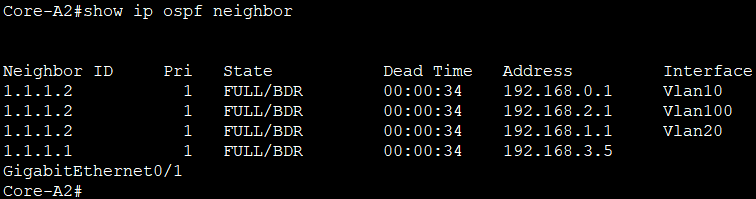     

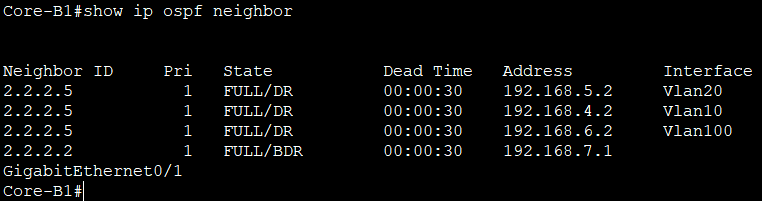     

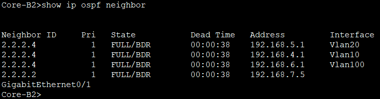     

#### Все соседи находятся в состоянии FULL/DR или FULL/BDR       

### **Шаг 3. Проверяем таблицу маршрутизации**     
#### **На Core A1:**     
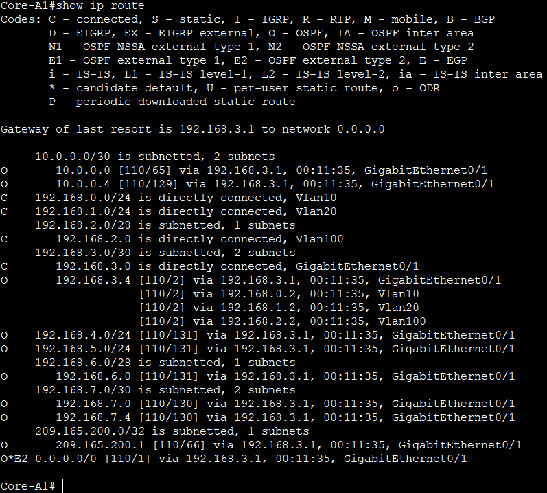     
#### В выводе присутствуют маршруты ко всем сетям, помеченные как O (OSPF), и маршрут по умолчанию O*E2 0.0.0.0/0.        

### **Шаг 4. Проверьте получение IP по DHCP**     
#### На каждом ПК:   
#### **PC-1**   
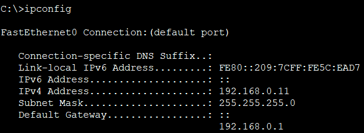   

#### **PC-2**   
 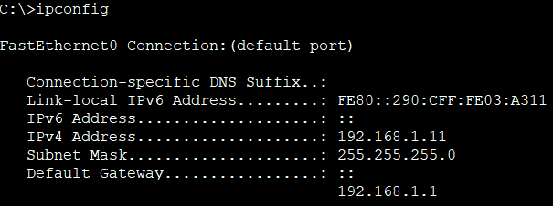      

#### **PC-3**     
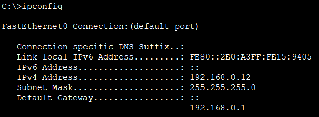     

#### **PC-4**     
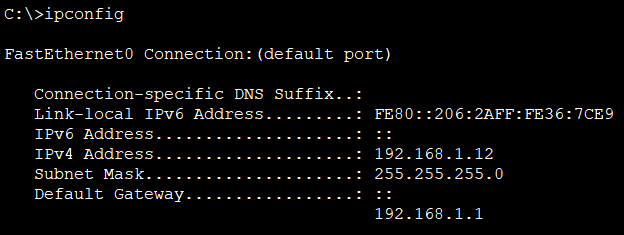    

#### **PC-5**     
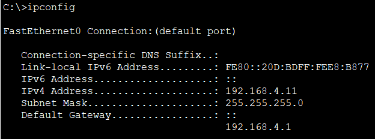     

#### **PC-6**     
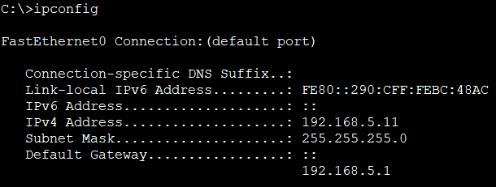     

#### **PC-7**     
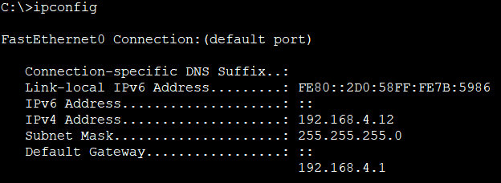       

#### **PC-8**     
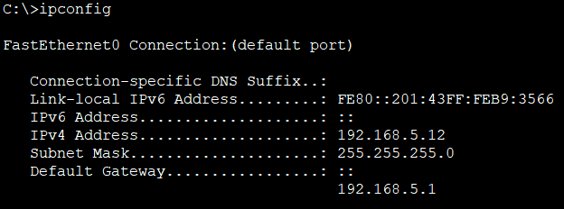     

#### Получен адрес из соответствующего пула        

### **Шаг 5. Проверяем доступ в интернет**      
#### С каждого ПК:     
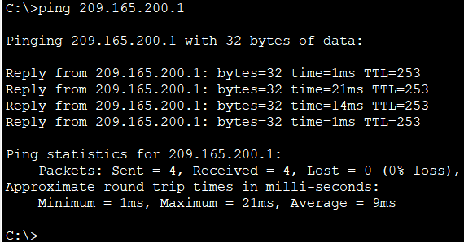    

#### Пинг проходит успешно (4 ответа).    

### **Шаг 6. Проверяем NAT-трансляции**    
#### **На Edge R1 и Edge R2:**   
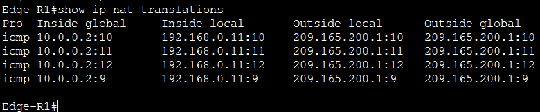    

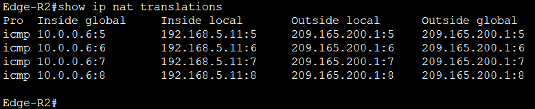    

#### Отображаются динамические записи       

### **Шаг 7. Проверка ACL**     
#### **1. SSH-доступ:**     
#### С ПК 1 (VLAN 10) попробуем подключиться к Core A1 по SSH:
#### 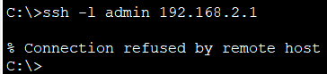 

#### Временно настраиваем порт Fa0/5 на коммутаторе Access-A1 в VLAN 100       
#### Подключаем к порту компьютер PC-0    
#### Поскольку DHCP для VLAN 100 не настроен задаем адрес вручную:    
 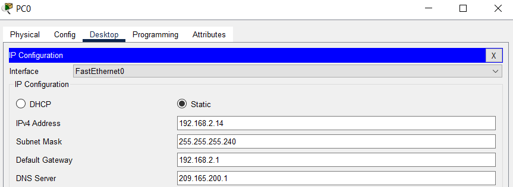      

#### Проверьте связность с Core-A1       
 

#### Проверяем SSH-доступ   
     

#### Возвращаем порт в исходное состояние      

#### **2. Изоляция VLAN:**    
#### С PC-1 (VLAN 10) выполним ping 192.168.1.11 (адрес PC-2 в VLAN 20)    
     

[Скачать конфиг проекта](https://github.com/nikolaishlyahtin1987-creator/NETWORK-ENGINEER_2026/blob/main/ПРОЕКТ_2026/ПРОЕКТ_НОВЫЙ%20С%20УРОВНЯМИ.pkt "Нажмите для скачивания файла конфигурации")

