# **Проектирование и настройка корпоративной сети с двумя удалёнными филиалами**       
## **Цель работы:**    
#### Спроектировать и настроить отказоустойчивую корпоративную сеть для двух удалённых филиалов с выходом в интернет через единого провайдера.   
## **Топология**    
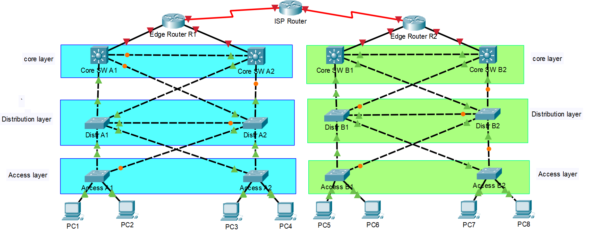     
## План IP-адресации   
#### Используется частная сеть 192.168.0.0/20, разбитая методом VLSM.      
### **Филиал А**      
|VLAN/Тип|Назначение |Сеть |Шлюз|Устройства|
|:---      |---|---|---|---:|    
VLAN 10    |Пользователи (Access A1)|192.168.0.0/24|192.168.0.1|ПК на Access A1|
VLAN 20    |Пользователи (Access A2)|192.168.1.0/24|192.168.1.1|ПК на Access A2|
VLAN 100   |Управление|192.168.2.0/28|192.168.2.1|Core A1, Core A2, Distr A1, Distr A2, Access A1, Access A2|
L3-транзит |Edge R1 ↔ Core A1|192.168.3.0/30|—|Edge R1 (Gi0/0), Core A1 (Gi0/1)|
L3-транзит |Edge R1 ↔ Core A2|192.168.3.4/30|—|Edge R1 (Gi0/1), Core A2 (Gi0/1)|     

### **Филиал B**      
|VLAN/Тип|Назначение |Сеть |Шлюз|Устройства|
|:---      |---|---|---|---:|    
VLAN 10    |Пользователи (Access B1)|192.168.4.0/24|192.168.4.1|ПК на Access B1|
VLAN 20    |Пользователи (Access AB)|192.168.5.0/24|192.168.5.1|ПК на Access B2|
VLAN 100   |Управление|192.168.6.0/28|192.168.6.1|Core B1, Core B2, Distr B1, Distr B2, Access B1, Access B2|
L3-транзит |Edge R2 ↔ Core B1|192.168.7.0/30|—|Edge R2 (Gi0/0), Core B1 (Gi0/1)|
L3-транзит |Edge R2 ↔ Core B2|192.168.7.4/30|—|Edge R2 (Gi0/1), Core B2 (Gi0/1)|       

### **WAN (провайдер ↔ филиалы)**     
|Соединение|Сеть |Маска |IP-адреса|
|:---      |---|---|---:|   
|ISP ↔ Edge R1 |10.0.0.0|/30|ISP: 10.0.0.1, R1: 10.0.0.2|
|ISP ↔ Edge R2|10.0.0.4|/30|ISP: 10.0.0.5, R2: 10.0.0.6|     

### **1. Настройка устройств**      
#### **1.1 Базовая конфигурация всех устройств**     
#### Выполняется на каждом из 15 устройств (ISP, Edge R1/R2, Core x4, Distr x4, Access x4).      
#### Настраиваем ISP Router; для остальных меняется **hostname**.    
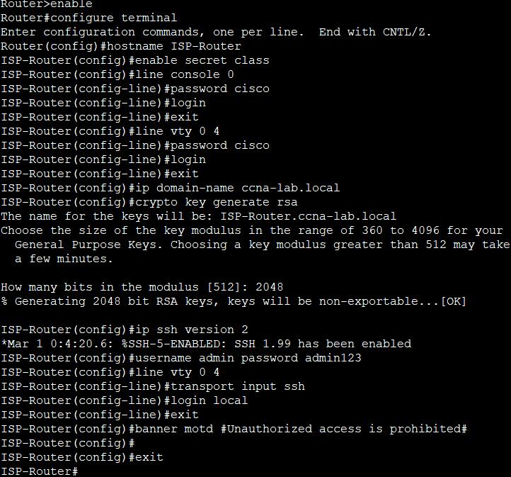
#### Созраняем текущую конфигурацию
 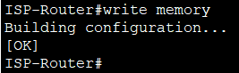       

#### **1.2 Настройка интерфейсов**     
#### **ISP Router**    
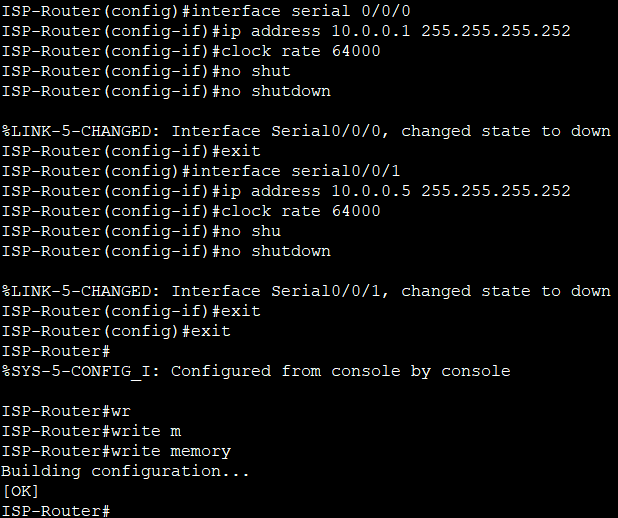     

#### **Edge R1 (филиал А)**     
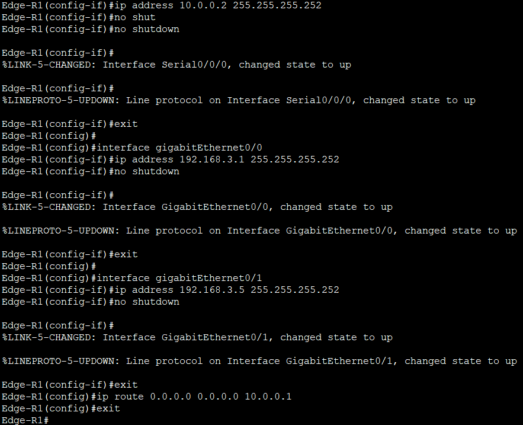     

#### **Edge R2 (филиал В)**       
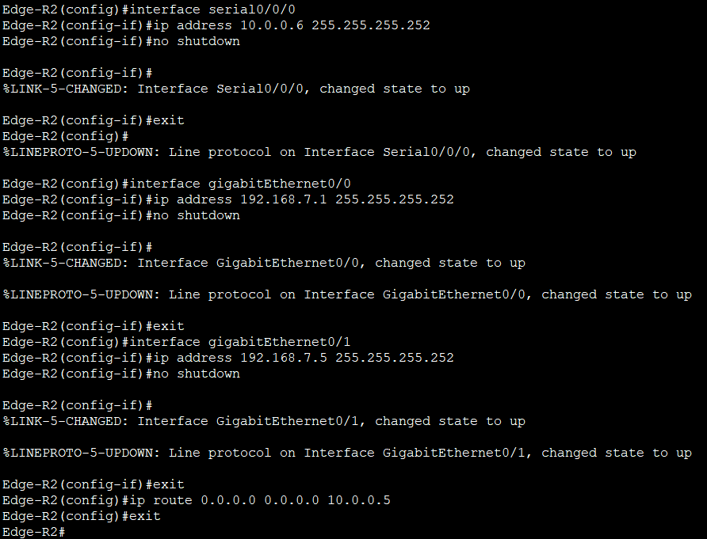     

#### **L3-коммутаторы ядра (Core A1, A2, B1, B2)**       
#### **Core A1** (для остальных меняются IP-адреса согласно таблице). 
#### **Для Core A2:**
#### interface gig0/1 с IP 192.168.3.6/30
#### **Для Core B1:**
#### interface gig0/1 с IP 192.168.7.2/30
#### **Для Core B2:**
#### interface gig0/1 с IP 192.168.7.6/30     

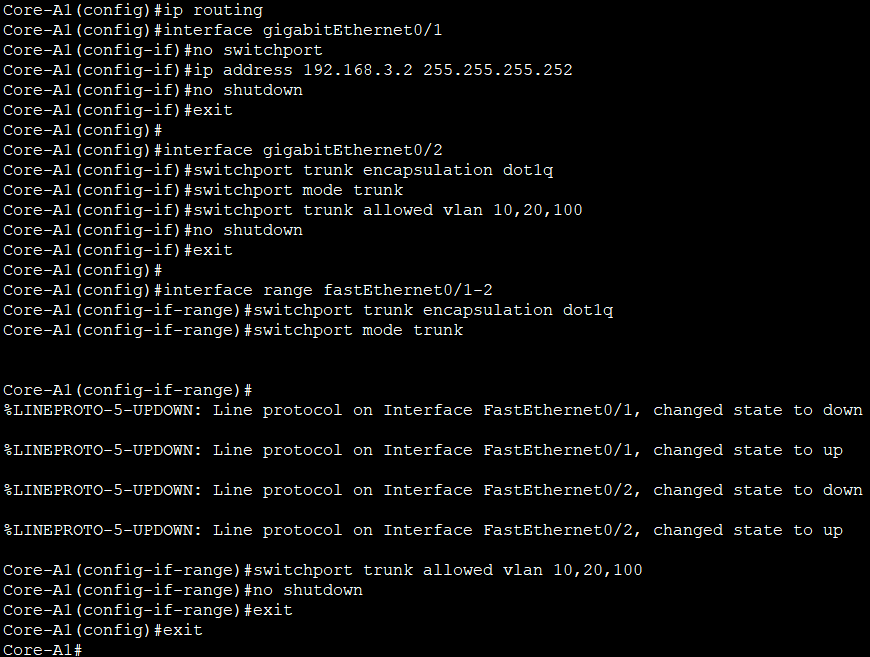      

### **L2-коммутаторы (Distr и Access)**    
#### **Distr A1**  (для остальных меняется IP-адрес управления).    
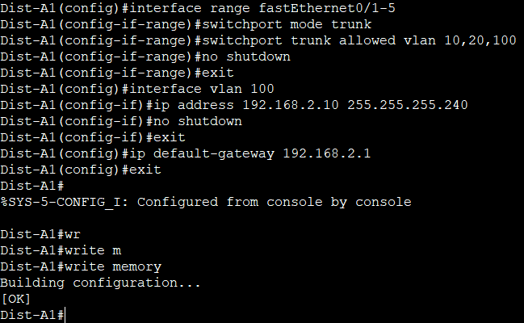     

### **IP-адреса VLAN 100 для всех L2-коммутаторов:**     
|Устройство|IP-адрес |
|:---      |---:|  
|Distr A1 |192.168.2.10/28|
|Distr A2|192.168.2.11/28|
|Distr B1|192.168.6.10/28|
|Distr B2|192.168.6.11/28|
|Access A1|192.168.2.12/28|
|Access A2|192.168.2.13/28|
|Access B1|192.168.6.12/28|
|Access B2|192.168.6.13/28|      

### **1.3 Настройка VLAN на Access-коммутаторах**      
#### Выполняется на каждом Access (A1, A2, B1, B2).      
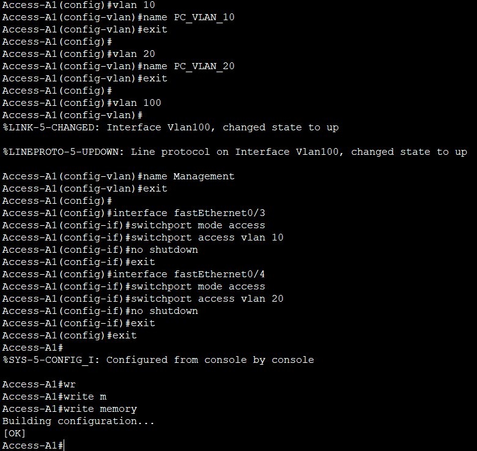    

### **1.4. Меж-VLAN маршрутизация (SVI) на Core L3**      
#### **Core A1:**     
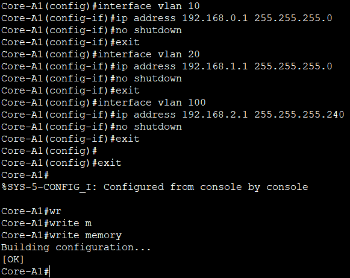     

#### **Core A2:**     
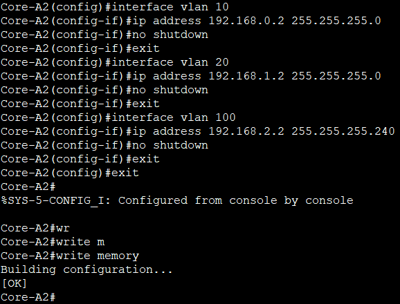     

#### **Core B1:**     
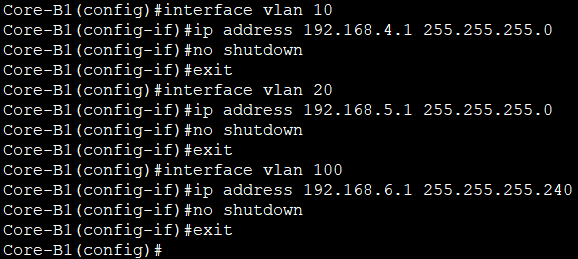    

#### **Core B2:**    
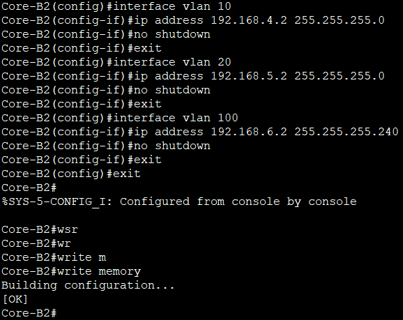     

### **1.5. Настройка DHCP**      
#### **Core A1 (филиал А):**     
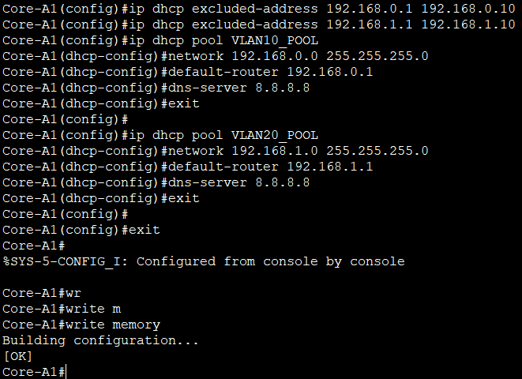    

#### **Core B1 (филиал В):**     
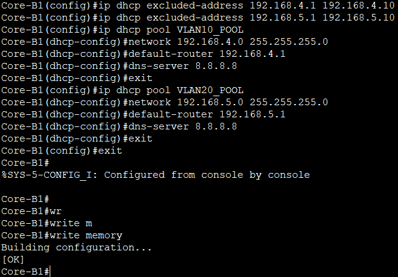   

### **1.6. Настройка OSPF**      
#### **ISP Router:**     
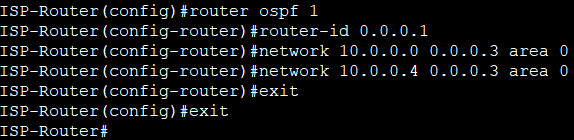     

#### **Edge R1:**     
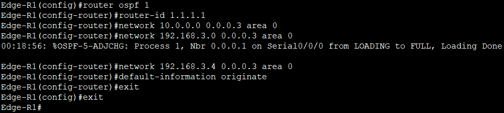     

#### **Edge R2:**     
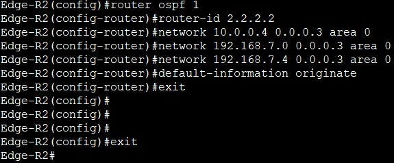    

#### **Core A1:**     
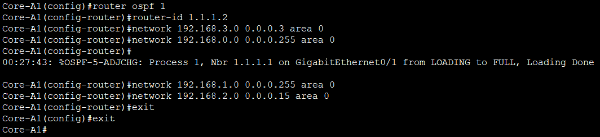     

#### **Core A2:**     
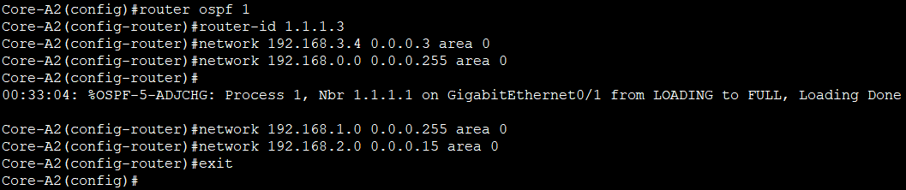     

#### **Core B1:**      
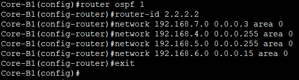      

#### **Core B2:**     
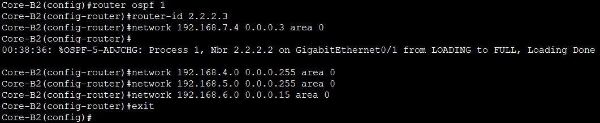     

 

